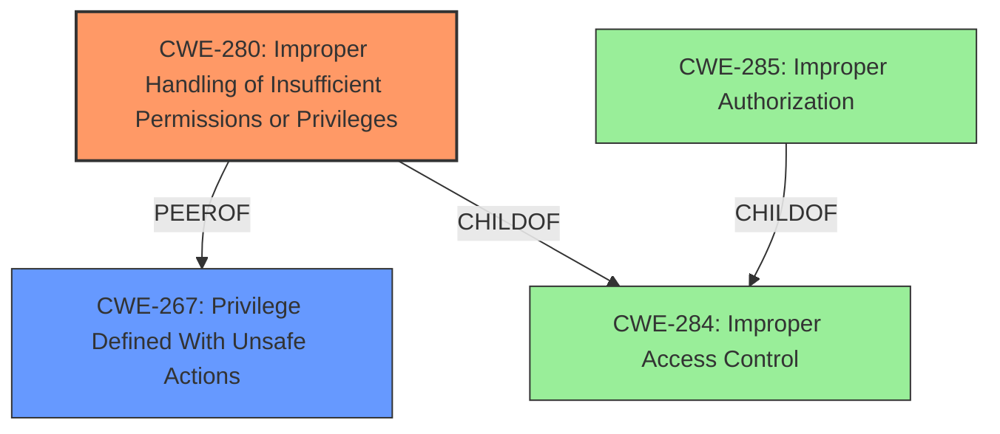

# Analysis Report for CVE-2024-7525

# Vulnerability Analysis Report: CVE-2024-7525

## Description

It was possible for a web extension with minimal permissions to create a `StreamFilter` which could be used to read and modify the response body of requests on any site. This vulnerability affects Firefox < 129, Firefox ESR < 115.14, Firefox ESR < 128.1, Thunderbird < 128.1, and Thunderbird < 115.14.

## Vulnerability Description Key Phrases

- **Impact:** read and modify response body of requests on any site
- **Vector:** create a StreamFilter
- **Attacker:** web extension with minimal permissions
- **Product:** Firefox, Firefox ESR, Thunderbird
- **Version:** Firefox < 129, Firefox ESR < 115.14, Firefox ESR < 128.1, Thunderbird < 128.1, Thunderbird < 115.14

## Analysis (with Relationship Data)

# Summary
| CWE ID | CWE Name | Confidence | CWE Abstraction Level | CWE Vulnerability Mapping Label | CWE-Vulnerability Mapping Notes |
|---|---|---|---|---|---|
| CWE-280 | Improper Handling of Insufficient Permissions or Privileges | 0.9 | Base | Allowed | Primary CWE. The application proceeds despite lacking necessary permissions, leading to a vulnerability. |
| CWE-267 | Privilege Defined With Unsafe Actions | 0.7 | Base | Allowed | Secondary Candidate. The `StreamFilter` privilege can be used unsafely. |

## Evidence and Confidence

*   **Confidence Score:** 0.9
*   **Evidence Strength:** HIGH

## Relationship Analysis
The primary relationship influencing the CWE selection is the hierarchical relationship between broader access control CWEs and more specific permission-related issues. CWE-280, a base-level CWE, is chosen over higher-level classes like CWE-285 or pillars like CWE-284 because it precisely captures the **improper handling of insufficient permissions**.



## Vulnerability Chain
The vulnerability chain begins with the **missing permission check** when creating a `StreamFilter` (CWE-280). This allows a web extension with minimal permissions to create such a filter. Subsequently, this filter can be used to read and modify the response body of requests on any site, leading to data interception and manipulation.

## Summary of Analysis
The analysis is primarily based on the provided evidence, particularly the "CVE Reference Links Content Summary," which highlights the **missing permission check** as the root cause. This aligns directly with CWE-280. The retriever results and guidance on privilege vs. permission mapping further support this selection. The choice of CWE-280 is at the optimal level of specificity because it accurately describes the **improper handling of insufficient privileges** during the creation of the `StreamFilter`.

Relevant CWE Information:

# Enhanced Context (25 CWEs)
The following CWEs were identified as potentially relevant to this vulnerability:

## CWE-267: Privilege Defined With Unsafe Actions
**Abstraction Level**: Base
**Similarity Score**: 0.78
**Source**: dense

**Description**:
A particular privilege, role, capability, or right can be used to perform unsafe actions that were not intended, even when it is assigned to the correct entity.

**Mapping Guidance**:
- Usage: Allowed
- Rationale: This CWE entry is at the Base level of abstraction, which is a preferred level of abstraction for mapping to the root causes of vulnerabilities.

## CWE-280: Improper Handling of Insufficient Permissions or Privileges
**Abstraction Level**: Base
**Similarity Score**: 0.76
**Source**: dense

**Description**:
The product does not handle or incorrectly handles when it has insufficient privileges to access resources or functionality as specified by their permissions. This may cause it to follow unexpected code paths that may leave the product in an invalid state.

**Mapping Guidance**:
- Usage: Allowed
- Rationale: This CWE entry is at the Base level of abstraction, which is a preferred level of abstraction for mapping to the root causes of vulnerabilities.

**CWE-280** is the primary CWE because the vulnerability stems from the **improper handling of insufficient permissions** when creating the `StreamFilter`. The system proceeds with creating the filter even when the web extension lacks the necessary privileges. This is a direct instance of **CWE-280**.

**CWE-267** is a secondary candidate because the `StreamFilter` itself can be viewed as a privilege that is defined with unsafe actions. However, the root cause is the **improper handling of permissions**, making **CWE-280** the primary concern.

**CWE-863** and **CWE-285** were considered but deemed less appropriate. While there is an authorization aspect, the core issue is not an incorrect authorization check (**CWE-863**) or a general improper authorization (**CWE-285**), but rather the specific failure to handle insufficient permissions (**CWE-280**).

**CWE-306** was also considered, but it focuses on missing authentication. In this case, the issue is not about missing authentication but about **improperly handling the permissions** of an authenticated entity (the web extension).

**CWE-787 (Out-of-bounds Write)**, **CWE-79 (Improper Neutralization of Input During Web Page Generation ('Cross-site Scripting'))**, **CWE-22 (Improper Limitation of a Pathname to a Restricted Directory ('Path Traversal'))**, and **CWE-416 (Use After Free)** do not accurately reflect the vulnerability. These CWEs describe different types of weaknesses that are not present in the vulnerability description.


## CWE Relationship Analysis

Current CWEs represent these abstraction levels: .


### Vulnerability Chain Analysis

**Chain starting from CWE-863:**
- 863 (Incorrect Authorization) - ROOT


**Chain starting from CWE-280:**
- 280 (Improper Handling of Insufficient Permissions or Privileges ) - ROOT


### CWE Relationship Diagram

```mermaid
graph TD
    classDef primary fill:#f96,stroke:#333,stroke-width:2px
    classDef secondary fill:#69f,stroke:#333
    classDef tertiary fill:#9e9,stroke:#333
```


*Report generated on 2025-07-14 02:52:34*
