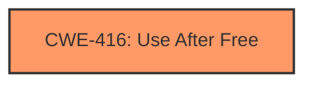

# Enhanced Analysis for CVE-2024-7533

# Summary
| CWE ID | CWE Name | Confidence | CWE Abstraction Level | CWE Vulnerability Mapping Label | CWE-Vulnerability Mapping Notes |
|---|---|---|---|---|---|
| CWE-416 | Use After Free | 1.0 | Variant | Primary | Allowed |

## Evidence and Confidence

*   **Confidence Score:** 1.0
*   **Evidence Strength:** HIGH

## Relationship Analysis
The primary relationship to consider is that CWE-416 is a variant. There is no need to look at parent relationships because the description is an exact match.



## Vulnerability Chain
The chain of events is as follows:
1.  **Root Cause:** CWE-416 (**Use after free**)
2.  **Impact:** Heap corruption

## Summary of Analysis
The vulnerability description clearly states "**Use after free**" as the root cause of the vulnerability. The CVE Reference Links Content Summary also confirms this. The primary CWE match from similar CVE descriptions is also CWE-416.

CWE-416 (Use After Free) is the most appropriate CWE because the vulnerability description explicitly mentions "use after free". This occurs when the program attempts to access memory that has already been freed, which can lead to heap corruption.

Other CWEs Considered and Rejected:

*   CWE-366 (Race Condition within a Thread), CWE-843 (Access of Resource Using Incompatible Type ('Type Confusion')), CWE-415 (Double Free), and others were considered because they appeared in the Retriever Results. However, they were rejected because the vulnerability description clearly indicates a **use-after-free** condition, making CWE-416 the most accurate and specific choice.
*   CWE-787 (Out-of-bounds Write) was also in the top CWEs for similar CVE Descriptions, but the root cause is clearly **use-after-free**.

The selection of CWE-416 is based on direct evidence from the vulnerability description and aligns with the primary CWE match from similar CVE descriptions.


## CWE Relationship Analysis

Current CWEs represent these abstraction levels: .


### Vulnerability Chain Analysis

**Chain starting from CWE-416:**
- 416 (Use After Free) - ROOT


**Chain starting from CWE-787:**
- 787 (Out-of-bounds Write) - ROOT


### CWE Relationship Diagram

```mermaid
graph TD
    classDef primary fill:#f96,stroke:#333,stroke-width:2px
    classDef secondary fill:#69f,stroke:#333
    classDef tertiary fill:#9e9,stroke:#333
```