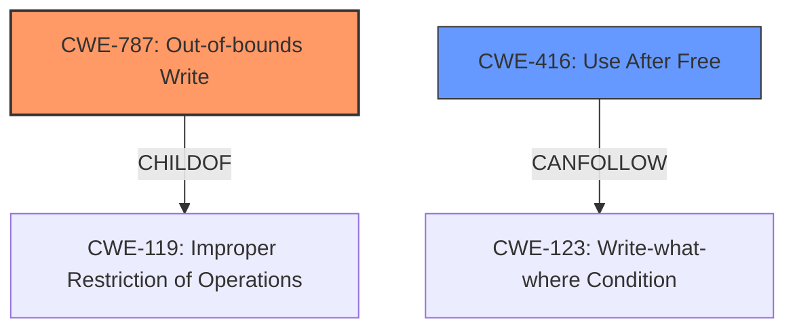

# Analysis for CVE-2024-7535

# Summary
| CWE ID | CWE Name | Confidence | CWE Abstraction Level | CWE Vulnerability Mapping Label | CWE-Vulnerability Mapping Notes |
|---|---|---|---|---|---|
| CWE-787 | Out-of-bounds Write | 0.6 | Base | Allowed | Primary CWE. The vulnerability leads to heap corruption, which can be caused by an out-of-bounds write. |
| CWE-416 | Use After Free | 0.5 | Variant | Allowed | Secondary CWE. Heap corruption can be caused by Use After Free. |

## Evidence and Confidence

*   **Confidence Score:** 0.6
*   **Evidence Strength:** MEDIUM

## Relationship Analysis
The primary CWE, CWE-787, is a base-level CWE. CWE-787 is a parent of CWE-124 (Buffer Underwrite) and child of CWE-119 (Improper Restriction of Operations within the Bounds of a Memory Buffer). CWE-416 is a variant level CWE and can follow CWE-123 (Write-what-where Condition). Given the vague description and the potential for heap corruption, I am selecting CWE-787 and CWE-416.

## Vulnerability Chain
The vulnerability chain starts with an "**inappropriate implementation**" in the V8 engine, leading to potential heap corruption. This could manifest as either an out-of-bounds write (CWE-787) or a use-after-free condition (CWE-416), both contributing to memory corruption.

## Summary of Analysis
The vulnerability description mentions an "**inappropriate implementation**" leading to potential heap corruption. The root cause is vague, but the impact suggests memory corruption. The retriever results point to several memory-related CWEs.
CWE-787 (Out-of-bounds Write) is chosen as a primary candidate because heap corruption is often a result of writing beyond the allocated buffer. CWE-416 (Use After Free) is added as a secondary candidate because UAF can also cause heap corruption.

I considered CWE-843 (Access of Resource Using Incompatible Type ('Type Confusion')), CWE-366 (Race Condition within a Thread), CWE-123 (Write-what-where Condition), CWE-825 (Expired Pointer Dereference), CWE-824 (Access of Uninitialized Pointer), CWE-823 (Use of Out-of-range Pointer Offset), CWE-822 (Untrusted Pointer Dereference), CWE-364 (Signal Handler Race Condition), CWE-134 (Use of Externally-Controlled Format String), CWE-120 (Buffer Copy without Checking Size of Input ('Classic Buffer Overflow')), but those were not selected because the description does not give enough evidence to support those CWEs.