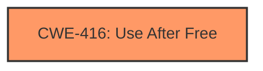

# Enhanced Analysis for CVE-2024-7536

# Summary
| CWE ID | CWE Name | Confidence | CWE Abstraction Level | CWE Vulnerability Mapping Label | CWE-Vulnerability Mapping Notes |
|---|---|---|---|---|---|
| CWE-416 | Use After Free | 1.0 | Variant | Primary | Allowed |

## Evidence and Confidence

*   **Confidence Score:** 1.0
*   **Evidence Strength:** HIGH

## Relationship Analysis
The primary relationship is the direct mapping to CWE-416, which is a variant-level CWE. The other CWEs considered were related to memory management issues and race conditions, but the explicit mention of "use after free" strongly suggests CWE-416 as the most accurate classification. No other relationships influenced the decision, as the description is straightforward.



## Vulnerability Chain
The vulnerability chain is simple:
1.  **Root Cause:** **Use after free** (CWE-416)
2.  **Impact:** Potentially exploit heap corruption

## Summary of Analysis
The vulnerability description clearly states "**Use after free**" which is the primary root cause. The CVE reference links content summary also confirms the root cause. The retriever results also indicated that CWE-416 is the top candidate. Therefore, CWE-416 is the most appropriate CWE for this vulnerability.

Relevant CWE Information:

# Enhanced Context (25 CWEs)
The following CWEs were identified as potentially relevant to this vulnerability:

## CWE-416: Use After Free
**Abstraction Level**: Variant
**Similarity Score**: 0.77
**Source**: dense

**Description**:
The product reuses or references memory after it has been freed. At some point afterward, the memory may be allocated again and saved in another pointer, while the original pointer references a location somewhere within the new allocation. Any operations using the original pointer are no longer valid because the memory "belongs" to the code that operates on the new pointer.

**Mapping Guidance**:
- Usage: Allowed
- Rationale: This CWE entry is at the Variant level of abstraction, which is a preferred level of abstraction for mapping to the root causes of vulnerabilities.

**CWE-416**: The vulnerability description explicitly mentions "use after free," which directly corresponds to CWE-416. The "CVE Reference Links Content Summary" section also confirms that the root cause is "use-after-free." The CWE description aligns perfectly: "The product reuses or references memory after it has been freed." This can lead to heap corruption, as also mentioned in the description. This is the primary CWE.


## CWE Relationship Analysis

Current CWEs represent these abstraction levels: .


### Vulnerability Chain Analysis

**Chain starting from CWE-416:**
- 416 (Use After Free) - ROOT


### CWE Relationship Diagram

```mermaid
graph TD
    classDef primary fill:#f96,stroke:#333,stroke-width:2px
    classDef secondary fill:#69f,stroke:#333
    classDef tertiary fill:#9e9,stroke:#333
```