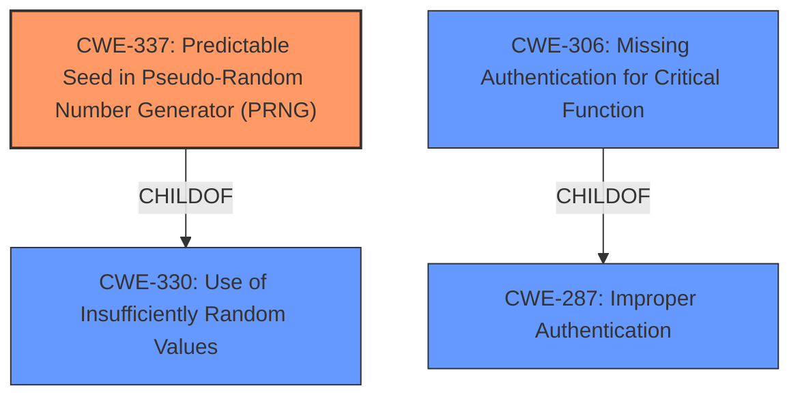

# Enhanced Analysis for CVE-2024-7558

# Summary
| CWE ID  | CWE Name                                                         | Confidence | CWE Abstraction Level | CWE Vulnerability Mapping Label | CWE-Vulnerability Mapping Notes |
| :-------- | :--------------------------------------------------------------- | :--------- | :---------------------- | :------------------------------ | :------------------------------ |
| CWE-337   | Predictable Seed in Pseudo-Random Number Generator (PRNG)        | 0.9        | Variant               | Primary                         | Allowed                       |
| CWE-306   | Missing Authentication for Critical Function                     | 0.7        | Base                  | Secondary                       | Allowed                       |

## Evidence and Confidence

*   **Confidence Score:** 0.8
*   **Evidence Strength:** HIGH

## Relationship Analysis
The primary CWE is CWE-337, which is a Variant of CWE-330 (Use of Insufficiently Random Values). CWE-330 is a Class. The choice of CWE-337 is based on the specific **weakness** of the **predictable seed** used in the PRNG.

CWE-306 is related, as the **predictable secret** allows bypassing authentication. CWE-306 is a base level CWE and has a parent child relationship with CWE-287 Improper Authentication which is a class.



## Vulnerability Chain
The vulnerability chain starts with the **predictable seed** in the PRNG (CWE-337), which results in a **predictable authentication secret**. Because the secret is **predictable**, it is as if there is no authentication (CWE-306), which leads to unauthorized access to sensitive information and tools.

## Summary of Analysis
The primary **weakness** is the use of a **predictable seed** in the pseudo-random number generator which generates the authentication secret, JUJU_CONTEXT_ID. The `JUJU_CONTEXT_ID` includes a random number generated using the Go standard library's `rand` package, seeded with the current Unix timestamp in seconds. This makes the random number predictable as the timestamp can be obtained or guessed. This leads to a bypass of authentication.

The provided evidence explicitly mentions the **predictable** nature of the random number generation due to the use of `time.Now().Unix()` as a seed. This aligns perfectly with CWE-337. The high retriever score for CWE-337 further supports this choice.

CWE-306 is a consequence of the predictable seed. Because the **secret** is **predictable** it is as if there is **missing authentication** for a critical function.

The selected CWEs are at the optimal level of specificity, as CWE-337 precisely describes the root cause.

Relevant CWE Information:

# Enhanced Context (25 CWEs)
The following CWEs were identified as potentially relevant to this vulnerability:

## CWE-330: Use of Insufficiently Random Values
**Abstraction Level**: Class

## CWE-337: Predictable Seed in Pseudo-Random Number Generator (PRNG)
**Abstraction Level**: Variant

## CWE-306: Missing Authentication for Critical Function
**Abstraction Level**: Base

## CWE-1391: Use of Weak Credentials
**Abstraction Level**: Class

### Additional CWE Considerations

*   **CWE-330 Use of Insufficiently Random Values**: Considered but CWE-337 is a better fit as it specifies the **weakness** is related to the seed of the PRNG.
*   **CWE-1391 Use of Weak Credentials:** Considered but the credentials aren't inherently **weak** but become **weak** because of the **predictable** way they are generated.
*   **CWE-923 Improper Restriction of Communication Channel to Intended Endpoints**: Considered, but the issue is with authentication and not the communication channel itself.
*   **CWE-732 Incorrect Permission Assignment for Critical Resource**: Not applicable because the issue isn't about incorrect permissions.
*   **CWE-918 Server-Side Request Forgery (SSRF)**: Irrelevant as the vulnerability does not involve server-side requests.
*   **CWE-1204 Generation of Weak Initialization Vector (IV)**: Not applicable because the **weakness** does not involve Initialization Vectors.
*   **CWE-276 Incorrect Default Permissions**: Not applicable because the issue is not related to file permissions.
*   **CWE-270 Privilege Context Switching Error**: Not applicable as there is no context switching involved.
*   **CWE-472 External Control of Assumed-Immutable Web Parameter**: Not applicable as the vulnerability doesn't involve web parameters.
*   **CWE-73 External Control of File Name or Path**: Not applicable because the **weakness** isn't related to external control of file names or paths.
*   **CWE-476 NULL Pointer Dereference**: Not applicable because the **weakness** doesn't involve NULL pointer dereferences.
*   **CWE-918: Server-Side Request Forgery (SSRF)**: Not applicable as the vulnerability does not involve server-side requests.
*   **CWE-1204: Generation of Weak Initialization Vector (IV)**: Not applicable because the **weakness** does not involve Initialization Vectors.
*   **CWE-276: Incorrect Default Permissions**: Not applicable because the issue is not related to file permissions.
*   **CWE-270: Privilege Context Switching Error**: Not applicable as there is no context switching involved.
*   **CWE-472: External Control of Assumed-Immutable Web Parameter**: Not applicable as the vulnerability doesn't involve web parameters.
*   **CWE-73: External Control of File Name or Path**: Not applicable because the **weakness** isn't related to external control of file names or paths.
*   **CWE-476: NULL Pointer Dereference**: Not applicable because the **weakness** doesn't involve NULL pointer dereferences.
*   **CWE-203: Observable Discrepancy**: Not applicable as there is no observable discrepancy.
*   **CWE-212: Improper Removal of Sensitive Information Before Storage or Transfer**: Not applicable because the issue does not involve the storage or transfer of sensitive data.
*   **CWE-345: Insufficient Verification of Data Authenticity**: Not applicable as data authenticity is not the primary issue.
*   **CWE-703: Improper Check or Handling of Exceptional Conditions**: Not applicable because exceptional conditions are not the main issue.
*   **CWE-754: Improper Check for Unusual or Exceptional Conditions**: Not applicable because exceptional conditions are not the main issue.
*   **CWE-863 Incorrect Authorization** and **CWE-285 Improper Authorization**: Authorization is not the primary factor; Authentication is bypassed first.


## CWE Relationship Analysis

Current CWEs represent these abstraction levels: .


### Vulnerability Chain Analysis

**Chain starting from CWE-476:**
- 476 (NULL Pointer Dereference) - ROOT


**Chain starting from CWE-345:**
- 345 (Insufficient Verification of Data Authenticity) - ROOT


### CWE Relationship Diagram

```mermaid
graph TD
    classDef primary fill:#f96,stroke:#333,stroke-width:2px
    classDef secondary fill:#69f,stroke:#333
    classDef tertiary fill:#9e9,stroke:#333
```