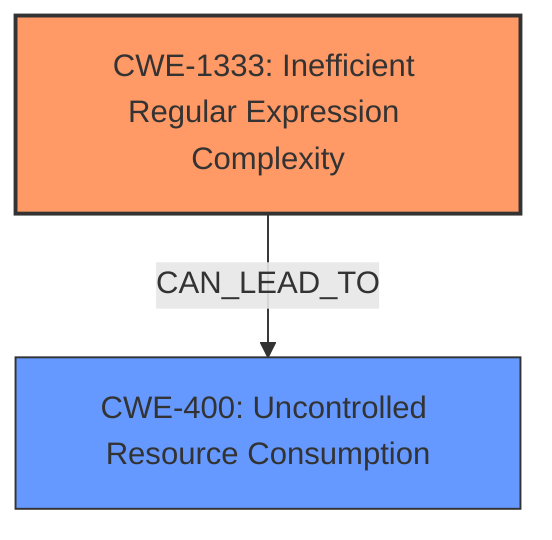

# Analysis for CVE-2024-7610

# Summary
| CWE ID | CWE Name | Confidence | CWE Abstraction Level | CWE Vulnerability Mapping Label | CWE-Vulnerability Mapping Notes |
|---|---|---|---|---|---|
| CWE-1333 | Inefficient Regular Expression Complexity | 1.0 | Base | Allowed | Primary CWE |
| CWE-400 | Uncontrolled Resource Consumption | 0.7 | Class | Discouraged | Secondary Candidate |

## Evidence and Confidence

*   **Confidence Score:** 0.9
*   **Evidence Strength:** HIGH

## Relationship Analysis
The primary relationship is that CWE-1333 (**Inefficient Regular Expression Complexity**) can lead to CWE-400 (**Uncontrolled Resource Consumption**). CWE-1333 is a Base level CWE, representing the root cause, while CWE-400 is a Class level CWE representing the impact. The retriever results support the selection of CWE-1333 due to its high similarity score and its base level of abstraction.

## Vulnerability Chain
The vulnerability chain starts with the **inefficient regular expression** (CWE-1333). This inefficiency leads to **catastrophic backtracking** when processing specific inputs, which in turn causes **high CPU usage** and ultimately results in a **Denial of Service (DoS)** (CWE-400).

CWE-1333 (Root Cause) -> Catastrophic Backtracking -> High CPU Usage -> CWE-400 (DoS Impact).

## Summary of Analysis
The primary weakness is the **inefficient regular expression** that causes catastrophic backtracking, leading to a denial-of-service condition. This aligns with CWE-1333 (**Inefficient Regular Expression Complexity**), which is a Base-level CWE and accurately represents the root cause. The vulnerability description clearly states that the root cause is a regular expression that can cause catastrophic backtracking, which is direct evidence supporting CWE-1333.

CWE-400 (**Uncontrolled Resource Consumption**) is a possible secondary CWE, representing the impact of the vulnerability (DoS). However, it's a Class-level CWE and is often misused. The focus should be on the root cause (CWE-1333).

The evidence from the CVE Reference Links Content Summary is: "Regular expression denial-of-service (ReDoS) vulnerability due to an **inefficient regular expression** pattern."

I've selected CWE-1333 as the primary CWE because it is the most specific and accurate representation of the root cause, as supported by the vulnerability description and retriever results. It is also at the optimal level of specificity (Base).

Relevant CWE Information:

# Enhanced Context (25 CWEs)
The following CWEs were identified as potentially relevant to this vulnerability:

## CWE-1333: Inefficient Regular Expression Complexity
**Abstraction Level**: Base
**Similarity Score**: 0.70
**Source**: dense

**Description**:
The product uses a regular expression with an inefficient, possibly exponential worst-case computational complexity that consumes excessive CPU cycles.

**Mapping Guidance**:
- Usage: Allowed
- Rationale: This CWE entry is at the Base level of abstraction, which is a preferred level of abstraction for mapping to the root causes of vulnerabilities.

## CWE-400: Uncontrolled Resource Consumption
**Abstraction Level**: Class
**Similarity Score**: 666.68
**Source**: sparse

**Description**:
The product does not properly control the allocation and maintenance of a limited resource, thereby enabling an actor to influence the amount of resources consumed, eventually leading to the exhaustion of available resources.

**Mapping Guidance**:
- Usage: Discouraged
- Rationale: CWE-400 is intended for incorrect behaviors in which the product is expected to track and restrict how many resources it consumes, but CWE-400 is often misused because it is conflated with the "technical impact" of vulnerabilities in which resource consumption occurs. It is sometimes used for low-information vulnerability reports. It is a level-1 Class (i.e., a child of a Pillar).