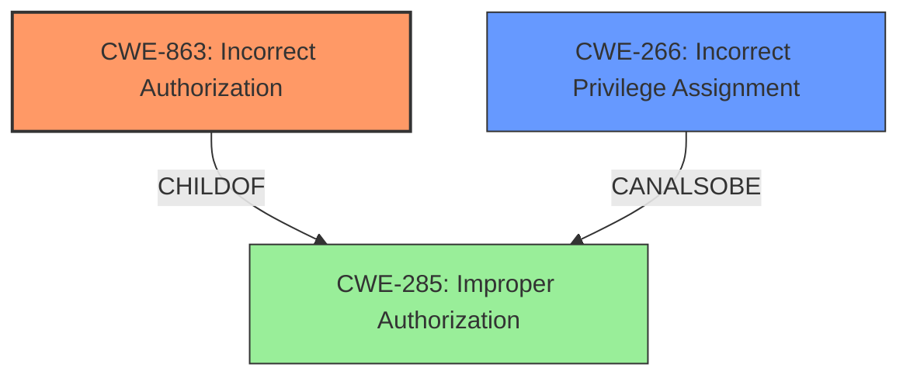

# Analysis for CVE-2024-7624

# Summary
| CWE ID | CWE Name | Confidence | CWE Abstraction Level | CWE Vulnerability Mapping Label | CWE-Vulnerability Mapping Notes |
|---|---|---|---|---|---|
| CWE-863 | Incorrect Authorization | 0.9 | Class | Primary CWE | Allowed-with-Review |
| CWE-266 | Incorrect Privilege Assignment | 0.7 | Base | Secondary Candidate | Allowed |

## Evidence and Confidence

*   **Confidence Score:** 0.8
*   **Evidence Strength:** HIGH

## Relationship Analysis
The primary relationship influencing the decision is the hierarchical relationship between CWE-863 Incorrect Authorization and CWE-285 Improper Authorization, with CWE-863 being more specific. Additionally, the guidance on privileges versus permissions helped differentiate between CWE-266 and CWE-863. The vulnerability involves the plugin performing an authorization check, but performing it incorrectly, making CWE-863 a better fit than CWE-862.

## Vulnerability Chain
The vulnerability chain starts with the **improper authorization** check within the `update_user_access()` function. This leads to a user with subscriber-level access being able to grant themselves full access to the plugin settings, resulting in privilege escalation.

## Summary of Analysis
The initial analysis focused on the fact that the Zephyr Project Manager plugin **not properly checking a users capabilities** before allowing them to enable access to the plugins settings through the `update_user_access()` function. This evidence led to the selection of CWE-863 Incorrect Authorization as the primary CWE. The "**not properly checking a users capabilities**" phrase is the key indicator. The retriever results also support this selection, with CWE-863 being a top candidate. The privilege vs. permissions guidance clarified that the issue is more about how the authorization logic is implemented rather than a simple misassignment of privileges.

The evidence supporting CWE-863 is strong, as the vulnerability description explicitly states that the plugin does perform a check, but does so incorrectly. This aligns perfectly with the definition of CWE-863. The abstraction level of Class for CWE-863 is appropriate, given that more specific details about the incorrect authorization are not available. CWE-266 is considered as a possible secondary CWE since the end result is that someone gets the wrong privileges, but the root cause is flawed authorization logic, not a direct assignment error.

Relevant CWE Information:

# Enhanced Context (25 CWEs)
The following CWEs were identified as potentially relevant to this vulnerability:

## CWE-863: Incorrect Authorization
**Abstraction Level**: Class
**Similarity Score**: 2461.81
**Source**: sparse

**Description**:
The product performs an authorization check when an actor attempts to access a resource or perform an action, but it does not correctly perform the check.

**Mapping Guidance**:
- Usage: Allowed-with-Review
- Rationale: This CWE entry is a Class and might have Base-level children that would be more appropriate

## CWE-266: Incorrect Privilege Assignment
**Abstraction Level**: Base
**Similarity Score**: 2256.66
**Source**: sparse

**Description**:
A product incorrectly assigns a privilege to a particular actor, creating an unintended sphere of control for that actor.

**Mapping Guidance**:
- Usage: Allowed
- Rationale: This CWE entry is at the Base level of abstraction, which is a preferred level of abstraction for mapping to the root causes of vulnerabilities.