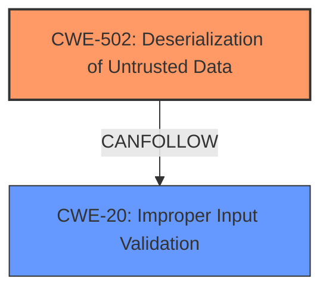

# Enhanced Analysis for CVE-2024-7656

# Summary

| CWE ID    | CWE Name                                                                 | Confidence | CWE Abstraction Level | CWE Vulnerability Mapping Label | CWE-Vulnerability Mapping Notes |
| :-------- | :----------------------------------------------------------------------- | :--------- | :---------------------- | :------------------------------ | :------------------------------ |
| CWE-502   | Deserialization of Untrusted Data                                        | 1.0        | Base                    | Primary                         | Allowed                       |
| CWE-20    | Improper Input Validation                                        | 0.7        | Class                    | Secondary                         | Allowed                       |

## Evidence and Confidence

*   **Confidence Score:** 1.0
*   **Evidence Strength:** HIGH

## Relationship Analysis

The primary weakness is **CWE-502 Deserialization of Untrusted Data**, which is a **Base** level CWE. This CWE is appropriate because the vulnerability description explicitly states that the plugin is vulnerable due to **deserialization of untrusted input**. **CWE-502** can lead to **CWE-20 Improper Input Validation** if the deserialized data is not validated correctly after deserialization. This could then lead to various impacts, such as arbitrary file deletion, sensitive data retrieval, or code execution, depending on the presence of a POP chain. Therefore, **CWE-20** can follow **CWE-502**.



## Vulnerability Chain

The vulnerability chain starts with the **deserialization of untrusted input** (**CWE-502**). If the deserialized data is not properly validated (**CWE-20**), it can lead to object injection, potentially allowing an attacker to delete arbitrary files, retrieve sensitive data, or execute code if a suitable POP chain is present.

## Summary of Analysis

The primary weakness is clearly **CWE-502 Deserialization of Untrusted Data**, as the vulnerability description explicitly states that the plugin is vulnerable due to the **deserialization of untrusted input** in the `devvn_ihotspot_shortcode_func` function. "This makes it possible for authenticated attackers, with Author-level access and above, to inject a PHP Object."
The evidence is strong, and the mapping aligns with the CWE's definition.
The relationship data indicates that **CWE-502** can lead to further vulnerabilities, especially **CWE-20 Improper Input Validation**, if the data is not validated after being deserialized.
I am highly confident in this assessment, as the description directly mentions deserialization of untrusted data, which is the core characteristic of **CWE-502**.

# Enhanced Context (25 CWEs)

## CWE-74: Improper Neutralization of Special Elements in Output Used by a Downstream Component ('Injection')
**Abstraction Level**: Class
**Similarity Score**: 0.74

This CWE is not selected because it focuses on the injection of special elements into output, whereas the vulnerability involves **deserialization of untrusted input**.

## CWE-425: Direct Request ('Forced Browsing')
**Abstraction Level**: Base
**Similarity Score**: 0.73

This CWE is not selected as the vulnerability is not about direct requests or forced browsing.

## CWE-138: Improper Neutralization of Special Elements
**Abstraction Level**: Class
**Similarity Score**: 0.73

This CWE is not selected because it describes a general failure to neutralize special elements, whereas the vulnerability specifically involves **deserialization of untrusted data**, which is better captured by **CWE-502**.

## CWE-502: Deserialization of Untrusted Data
**Abstraction Level**: Base
**Similarity Score**: 0.72

This CWE is selected because it directly addresses the **deserialization of untrusted data** without proper validation, which is the root cause of the vulnerability.

## CWE-345: Insufficient Verification of Data Authenticity
**Abstraction Level**: Class
**Similarity Score**: 0.72

This CWE is not selected because the vulnerability is not primarily about verifying data authenticity.

## CWE-1390: Weak Authentication
**Abstraction Level**: Class
**Similarity Score**: 0.72

This CWE is not selected because the vulnerability is not about weak authentication mechanisms.

## CWE-472: External Control of Assumed-Immutable Web Parameter
**Abstraction Level**: Base
**Similarity Score**: 0.72

This CWE is not selected because the vulnerability is not about external control of assumed-immutable web parameters.

## CWE-1391: Use of Weak Credentials
**Abstraction Level**: Class
**Similarity Score**: 0.72

This CWE is not selected because the vulnerability is not about the use of weak credentials.

## CWE-497: Exposure of Sensitive System Information to an Unauthorized Control Sphere
**Abstraction Level**: Base
**Similarity Score**: 0.72

This CWE is not selected because the vulnerability is not primarily about the exposure of sensitive system information.

## CWE-693: Protection Mechanism Failure
**Abstraction Level**: Pillar
**Similarity Score**: 0.72

This CWE is not selected because it is too high-level and doesn't accurately represent the specific weakness.

## CWE-22: Improper Limitation of a Pathname to a Restricted Directory ('Path Traversal')
**Abstraction Level**: Base
**Similarity Score**: 4093.15

This CWE is not selected because the vulnerability is not about path traversal.

## CWE-352: Cross-Site Request Forgery (CSRF)
**Abstraction Level**: Compound
**Similarity Score**: 4028.77

This CWE is not selected because the vulnerability is not about cross-site request forgery.

## CWE-639: Authorization Bypass Through User-Controlled Key
**Abstraction Level**: Base
**Similarity Score**: 4024.50

This CWE is not selected because the vulnerability is not about authorization bypass through user-controlled keys.

## CWE-863: Incorrect Authorization
**Abstraction Level**: Class
**Similarity Score**: 3958.99

This CWE is not selected because the vulnerability is not primarily about incorrect authorization.

## CWE-306: Missing Authentication for Critical Function
**Abstraction Level**: Base
**Similarity Score**: 3957.52

This CWE is not selected because the vulnerability is not about missing authentication for a critical function.

## CWE-20: Improper Input Validation
**Abstraction Level**: Class
**Similarity Score**: N/A

This CWE is a potential secondary candidate because the **deserialized data** should be validated, and a failure to do so is **improper input validation**.

## CWE-79: Improper Neutralization of Input During Web Page Generation ('Cross-site Scripting')
**Abstraction Level**: base
**Similarity Score**: 2.84

This CWE is not selected because the vulnerability is not about cross-site scripting.

## CWE-94: Improper Control of Generation of Code ('Code Injection')
**Abstraction Level**: base
**Similarity Score**: 2.42

This CWE is not selected because the vulnerability, while it can lead to code execution given a POP chain, is not directly about code injection. The root cause is the **deserialization of untrusted data**.

## CWE-471: Modification of Assumed-Immutable Data (MAID)
**Abstraction Level**: base
**Similarity Score**: 2.21

This CWE is not selected because the vulnerability is not about modification of assumed-immutable data.

## CWE-73: External Control of File Name or Path
**Abstraction Level**: base
**Similarity Score**: 2.21

This CWE is not selected because the vulnerability is not about external control of file names or paths.

## CWE-613: Insufficient Session Expiration
**Abstraction Level**: base
**Similarity Score**: 2.09

This CWE is not selected because the vulnerability is not about insufficient session expiration.

## CWE-98: Improper Control of Filename for Include/Require Statement in PHP Program ('PHP Remote File Inclusion')
**Abstraction Level**: variant
**Similarity Score**: 2.04

This CWE is not selected because the vulnerability is not about PHP remote file inclusion.


## CWE Relationship Analysis

Current CWEs represent these abstraction levels: .


### Vulnerability Chain Analysis

**Chain starting from CWE-471:**
- 471 (Modification of Assumed-Immutable Data (MAID)) - ROOT


**Chain starting from CWE-94:**
- 94 (Improper Control of Generation of Code ('Code Injection')) - ROOT


### CWE Relationship Diagram

```mermaid
graph TD
    classDef primary fill:#f96,stroke:#333,stroke-width:2px
    classDef secondary fill:#69f,stroke:#333
    classDef tertiary fill:#9e9,stroke:#333
```