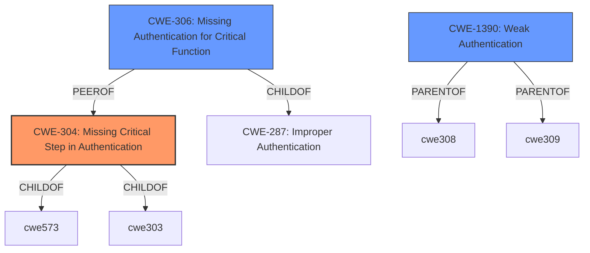

# Raw Analyzer Response for CVE-2024-7745

# Summary
| CWE ID | CWE Name | Confidence | CWE Abstraction Level | CWE Vulnerability Mapping Label | CWE-Vulnerability Mapping Notes |
|---|---|---|---|---|---|
| CWE-304 | Missing Critical Step in Authentication | 0.9 | Base | Primary CWE | Allowed |
| CWE-306 | Missing Authentication for Critical Function | 0.7 | Base | Secondary Candidate | Allowed |
| CWE-1390 | Weak Authentication | 0.6 | Class | Secondary Candidate | Allowed-with-Review |

## Evidence and Confidence

*   **Confidence Score:** 0.9
*   **Evidence Strength:** HIGH

## Relationship Analysis
The primary CWE is CWE-304, Missing Critical Step in Authentication, which is a child of CWE-573, Improperly Implemented Security Check. It also relates to CWE-303, Incorrect Implementation of Authentication Algorithm. CWE-306, Missing Authentication for Critical Function, is a child of CWE-287, Improper Authentication. CWE-1390, Weak Authentication, is a class-level CWE that can be a parent of CWE-308, Use of Single-factor Authentication, and CWE-309, Use of Password System for Primary Authentication. The relationships suggest a hierarchy of authentication-related weaknesses, with CWE-304 being the most specific and relevant in this case.

## Vulnerability Chain
The vulnerability chain starts with a **missing critical step in multi-factor authentication** (CWE-304), which allows users to bypass the second-factor verification, leading to login with only username and password.
  - **Root Cause**: CWE-304: Missing Critical Step in Authentication
  - **Impact**: User bypasses second-factor authentication.

## Summary of Analysis
The initial analysis considered several CWEs related to authentication and authorization. The primary focus was on identifying the **root cause** of the vulnerability, which is the **missing critical step in multi-factor authentication**.
CWE-304 (Missing Critical Step in Authentication) was selected as the primary CWE because it directly addresses the root cause of the vulnerability, i.e., the failure to properly implement multi-factor authentication. The vulnerability description explicitly states that a **critical step is missing**, which aligns perfectly with CWE-304.

CWE-306 (Missing Authentication for Critical Function) was considered because the impact is that authentication can be bypassed. However, since the application intends to use multi-factor authentication, the issue is not a complete absence of authentication but rather a flaw in its implementation.

CWE-1390 (Weak Authentication) was considered as it describes the overall weakness of the authentication mechanism. However, CWE-304 provides a more specific description of the root cause.

The final decision to prioritize CWE-304 was influenced by the explicit mention of the **missing step** in the vulnerability description, making it a precise match. The other CWEs were considered but deemed less specific to the **root cause**. The selection is based on the evidence: "**Missing Critical Step in Multi-Factor Authentication** of the Web Transfer Module allows users to skip the second-factor verification and log in with username and password only." The chosen CWEs are at the optimal level of specificity, with CWE-304 being a base-level CWE that directly addresses the missing step in authentication.

Relevant CWE Information:

# Enhanced Context (25 CWEs)
The following CWEs were identified as potentially relevant to this vulnerability:

## CWE-303: Incorrect Implementation of Authentication Algorithm
**Abstraction Level**: Base
**Similarity Score**: 0.77
**Source**: dense

**Description**:
The requirements for the product dictate the use of an established authentication algorithm, but the implementation of the algorithm is incorrect.

**Mapping Guidance**:
- Usage: Allowed
- Rationale: This CWE entry is at the Base level of abstraction, which is a preferred level of abstraction for mapping to the root causes of vulnerabilities.

## CWE-41: Improper Resolution of Path Equivalence
**Abstraction Level**: Base
**Similarity Score**: 0.75
**Source**: dense

**Description**:
The product is vulnerable to file system contents disclosure through path equivalence. Path equivalence involves the use of special characters in file and directory names. The associated manipulations are intended to generate multiple names for the same object.

**Mapping Guidance**:
- Usage: Allowed
- Rationale: This CWE entry is at the Base level of abstraction, which is a preferred level of abstraction for mapping to the root causes of vulnerabilities.

## CWE-288: Authentication Bypass Using an Alternate Path or Channel
**Abstraction Level**: Base
**Similarity Score**: 0.75
**Source**: dense

**Description**:
The product requires authentication, but the product has an alternate path or channel that does not require authentication.

**Mapping Guidance**:
- Usage: Allowed
- Rationale: This CWE entry is at the Base level of abstraction, which is a preferred level of abstraction for mapping to the root causes of vulnerabilities.

## CWE-807: Reliance on Untrusted Inputs in a Security Decision
**Abstraction Level**: Base
**Similarity Score**: 0.74
**Source**: dense

**Description**:
The product uses a protection mechanism that relies on the existence or values of an input, but the input can be modified by an untrusted actor in a way that bypasses the protection mechanism.

**Mapping Guidance**:
- Usage: Allowed
- Rationale: This CWE entry is at the Base level of abstraction, which is a preferred level of abstraction for mapping to the root causes of vulnerabilities.

## CWE-1391: Use of Weak Credentials
**Abstraction Level**: Class
**Similarity Score**: 0.74
**Source**: dense

**Description**:
The product uses weak credentials (such as a default key or hard-coded password) that can be calculated, derived, reused, or guessed by an attacker.

**Mapping Guidance**:
- Usage: Allowed-with-Review
- Rationale: This CWE entry is a Class and might have Base-level children that would be more appropriate

## CWE-345: Insufficient Verification of Data Authenticity
**Abstraction Level**: Class
**Similarity Score**: 0.74
**Source**: dense

**Description**:
The product does not sufficiently verify the origin or authenticity of data, in a way that causes it to accept invalid data.

**Mapping Guidance**:
- Usage: Discouraged
- Rationale: This CWE entry is a level-1 Class (i.e., a child of a Pillar). It might have lower-level children that would be more appropriate

## CWE-1390: Weak Authentication
**Abstraction Level**: Class
**Similarity Score**: 0.73
**Source**: dense

**Description**:
The product uses an authentication mechanism to restrict access to specific users or identities, but the mechanism does not sufficiently prove that the claimed identity is correct.

**Mapping Guidance**:
- Usage: Allowed-with-Review
- Rationale: This CWE entry is a Class and might have Base-level children that would be more appropriate

## CWE-178: Improper Handling of Case Sensitivity
**Abstraction Level**: Base
**Similarity Score**: 0.73
**Source**: dense

**Description**:
The product does not properly account for differences in case sensitivity when accessing or determining the properties of a resource, leading to inconsistent results.

**Mapping Guidance**:
- Usage: Allowed
- Rationale: This CWE entry is at the Base level of abstraction, which is a preferred level of abstraction for mapping to the root causes of vulnerabilities.

## CWE-472: External Control of Assumed-Immutable Web Parameter
**Abstraction Level**: Base
**Similarity Score**: 0.73
**Source**: dense

**Description**:
The web application does not sufficiently verify inputs that are assumed to be immutable but are actually externally controllable, such as hidden form fields.

**Mapping Guidance**:
- Usage: Allowed
- Rationale: This CWE entry is at the Base level of abstraction, which is a preferred level of abstraction for mapping to the root causes of vulnerabilities.

## CWE-425: Direct Request ('Forced Browsing')
**Abstraction Level**: Base