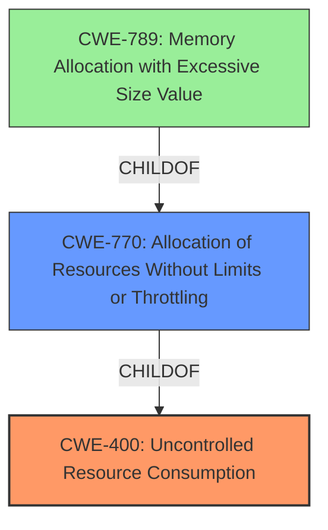

# Analysis Report for CVE-2024-7768

# Vulnerability Analysis Report: CVE-2024-7768

## Description

A vulnerability in the `/3/ImportFiles` endpoint of h2oai/h2o-3 version 3.46.1 allows an attacker to cause a denial of service. The endpoint takes a single GET parameter, `path`, which can be recursively set to reference itself. This leads the server to repeatedly call its own endpoint, eventually filling up the request queue and leaving the server unable to handle other requests.

## Vulnerability Description Key Phrases

- **Impact:** denial of service
- **Attacker:** attacker
- **Product:** h2oai/h2o-3
- **Version:** 3.46.1
- **Component:** /3/ImportFiles endpoint

## Analysis (with Relationship Data)

# Summary
| CWE ID | CWE Name | Confidence | CWE Abstraction Level | CWE Vulnerability Mapping Label | CWE-Vulnerability Mapping Notes |
|---|---|---|---|---|---|
| CWE-400 | Uncontrolled Resource Consumption | 0.9 | Class | Primary | Allowed-with-Review |
| CWE-770 | Allocation of Resources Without Limits or Throttling | 0.7 | Base | Secondary | Allowed |

## Evidence and Confidence

*   **Confidence Score:** 0.8
*   **Evidence Strength:** HIGH

## Relationship Analysis
The primary CWE is CWE-400 [Uncontrolled Resource Consumption], which is a Class-level CWE. CWE-770 [Allocation of Resources Without Limits or Throttling] is a Base-level CWE and a parent of CWE-789 [Memory Allocation with Excessive Size Value]. CWE-770 is a more specific type of resource consumption that involves allocating resources without limits. Since the vulnerability involves the server repeatedly calling its own endpoint, eventually filling up the request queue, CWE-770 is a relevant secondary CWE to consider.



## Vulnerability Chain
The vulnerability chain starts with the attacker providing a crafted request to the `/3/ImportFiles` endpoint. This request causes the server to recursively call its own endpoint, leading to **uncontrolled resource consumption** and ultimately resulting in a denial of service.

## Summary of Analysis
The vulnerability description clearly indicates that the server is experiencing a denial of service due to a recursive call to its own endpoint, which fills up the request queue. The primary cause is the **uncontrolled resource consumption** (CWE-400) due to the recursive nature of the endpoint call. While CWE-770 [Allocation of Resources Without Limits or Throttling] could also apply, CWE-400 is the more general and appropriate root cause.

The evidence from the vulnerability description is: "The endpoint takes a single GET parameter, `path`, which can be recursively set to reference itself. This leads the server to repeatedly call its own endpoint, eventually filling up the request queue and leaving the server unable to handle other requests."

CWE-306 [Missing Authentication for Critical Function], CWE-639 [Authorization Bypass Through User-Controlled Key], CWE-201 [Insertion of Sensitive Information Into Sent Data], CWE-23 [Relative Path Traversal], CWE-863 [Incorrect Authorization], and CWE-79 [Improper Neutralization of Input During Web Page Generation ('Cross-site Scripting')] were considered but do not directly apply to this vulnerability. The vulnerability is not related to authentication, authorization, information leakage, or input validation, but rather to the exhaustion of resources due to the recursive call.

I am selecting CWE-400 as the primary CWE because it accurately reflects the **uncontrolled resource consumption** leading to a denial of service. CWE-770 is selected as a secondary CWE because the recursive calls lead to resource allocation without limits or throttling.

Relevant CWE Information:
# Enhanced Context (25 CWEs)
The following CWEs were identified as potentially relevant to this vulnerability:

## CWE-23: Relative Path Traversal
**Abstraction Level**: Base
**Similarity Score**: 0.69
**Source**: dense

**Description**:
The product uses external input to construct a pathname that should be within a restricted directory, but it does not properly neutralize sequences such as ".." that can resolve to a location that is outside of that directory.

**Mapping Guidance**:
- Usage: Allowed
- Rationale: This CWE entry is at the Base level of abstraction, which is a preferred level of abstraction for mapping to the root causes of vulnerabilities.


## CWE-668: Exposure of Resource to Wrong Sphere
**Abstraction Level**: Class
**Similarity Score**: 0.69
**Source**: dense

**Description**:
The product exposes a resource to the wrong control sphere, providing unintended actors with inappropriate access to the resource.

**Mapping Guidance**:
- Usage: Discouraged
- Rationale: CWE-668 is high-level and is often misused as a catch-all when lower-level CWE IDs might be applicable. It is sometimes used for low-information vulnerability reports [REF-1287]. It is a level-1 Class (i.e., a child of a Pillar). It is not useful for trend analysis.


## CWE-294: Authentication Bypass by Capture-replay
**Abstraction Level**: Base
**Similarity Score**: 0.69
**Source**: dense

**Description**:
A capture-replay flaw exists when the design of the product makes it possible for a malicious user to sniff network traffic and bypass authentication by replaying it to the server in question to the same effect as the original message (or with minor changes).

**Mapping Guidance**:
- Usage: Allowed
- Rationale: This CWE entry is at the Base level of abstraction, which is a preferred level of abstraction for mapping to the root causes of vulnerabilities.


## CWE-74: Improper Neutralization of Special Elements in Output Used by a Downstream Component ('Injection')
**Abstraction Level**: Class
**Similarity Score**: 0.69
**Source**: dense

**Description**:
The product constructs all or part of a command, data structure, or record using externally-influenced input from an upstream component, but it does not neutralize or incorrectly neutralizes special elements that could modify how it is parsed or interpreted when it is sent to a downstream component.

**Mapping Guidance**:
- Usage: Discouraged
- Rationale: CWE-74 is high-level and often misused when lower-level weaknesses are more appropriate.


## CWE-303: Incorrect Implementation of Authentication Algorithm
**Abstraction Level**: Base
**Similarity Score**: 0.68
**Source**: dense

**Description**:
The requirements for the product dictate the use of an established authentication algorithm, but the implementation of the algorithm is incorrect.

**Mapping Guidance**:
- Usage: Allowed
- Rationale: This CWE entry is at the Base level of abstraction, which is a preferred level of abstraction for mapping to the root causes of vulnerabilities.


## CWE-434: Unrestricted Upload of File with Dangerous Type
**Abstraction Level**: Base
**Similarity Score**: 0.68
**Source**: dense

**Description**:
The product allows the upload or transfer of dangerous file types that are automatically processed within its environment.

**Mapping Guidance**:
- Usage: Allowed
- Rationale: This CWE entry is at the Base level of abstraction, which is a preferred level of abstraction for mapping to the root causes of vulnerabilities.


## CWE-497: Exposure of Sensitive System Information to an Unauthorized Control Sphere
**Abstraction Level**: Base
**Similarity Score**: 0.68
**Source**: dense

**Description**:
The product does not properly prevent sensitive system-level information from being accessed by unauthorized actors who do not have the same level of access to the underlying system as the product does.

**Mapping Guidance**:
- Usage: Allowed
- Rationale: This CWE entry is at the Base level of abstraction, which is a preferred level of abstraction for mapping to the root causes of vulnerabilities.


## CWE-212: Improper Removal of Sensitive Information Before Storage or Transfer
**Abstraction Level**: Base
**Similarity Score**: 0.68
**Source**: dense

**Description**:
The product stores, transfers, or shares a resource that contains sensitive information, but it does not properly remove that information before the product makes the resource available to unauthorized actors.

**Mapping Guidance**:
- Usage: Allowed
- Rationale: This CWE entry is at the Base level of abstraction, which is a preferred level of abstraction for mapping to the root causes of vulnerabilities.


## CWE-346: Origin Validation Error
**Abstraction Level**: Class
**Similarity Score**: 0.68
**Source**: dense

**Description**:
The product does not properly verify that the source of data or communication is valid.

**Mapping Guidance**:
- Usage: Allowed-with-Review
- Rationale: This CWE entry is a Class and might have Base-level children that would be more appropriate


## CWE-425: Direct Request ('Forced Browsing')
**Abstraction Level**: Base
**Similarity Score**: 0.68
**Source**: dense

**Description**:
The web application does not adequately enforce appropriate authorization on all restricted URLs, scripts, or files.

**Mapping Guidance**:
- Usage: Allowed
- Rationale: This CWE entry is at the Base level of abstraction, which is a preferred level of abstraction for mapping to the root causes of vulnerabilities.


## CWE-639: Authorization Bypass


## CWE Relationship Analysis

Current CWEs represent these abstraction levels: .


### Vulnerability Chain Analysis

**Chain starting from CWE-863:**
- 863 (Incorrect Authorization) - ROOT


**Chain starting from CWE-400:**
- 400 (Uncontrolled Resource Consumption) - ROOT


### CWE Relationship Diagram

```mermaid
graph TD
    classDef primary fill:#f96,stroke:#333,stroke-width:2px
    classDef secondary fill:#69f,stroke:#333
    classDef tertiary fill:#9e9,stroke:#333
```


*Report generated on 2025-07-14 03:07:28*
