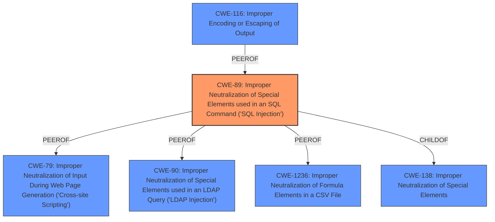

# Analysis Report for CVE-2024-7780

# Vulnerability Analysis Report: CVE-2024-7780

## Description

The Contact Form by Bit Form Multi Step Form, Calculation Contact Form, Payment Contact Form & Custom Contact Form builder plugin for WordPress is vulnerable to generic SQL Injection via the id parameter in versions 2.0 to 2.13.9 due to **insufficient escaping on the user-supplied parameter and lack of sufficient preparation on the existing SQL query**. This makes it possible for authenticated attackers, with Administrator-level access and above, to append additional SQL queries into already existing queries that can be used to extract sensitive information from the database.

## Vulnerability Description Key Phrases

- **Rootcause:** insufficient escaping on the user-supplied parameter and lack of sufficient preparation on the existing SQL query
- **Weakness:** SQL injection
- **Impact:** extract sensitive information from the database
- **Vector:** id parameter
- **Attacker:** authenticated attackers with Administrator-level access and above
- **Product:** ["['Bit Form Multi Step Form'", "'Calculation Contact Form'", "'Payment Contact Form & Custom Contact Form builder plugin']"]
- **Version:** 2.0 to 2.13.9

## Analysis (with Relationship Data)

# Summary
| CWE ID | CWE Name | Confidence | CWE Abstraction Level | CWE Vulnerability Mapping Label | CWE-Vulnerability Mapping Notes |
|---|---|---|---|---|---|
| CWE-89 | Improper Neutralization of Special Elements used in an SQL Command ('SQL Injection') | 1.0 | Base | Allowed | Primary CWE. The vulnerability is due to **insufficient escaping on the user-supplied parameter and lack of sufficient preparation on the existing SQL query**. |

## Evidence and Confidence

*   **Confidence Score:** 1.0
*   **Evidence Strength:** HIGH

## Relationship Analysis
The primary relationship influencing the selection is the direct match of the vulnerability description to the CWE-89 definition. While other CWEs exist related to neutralization, encoding, or authorization, CWE-89 directly addresses the **improper neutralization** leading to SQL injection. The base abstraction level is appropriate as it focuses on the specific weakness.



## Vulnerability Chain
The vulnerability chain is straightforward:
1.  **Root Cause:** **Insufficient escaping** and **lack of SQL query preparation** (CWE-89).
2.  **Impact:** SQL injection, leading to the ability to extract sensitive information from the database.

## Summary of Analysis
The analysis is based on the provided evidence, which clearly indicates an SQL injection vulnerability due to **insufficient escaping** and **lack of SQL query preparation**.

The key phrase from the Vulnerability Description is: "**insufficient escaping on the user-supplied parameter and lack of sufficient preparation on the existing SQL query**".

The CVE Reference Links Content Summary states: "Root cause of vulnerability: Insufficient input sanitization and lack of proper preparation of SQL queries" and "Weaknesses/vulnerabilities present: SQL injection".

The Retriever Results list CWE-89 as the top combined result with a score of 1.0.

CWE-89 is the most specific and accurate representation of the vulnerability. Other CWEs considered, such as those related to authorization or CSRF, are not directly relevant to the root cause. The base level of abstraction is appropriate because it directly describes the weakness.


## CWE Relationship Analysis

Current CWEs represent these abstraction levels: .


### Vulnerability Chain Analysis

**Chain starting from CWE-90:**
- 90 (Improper Neutralization of Special Elements used in an LDAP Query ('LDAP Injection')) - ROOT


**Chain starting from CWE-89:**
- 89 (Improper Neutralization of Special Elements used in an SQL Command ('SQL Injection')) - ROOT


### CWE Relationship Diagram

```mermaid
graph TD
    classDef primary fill:#f96,stroke:#333,stroke-width:2px
    classDef secondary fill:#69f,stroke:#333
    classDef tertiary fill:#9e9,stroke:#333
```


*Report generated on 2025-07-14 03:08:45*
