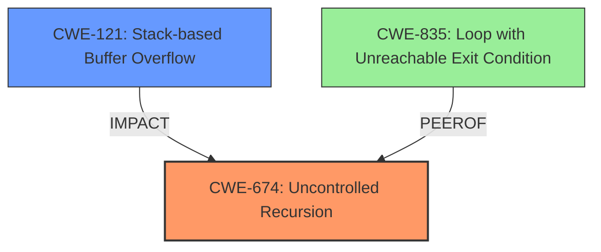

# Analysis Report for CVE-2024-7866

# Vulnerability Analysis Report: CVE-2024-7866

## Description

In Xpdf 4.05 (and earlier), a PDF object loop in a pattern resource leads to ****infinite recursion**** and a **stack overflow**.

## Vulnerability Description Key Phrases

- **Rootcause:** infinite recursion
- **Weakness:** ['infinite recursion', 'stack overflow']
- **Product:** Xpdf
- **Version:** 4.05 (and earlier)
- **Component:** PDF object loop in a pattern resource

## Analysis (with Relationship Data)

# Summary
| CWE ID  | CWE Name                                                                  | Confidence | CWE Abstraction Level | CWE Vulnerability Mapping Label | CWE-Vulnerability Mapping Notes |
| :-------- | :------------------------------------------------------------------------ | :--------- | :---------------------- | :------------------------------ | :------------------------------ |
| CWE-674   | Uncontrolled Recursion                                                    | 1          | Class                   | Primary                         | Allowed-with-Review             |
| CWE-121   | Stack-based Buffer Overflow                                               | 0.7        | Base                    | Secondary                       | N/A                             |

## Evidence and Confidence

*   **Confidence Score:** 0.85
*   **Evidence Strength:** HIGH

## Relationship Analysis
The primary CWE is CWE-674, Uncontrolled Recursion, which is a Class-level CWE. The vulnerability description mentions **infinite recursion** leading to a **stack overflow**. While a stack overflow can be directly related to CWE-121, Stack-based Buffer Overflow, the root cause is the uncontrolled recursion. CWE-674 is a parent of more specific Base-level CWEs, but none of them are a perfect fit. CWE-674 can lead to resource exhaustion, which is consistent with the stack overflow. Therefore, the most appropriate primary CWE is CWE-674.



## Vulnerability Chain
The vulnerability chain starts with a **PDF object loop in a pattern resource** leading to **infinite recursion**, which then causes a **stack overflow**.

-   **Root Cause:** **Infinite recursion** due to the loop.
-   **Weakness:** Uncontrolled Recursion (CWE-674)
-   **Impact:** Stack-based Buffer Overflow (CWE-121)

## Summary of Analysis
The analysis focuses on identifying the root cause of the vulnerability and mapping it to the most appropriate CWE. The vulnerability description clearly states that the **infinite recursion** leads to a **stack overflow**. While **stack overflow** is a symptom, the root cause is the **uncontrolled recursion**.

CWE-674 (Uncontrolled Recursion) is selected as the primary CWE because it directly addresses the root cause of the vulnerability. The description of CWE-674 states that the product does not properly control the amount of recursion that takes place, consuming excessive resources, such as allocated memory or the program stack, which perfectly aligns with the vulnerability description.

CWE-121 (Stack-based Buffer Overflow) is considered a secondary CWE because it is a consequence of the **uncontrolled recursion**. The **stack overflow** occurs because the recursion consumes excessive stack space, leading to the overflow.

The retriever scores also support this analysis, with CWE-674 having the highest score for the keyphrases **infinite recursion** and **stack overflow**.

The selected CWEs are at the optimal level of specificity because CWE-674 is a Class-level CWE, and there isn't a more specific Base-level CWE that accurately captures the root cause of the vulnerability. CWE-121 is a base CWE and adequately describes the stack overflow condition.

Relevant CWE Information:
# Enhanced Context (25 CWEs)
The following CWEs were identified as potentially relevant to this vulnerability:

## CWE-703: Improper Check or Handling of Exceptional Conditions
**Abstraction Level**: Pillar
**Similarity Score**: 0.70
**Source**: dense

**Description**:
The product does not properly anticipate or handle exceptional conditions that rarely occur during normal operation of the product.

**Mapping Guidance**:
- Usage: Discouraged
- Rationale: This CWE entry is extremely high-level, a Pillar.

## CWE-668: Exposure of Resource to Wrong Sphere
**Abstraction Level**: Class
**Similarity Score**: 0.70
**Source**: dense

**Description**:
The product exposes a resource to the wrong control sphere, providing unintended actors with inappropriate access to the resource.

**Mapping Guidance**:
- Usage: Discouraged
- Rationale: CWE-668 is high-level and is often misused as a catch-all when lower-level CWE IDs might be applicable. It is sometimes used for low-information vulnerability reports [REF-1287]. It is a level-1 Class (i.e., a child of a Pillar). It is not useful for trend analysis.

## CWE-41: Improper Resolution of Path Equivalence
**Abstraction Level**: Base
**Similarity Score**: 0.70
**Source**: dense

**Description**:
The product is vulnerable to file system contents disclosure through path equivalence. Path equivalence involves the use of special characters in file and directory names. The associated manipulations are intended to generate multiple names for the same object.

**Mapping Guidance**:
- Usage: Allowed
- Rationale: This CWE entry is at the Base level of abstraction, which is a preferred level of abstraction for mapping to the root causes of vulnerabilities.

## CWE-824: Access of Uninitialized Pointer
**Abstraction Level**: Base
**Similarity Score**: 0.70
**Source**: dense

**Description**:
The product accesses or uses a pointer that has not been initialized.

**Mapping Guidance**:
- Usage: Allowed
- Rationale: This CWE entry is at the Base level of abstraction, which is a preferred level of abstraction for mapping to the root causes of vulnerabilities.

## CWE-131: Incorrect Calculation of Buffer Size
**Abstraction Level**: Base
**Similarity Score**: 0.70
**Source**: dense

**Description**:
The product does not correctly calculate the size to be used when allocating a buffer, which could lead to a buffer overflow.

**Mapping Guidance**:
- Usage: Allowed
- Rationale: This CWE entry is at the Base level of abstraction, which is a preferred level of abstraction for mapping to the root causes of vulnerabilities.

## CWE-754: Improper Check for Unusual or Exceptional Conditions
**Abstraction Level**: Class
**Similarity Score**: 0.70
**Source**: dense

**Description**:
The product does not check or incorrectly checks for unusual or exceptional conditions that are not expected to occur frequently during day to day operation of the product.

**Mapping Guidance**:
- Usage: Allowed-with-Review
- Rationale: This CWE entry is a Class and might have Base-level children that would be more appropriate

## CWE-404: Improper Resource Shutdown or Release
**Abstraction Level**: Class
**Similarity Score**: 0.70
**Source**: dense

**Description**:
The product does not release or incorrectly releases a resource before it is made available for re-use.

**Mapping Guidance**:
- Usage: Allowed-with-Review
- Rationale: This CWE entry is a Class and might have Base-level children that would be more appropriate

## CWE-696: Incorrect Behavior Order
**Abstraction Level**: Class
**Similarity Score**: 0.70
**Source**: dense

**Description**:
The product performs multiple related behaviors, but the behaviors are performed in the wrong order in ways which may produce resultant weaknesses.

**Mapping Guidance**:
- Usage: Allowed-with-Review
- Rationale: This CWE entry is a Class and might have Base-level children that would be more appropriate

## CWE-657: Violation of Secure Design Principles
**Abstraction Level**: Class
**Similarity Score**: 0.69
**Source**: dense

**Description**:
The product violates well-established principles for secure design.

**Mapping Guidance**:
- Usage: Discouraged
- Rationale: This CWE entry is a level-1 Class (i.e., a child of a Pillar). It might have lower-level children that would be more appropriate

## CWE-330: Use of Insufficiently Random Values
**Abstraction Level**: Class
**Similarity Score**: 0.69
**Source**: dense

**Description**:
The product uses insufficiently random numbers or values in a security context that depends on unpredictable numbers.

**Mapping Guidance**:
- Usage: Discouraged
- Rationale: This CWE entry is a level-1 Class (i.e., a child of a Pillar). It might have lower-level children that would be more appropriate

## CWE-1325: Improperly Controlled Sequential Memory Allocation
**Abstraction Level**: Base
**Similarity Score**: 2777.31
**Source**: sparse

**Description**:
The product manages a group of objects or resources and performs a separate memory allocation for each object, but it does not properly limit the total amount of memory that is consumed by all of the combined objects.

**Mapping Guidance**:
- Usage: Allowed
- Rationale: This CWE entry is at


## CWE Relationship Analysis

Current CWEs represent these abstraction levels: .


### Vulnerability Chain Analysis

**Chain starting from CWE-121:**
- 121 (Stack-based Buffer Overflow) - ROOT


**Chain starting from CWE-404:**
- 404 (Improper Resource Shutdown or Release) - ROOT


### CWE Relationship Diagram

```mermaid
graph TD
    classDef primary fill:#f96,stroke:#333,stroke-width:2px
    classDef secondary fill:#69f,stroke:#333
    classDef tertiary fill:#9e9,stroke:#333
```


*Report generated on 2025-07-14 03:12:38*
