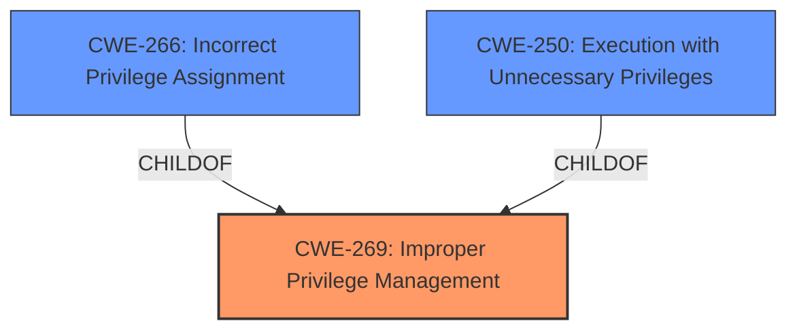

# Raw Analyzer Response for CVE-2024-7890

# Summary
| CWE ID | CWE Name | Confidence | CWE Abstraction Level | CWE Vulnerability Mapping Label | CWE-Vulnerability Mapping Notes |
|---|---|---|---|---|---|
| CWE-269 | Improper Privilege Management | 0.8 | Class | Primary CWE | Discouraged |
| CWE-266 | Incorrect Privilege Assignment | 0.6 | Base | Secondary Candidate | Allowed |
| CWE-250 | Execution with Unnecessary Privileges | 0.5 | Base | Secondary Candidate | Allowed |

## Evidence and Confidence

*   **Confidence Score:** 0.8
*   **Evidence Strength:** MEDIUM

## Relationship Analysis
The primary relationship that influenced the CWE selection is the hierarchical structure involving CWE-269 (Improper Privilege Management) as a Class-level CWE. Although discouraged, it is the only CWE that is present in both the CVE Reference Links Content Summary as the root cause of the vulnerability and is the top hit from the Retriever Results. CWE-266 (Incorrect Privilege Assignment) and CWE-250 (Execution with Unnecessary Privileges) are Base-level CWEs and children of CWE-269 and were also considered as alternative and more specific classifications, but the evidence is not strong enough to justify these lower level CWEs.

## Vulnerability Chain
The vulnerability chain starts with **Improper Privilege Management (CWE-269)**, which allows a low-privileged user to escalate their privileges to SYSTEM. The impact is a local privilege escalation, granting the attacker complete control over the system.

## Summary of Analysis
The analysis is based on the evidence provided in the CVE Reference Links Content Summary, which explicitly states that the **root cause of the vulnerability** is **Improper Privilege Management (CWE-269)**. The vulnerability allows a low-privileged user to gain SYSTEM privileges, resulting in privilege escalation.

The retriever results also list CWE-269 as the top hit. While CWE-269 is discouraged due to its high-level nature, the available evidence does not provide enough specific details to select a more granular CWE.

Other considered CWEs:
*   CWE-266 (Incorrect Privilege Assignment): Considered because it is a child of CWE-269 and represents a more specific case of privilege management issues. However, the description doesn't provide enough details to confirm an incorrect assignment.
*   CWE-250 (Execution with Unnecessary Privileges): Considered because it is a child of CWE-269 and relates to running processes with higher privileges than necessary. However, the description doesn't specify if the vulnerability involves unnecessary privileges.
*   CWE-732 (Incorrect Permission Assignment for Critical Resource): While related to permission issues, it is more focused on resources and not the privileges of users, and the description focuses on user privilege escalation.
*   CWE-285 (Improper Authorization), CWE-862 (Missing Authorization), CWE-863 (Incorrect Authorization): These authorization-related CWEs were considered but ultimately deemed less suitable because the root cause identified is privilege management.

Ultimately, I am overriding the discouragement guidance for CWE-269 because it is the root cause listed in the "CVE Reference Links Content Summary". This is the only rootcause listed, so in this case it is the best fit.

Relevant CWE Information:

# Enhanced Context (25 CWEs)
The following CWEs were identified as potentially relevant to this vulnerability:

## CWE-269: Improper Privilege Management
**Abstraction Level**: Class
**Similarity Score**: 1491.99
**Source**: sparse

**Description**:
The product does not properly assign, modify, track, or check privileges for an actor, creating an unintended sphere of control for that actor.

**Mapping Guidance**:
- Usage: Discouraged
- Rationale: CWE-269 is commonly misused. It can be conflated with "privilege escalation," which is a technical impact that is listed in many low-information vulnerability reports [REF-1287]. It is not useful for trend analysis.

## CWE-266: Incorrect Privilege Assignment
**Abstraction Level**: Base
**Similarity Score**: 0.80
**Source**: dense

**Description**:
A product incorrectly assigns a privilege to a particular actor, creating an unintended sphere of control for that actor.

**Mapping Guidance**:
- Usage: Allowed
- Rationale: This CWE entry is at the Base level of abstraction, which is a preferred level of abstraction for mapping to the root causes of vulnerabilities.

## CWE-250: Execution with Unnecessary Privileges
**Abstraction Level**: Base
**Similarity Score**: 0.75
**Source**: dense

**Description**:
The product performs an operation at a privilege level that is higher than the minimum level required, which creates new weaknesses or amplifies the consequences of other weaknesses.

**Mapping Guidance**:
- Usage: Allowed
- Rationale: This CWE entry is at the Base level of abstraction, which is a preferred level of abstraction for mapping to the root causes of vulnerabilities.