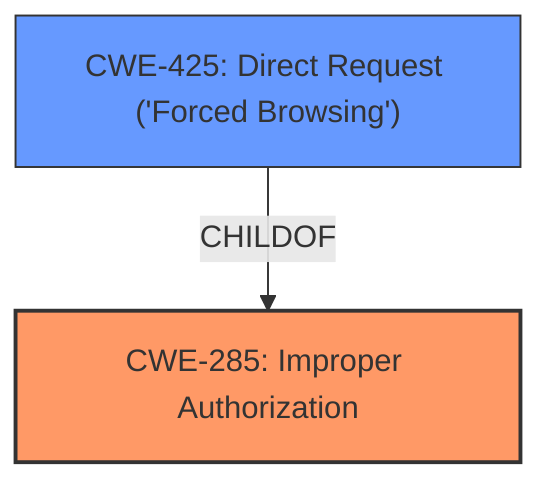

# Analysis Report for CVE-2024-7921

# Vulnerability Analysis Report: CVE-2024-7921

## Description

A vulnerability has been found in Anhui Deshun Intelligent Technology Jieshun JieLink+ JSOTC2016 up to 20240805 and classified as problematic. Affected by this vulnerability is an unknown functionality of the file /report/ParkOutRecord/GetDataList. The manipulation leads to **improper access controls**. The attack can be launched remotely. The exploit has been disclosed to the public and may be used.

## Vulnerability Description Key Phrases

- **Rootcause:** improper access controls
- **Product:** Anhui Deshun Intelligent Technology Jieshun JieLink+
- **Version:** JSOTC2016 up to 20240805
- **Component:** /report/ParkOutRecord/GetDataList

## Analysis (with Relationship Data)

# Summary
| CWE ID | CWE Name | Confidence | CWE Abstraction Level | CWE Vulnerability Mapping Label | CWE-Vulnerability Mapping Notes |
|---|---|---|---|---|---|
| CWE-285 | Improper Authorization | 0.8 | Class | Primary | Allowed-with-Review |
| CWE-425 | Direct Request ('Forced Browsing') | 0.7 | Base | Secondary | Allowed |

## Evidence and Confidence

*   **Confidence Score:** 0.75
*   **Evidence Strength:** MEDIUM

## Relationship Analysis
The primary relationship influencing the CWE selection is the hierarchical relationship between CWE-285 (Improper Authorization) and its potential children, including CWE-425 (Direct Request). While CWE-285 is a Class-level CWE, it aligns directly with the description of **improper access controls**. CWE-425 is a Base-level CWE that is more specific and indicates that the application does not adequately enforce authorization on restricted URLs. Given the information, CWE-425 can be a more specific instance of CWE-285.



## Vulnerability Chain
The vulnerability chain starts with **improper access controls** (CWE-285), leading to potential unauthorized access to the `/report/ParkOutRecord/GetDataList` functionality. This could then lead to sensitive information disclosure and data manipulation.

## Summary of Analysis
The initial analysis identified **improper access controls** as the root cause. The vulnerability description explicitly mentions this weakness. The retriever results also listed CWE-285 (Improper Authorization) as a candidate. Considering the relationship analysis, CWE-285 is a class-level CWE, and a more specific Base-level CWE, CWE-425 (Direct Request) fits the description better since the application doesn't adequately enforce authorization on restricted URLs, scripts, or files. Therefore, CWE-285 is considered the primary CWE due to the explicit mention of **improper access controls**, and CWE-425 is a secondary CWE as a more specific child.

Relevant CWE Information:

# Enhanced Context (25 CWEs)
The following CWEs were identified as potentially relevant to this vulnerability:

## CWE-425: Direct Request ('Forced Browsing')
**Abstraction Level**: Base
**Similarity Score**: 0.75
**Source**: dense

**Description**:
The web application does not adequately enforce appropriate authorization on all restricted URLs, scripts, or files.

**Mapping Guidance**:
- Usage: Allowed
- Rationale: This CWE entry is at the Base level of abstraction, which is a preferred level of abstraction for mapping to the root causes of vulnerabilities.

## CWE-285: Improper Authorization
**Abstraction Level**: Class
**Similarity Score**: 829.22
**Source**: sparse

**Description**:
The product does not perform or incorrectly performs an authorization check when an actor attempts to access a resource or perform an action.

**Mapping Guidance**:
- Usage: Discouraged
- Rationale: CWE-285 is high-level and lower-level CWEs can frequently be used instead. It is a level-1 Class (i.e., a child of a Pillar).

**CWE-285: Improper Authorization**
*   **Technical Explanation:** CWE-285 (Improper Authorization) describes the scenario where a product does not perform or incorrectly performs an authorization check. This aligns with the description of **improper access controls**. An attacker can gain unauthorized access to functionality or data due to the lack of proper checks.
*   **Security Implications:** The impact of this vulnerability is unauthorized access to sensitive information and potential data manipulation. An attacker could modify data within the database, leading to data corruption or loss.
*   **Relationships:** CWE-285 is a Class-level CWE. Child CWEs, like CWE-425 (Direct Request), provide more specific details.
*   **Mapping Guidance:** The usage is "Discouraged" because it's high-level, but it is the best fit given the direct reference to "**improper access controls**" in the description.
*   **Role:** Primary CWE
*   **Evidence:** "The manipulation leads to **improper access controls**."

**CWE-425: Direct Request ('Forced Browsing')**
*   **Technical Explanation:** CWE-425 (Direct Request) occurs when a web application does not adequately enforce authorization on all restricted URLs, scripts, or files. This allows attackers to directly access resources without proper authentication or authorization checks.
*   **Security Implications:** Attackers can bypass intended access restrictions, potentially accessing sensitive data, executing unauthorized actions, or disrupting system operations.
*   **Relationships:** CWE-425 is a child of CWE-285 (Improper Authorization). It represents a more specific case of authorization failure.
*   **Mapping Guidance:** The usage is "Allowed."
*   **Role:** Secondary CWE
*   **Evidence:** The vulnerability affects the `/report/ParkOutRecord/GetDataList` endpoint, suggesting a direct request vulnerability.

**CWEs Considered but Not Used:**

*   CWE-79 (Improper Neutralization of Input During Web Page Generation ('Cross-site Scripting')): While the retriever identified this, there's no indication of XSS in the provided description.
*   CWE-89 (Improper Neutralization of Special Elements used in an SQL Command ('SQL Injection')): Similarly, there's no evidence of SQL injection.
*   CWE-306 (Missing Authentication for Critical Function): While related, the description specifically mentions **improper access controls**, pointing more towards authorization issues rather than a complete lack of authentication.
*   CWE-78 (Improper Neutralization of Special Elements used in an OS Command ('OS Command Injection')): There is no evidence that this vulnerability involves OS command injection.


## CWE Relationship Analysis

Current CWEs represent these abstraction levels: .


### Vulnerability Chain Analysis

**Chain starting from CWE-89:**
- 89 (Improper Neutralization of Special Elements used in an SQL Command ('SQL Injection')) - ROOT


**Chain starting from CWE-79:**
- 79 (Improper Neutralization of Input During Web Page Generation ('Cross-site Scripting')) - ROOT


### CWE Relationship Diagram

```mermaid
graph TD
    classDef primary fill:#f96,stroke:#333,stroke-width:2px
    classDef secondary fill:#69f,stroke:#333
    classDef tertiary fill:#9e9,stroke:#333
```


*Report generated on 2025-07-14 03:15:31*
