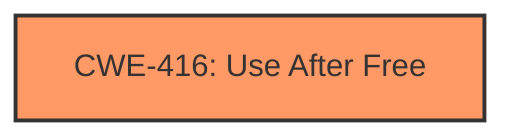

# Analysis Report for CVE-2024-7964

# Vulnerability Analysis Report: CVE-2024-7964

## Description

Use after free in Passwords in Google Chrome on Android prior to 128.0.6613.84 allowed a remote attacker to potentially exploit heap corruption via a crafted HTML page. (Chromium security severity High)

## Vulnerability Description Key Phrases

- **Rootcause:** use after free
- **Impact:** potentially exploit heap corruption
- **Vector:** crafted HTML page
- **Attacker:** remote attacker
- **Product:** Google Chrome on Android
- **Version:** prior to 128.0.6613.84
- **Component:** Passwords

## Analysis (with Relationship Data)

# Summary
| CWE ID | CWE Name | Confidence | CWE Abstraction Level | CWE Vulnerability Mapping Label | CWE-Vulnerability Mapping Notes |
|---|---|---|---|---|---|
| CWE-416 | Use After Free | 1.0 | Variant | Primary | Allowed |

## Evidence and Confidence

*   **Confidence Score:** 1.0
*   **Evidence Strength:** HIGH

## Relationship Analysis
The primary relationship influencing the decision is that CWE-416 is a Variant, which is the preferred level of abstraction. The retriever results also list it as the top candidate.



## Vulnerability Chain
The vulnerability chain consists of a **use after free** (**rootcause**), leading to potential heap corruption and arbitrary code execution.

## Summary of Analysis
The vulnerability description explicitly states "**use after free** in Passwords", which directly corresponds to CWE-416. The CVE Reference Links Content Summary also confirms "**Use after free**" as a weakness. The Retriever Results list CWE-416 as the top candidate. The description aligns well with the CWE definition.

Relevant CWE Information:

# Enhanced Context (25 CWEs)
The following CWEs were identified as potentially relevant to this vulnerability:

## CWE-416: Use After Free
**Abstraction Level**: Variant
**Similarity Score**: 0.76
**Source**: dense

**Description**:
The product reuses or references memory after it has been freed. At some point afterward, the memory may be allocated again and saved in another pointer, while the original pointer references a location somewhere within the new allocation. Any operations using the original pointer are no longer valid because the memory "belongs" to the code that operates on the new pointer.

**Mapping Guidance**:
- Usage: Allowed
- Rationale: This CWE entry is at the Variant level of abstraction, which is a preferred level of abstraction for mapping to the root causes of vulnerabilities.

CWE-416 is selected because the vulnerability description explicitly mentions "**use after free**", which matches the CWE name and description perfectly. The CWE is at the Variant level of abstraction, which is preferred. The retriever results also list it as the top candidate.

Other CWEs Considered but Not Used:

*   CWE-366: Race Condition within a Thread: While race conditions can sometimes lead to use-after-free, there's no direct evidence of a race condition in this vulnerability description.
*   CWE-843: Access of Resource Using Incompatible Type ('Type Confusion'): There is no evidence in the description to suggest type confusion is involved.
*   CWE-415: Double Free: The description specifies a "use after free", not a double free.
*   CWE-122: Heap-based Buffer Overflow: The description specifies a "use after free", not a buffer overflow.
*   CWE-362: Concurrent Execution using Shared Resource with Improper Synchronization ('Race Condition'): Similar to CWE-366, there's no direct evidence of a race condition.
*   CWE-911: Improper Update of Reference Count: There is no evidence in the description to suggest reference counting is involved.
*   CWE-356: Product UI does not Warn User of Unsafe Actions: This CWE relates to UI warnings, which is not relevant to this vulnerability.
*   CWE-1021: Improper Restriction of Rendered UI Layers or Frames: This CWE is about UI layering issues, which is not relevant to the vulnerability.
*   CWE-123: Write-what-where Condition: While use-after-free can lead to write-what-where, the primary issue is the use of freed memory, making CWE-416 more appropriate.


## CWE Relationship Analysis

Current CWEs represent these abstraction levels: .


### Vulnerability Chain Analysis

**Chain starting from CWE-123:**
- 123 (Write-what-where Condition) - ROOT


**Chain starting from CWE-416:**
- 416 (Use After Free) - ROOT


### CWE Relationship Diagram

```mermaid
graph TD
    classDef primary fill:#f96,stroke:#333,stroke-width:2px
    classDef secondary fill:#69f,stroke:#333
    classDef tertiary fill:#9e9,stroke:#333
```


*Report generated on 2025-07-14 03:17:22*
