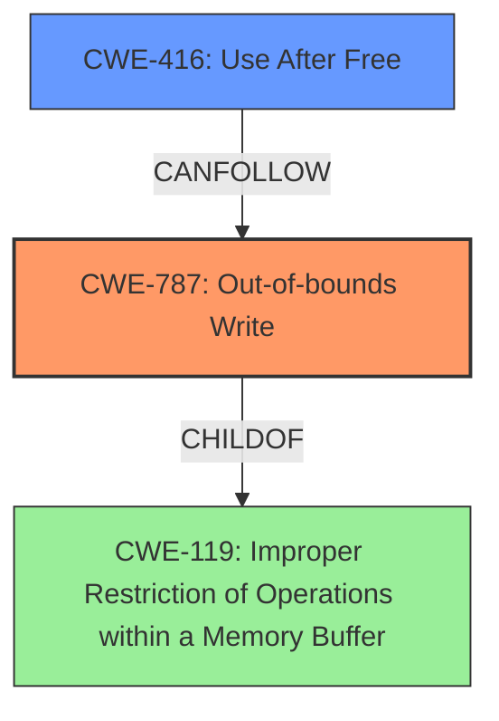

# Analysis for CVE-2024-7965

# Summary

| CWE ID | CWE Name | Confidence | CWE Abstraction Level | CWE Vulnerability Mapping Label | CWE-Vulnerability Mapping Notes |
|---|---|---|---|---|---|
| CWE-787 | Out-of-bounds Write | 0.75 | Base | Allowed | Primary CWE |
| CWE-416 | Use After Free | 0.6 | Variant | Allowed | Secondary Candidate |

## Evidence and Confidence

*   **Confidence Score:** 0.7
*   **Evidence Strength:** MEDIUM

## Relationship Analysis
The primary relationship influencing the selection of CWE-787 is its association with heap corruption, as mentioned in the vulnerability description. While CWE-416 is a potential secondary candidate due to the mention of heap corruption, the direct relationship of CWE-787 to out-of-bounds writes makes it a more suitable primary classification.

## Vulnerability Chain
The vulnerability chain starts with an **inappropriate implementation** in the V8 engine, leading to potential heap corruption, and potentially resulting in an out-of-bounds write.

## Summary of Analysis
The initial assessment focused on identifying the root cause and the resulting impact. The primary clue was the phrase "heap corruption," which narrowed down the possible CWEs. Although the description mentions "inappropriate implementation," this is too vague on its own. The reference to heap corruption suggests memory corruption issues. The "CWE for similar CVE Descriptions" listed CWE-787 [Out-of-bounds Write] as a top candidate.

The retriever results also suggested CWE-416 [Use After Free] and CWE-843 [Access of Resource Using Incompatible Type ('Type Confusion')], among others. After reviewing the CWE specifications, CWE-787 was deemed the most relevant because it directly addresses the potential for writing outside the intended memory bounds, which is a common consequence of heap corruption. CWE-416 was considered as a secondary CWE because heap corruption can sometimes lead to use-after-free conditions.

The selection of CWE-787 is at the base level of abstraction, which is the preferred level. It accurately represents the weakness. The confidence score is 0.75 because the vulnerability description is somewhat vague, and the heap corruption is only "potential." However, the evidence available points strongly to memory corruption due to an implementation flaw.

*Evidence:*
- Vulnerability Description Key Phrases: "Inappropriate implementation", "potentially exploit heap corruption"
- CVE Reference Links Content Summary: "The vulnerability is due to an 'Inappropriate implementation' in the V8 JavaScript engine."

**CWE Selection Details:**

*   **CWE-787: Out-of-bounds Write**
    *   **Explanation:** The vulnerability allows a remote attacker to potentially exploit heap corruption via a crafted HTML page, which suggests that the attacker can write data outside the intended memory buffer. The phrase "**inappropriate implementation**" suggests an error in the code that allows this to occur.
    *   **Security Implications:** Out-of-bounds write can lead to arbitrary code execution, denial of service, or information disclosure.
    *   **Relationship:** CWE-787 is a base-level CWE, and it is a child of CWE-119 [Improper Restriction of Operations within a Memory Buffer].
    *   **Usage:** Allowed.
*   **CWE-416: Use After Free**
    *   **Explanation:** Heap corruption can lead to memory being freed and then subsequently accessed, resulting in a use-after-free condition.
    *   **Security Implications:** Use-after-free can lead to arbitrary code execution, denial of service, or information disclosure.
    *   **Relationship:** CWE-416 is a variant-level CWE.
    *   **Usage:** Allowed.

**CWEs Considered But Not Used:**

*   **CWE-843: Access of Resource Using Incompatible Type ('Type Confusion')**: This was considered because heap corruption can sometimes involve type confusion. However, the primary issue appears to be writing data outside the intended buffer, making CWE-787 a more direct fit.
*   **CWE-122: Heap-based Buffer Overflow:** While this is related to heap corruption, the description does not explicitly state a buffer overflow. CWE-787 is more general and applies to any out-of-bounds write, not just overflows.
*   **CWE-451: User Interface (UI) Misrepresentation of Critical Information** and **CWE-356: Product UI does not Warn User of Unsafe Actions**: These are not relevant as the vulnerability is in the V8 engine and does not involve the user interface.