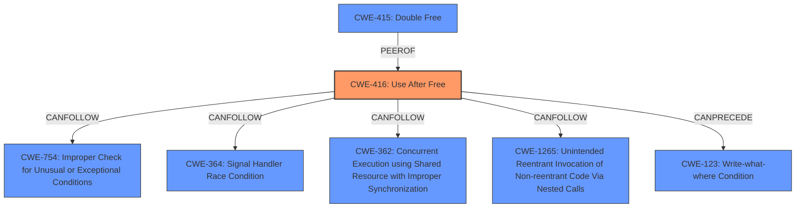

# Analysis Report for CVE-2024-7968

# Vulnerability Analysis Report: CVE-2024-7968

## Description

**Use after free** in Autofill in Google Chrome prior to 128.0.6613.84 allowed a remote attacker who had convinced the user to engage in specific UI interactions to potentially exploit heap corruption via a crafted HTML page. (Chromium security severity High)

## Vulnerability Description Key Phrases

- **Rootcause:** Use after free
- **Impact:** potentially exploit heap corruption
- **Vector:** crafted HTML page
- **Attacker:** remote attacker
- **Product:** Google Chrome
- **Version:** prior to 128.0.6613.84
- **Component:** Autofill

## Analysis (with Relationship Data)

# Summary
| CWE ID | CWE Name | Confidence | CWE Abstraction Level | CWE Vulnerability Mapping Label | CWE-Vulnerability Mapping Notes |
|---|---|---|---|---|---|
| CWE-416 | Use After Free | 1.0 | Variant | Allowed | Primary CWE. The vulnerability description explicitly states "Use after free". |

## Evidence and Confidence

*   **Confidence Score:** 1.0
*   **Evidence Strength:** HIGH

## Relationship Analysis
The primary identified CWE is CWE-416 (Use After Free), which is a variant-level CWE. There are several other CWEs that are related, such as CWE-123 (Write-what-where Condition) and CWE-415 (Double Free) that could occur after a Use After Free. The graph relationships show how CWE-416 can be a part of vulnerability chains.



## Vulnerability Chain
The vulnerability chain starts with a **use after free** (CWE-416). This can lead to heap corruption, as stated in the vulnerability description, and potentially other weaknesses such as write-what-where conditions or double frees.

## Summary of Analysis
The primary weakness is a **use after free** in the Autofill component of Google Chrome. The vulnerability description explicitly states this, and the CVE reference links content summary confirms it. The retriever results also strongly suggest CWE-416 as the primary CWE. Given the explicit nature of the description, there is high confidence in this assessment. The other CWEs were considered but not used because they describe potential consequences or related issues that could arise from a **use after free** but are not the root cause itself. The selection of CWE-416 is at the optimal level of specificity because it directly reflects the stated weakness.


## CWE Relationship Analysis

Current CWEs represent these abstraction levels: .


### Vulnerability Chain Analysis

**Chain starting from CWE-123:**
- 123 (Write-what-where Condition) - ROOT


**Chain starting from CWE-416:**
- 416 (Use After Free) - ROOT


### CWE Relationship Diagram

```mermaid
graph TD
    classDef primary fill:#f96,stroke:#333,stroke-width:2px
    classDef secondary fill:#69f,stroke:#333
    classDef tertiary fill:#9e9,stroke:#333
```


*Report generated on 2025-07-14 03:18:11*
