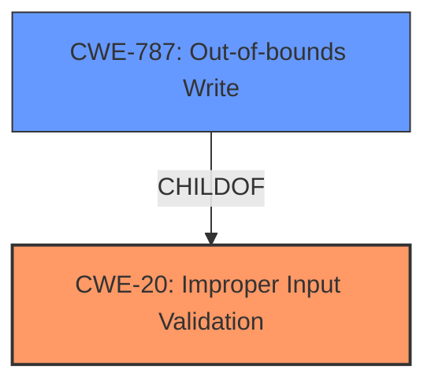

# Analysis Report for CVE-2024-7988

# Vulnerability Analysis Report: CVE-2024-7988

## Description

A remote code execution vulnerability exists in the Rockwell Automation ThinManager ThinServerTM that allows a threat actor to execute arbitrary code with System privileges. This vulnerability exists due to the **lack of proper data input validation**, which allows files to be overwritten.

## Vulnerability Description Key Phrases

- **Rootcause:** lack of proper data input validation
- **Impact:** ['execute arbitrary code', 'remote code execution']
- **Vector:** files to be overwritten
- **Attacker:** threat actor
- **Product:** Rockwell Automation ThinManager ThinServerTM

## Analysis (with Relationship Data)

# Summary
| CWE ID | CWE Name | Confidence | CWE Abstraction Level | CWE Vulnerability Mapping Label | CWE-Vulnerability Mapping Notes |
|---|---|---|---|---|---|
| CWE-20 | Improper Input Validation | 0.9 | Class | Primary CWE | Allowed-with-Review |
| CWE-787 | Out-of-bounds Write | 0.5 | Base | Secondary Candidate | Allowed |

## Evidence and Confidence

*   **Confidence Score:** 0.7
*   **Evidence Strength:** HIGH

## Relationship Analysis
The primary relationship influencing the CWE selection is the parent-child relationship where CWE-20 is a class-level CWE and includes more specific base-level CWEs. The vulnerability description indicates a **lack of proper data input validation**, which directly aligns with CWE-20. However, the details are limited. The retriever also returns CWE-787, as a result of **lack of proper data input validation**, which allows files to be overwritten.



## Vulnerability Chain
The vulnerability chain starts with **lack of proper data input validation** (CWE-20) leading to files being overwritten, which can lead to arbitrary code execution.
  - **Root Cause:** CWE-20 (**lack of proper data input validation**)
  - **Impact:** Arbitrary file overwrite leading to remote code execution

## Summary of Analysis
The initial assessment identified CWE-20 as the primary weakness due to the stated **lack of proper data input validation**. The evidence explicitly mentions that the vulnerability exists due to this **lack of proper data input validation**, which allows files to be overwritten. The relationship analysis considered the parent-child relationship between CWE-20 and more specific input validation CWEs.

The final decision emphasizes CWE-20 as the root cause. The selection is based on the explicit mention of **lack of proper data input validation** in the vulnerability description and CVE summary. CWE-787 is considered a potential secondary candidate, but the description does not have enough detail to promote this.

Relevant CWE Information:

# Enhanced Context (25 CWEs)
The following CWEs were identified as potentially relevant to this vulnerability:

## Vulnerability Description
A remote code execution vulnerability exists in the Rockwell Automation ThinManager ThinServerTM that allows a threat actor to execute arbitrary code with System privileges. This vulnerability exists due to the **lack of proper data input validation**, which allows files to be overwritten.

### Vulnerability Description Key Phrases
- **rootcause:** **lack of proper data input validation**
- **impact:** execute arbitrary code and remote code execution
- **vector:** files to be overwritten
- **attacker:** threat actor
- **product:** Rockwell Automation ThinManager ThinServerTM

## CVE Reference Links Content Summary
- **Root cause of vulnerability:** Improper input validation allows files to be overwritten.
- **Weaknesses/vulnerabilities present:** Lack of proper data input validation leading to arbitrary file overwrite.
- **Impact of exploitation:** Remote code execution with System privileges.
- **Attack vectors:** Network-based attack (AV:N), no user interaction (UI:N), no special privileges required (PR:N).

## Retriever Results

### Top Combined Results

| Rank | CWE ID | Name | Abstraction | Usage  | Retrievers | Individual Scores |
|------|--------|------|-------------|-------|------------|-------------------|
| 1 | 20 | Improper Input Validation | Class | Discouraged | sparse | 0.277 |
| 2 | 121 | Stack-based Buffer Overflow | Variant | Allowed | sparse | 0.276 |
| 3 | 119 | Improper Restriction of Operations within the Bounds of a Memory Buffer | Class | Discouraged | sparse | 0.266 |
| 4 | 787 | Out-of-bounds Write | Base | Allowed | sparse | 0.254 |
| 5 | 138 | Improper Neutralization of Special Elements | Class | Discouraged | sparse | 0.253 |
| 6 | 1284 | Improper Validation of Specified Quantity in Input | Base | Allowed | sparse | 0.251 |
| 7 | 1285 | Improper Validation of Specified Index, Position, or Offset in Input | Base | Allowed | sparse | 0.251 |
| 8 | 352 | Cross-Site Request Forgery (CSRF) | Compound | Allowed | sparse | 0.244 |
| 9 | 94 | Improper Control of Generation of Code ('Code Injection') | Base | Allowed-with-Review | dense | 0.577 |
| 10 | 825 | Expired Pointer Dereference | Base | Allowed | graph | 0.003 |

CWE-20: Improper Input Validation
- The product receives input or data, but it does not validate or incorrectly validates that the input has the properties that are required to process the data safely and correctly.
- Usage: Discouraged
- Rationale: CWE-20 is commonly misused in low-information vulnerability reports when lower-level CWEs could be used instead, or when more details about the vulnerability are available [REF-1287]. It is not useful for trend analysis. It is also a level-1 Class (i.e., a child of a Pillar).

CWE-787: Out-of-bounds Write
- CWE-787: Out-of-bounds Write
- Usage: Allowed
- Rationale: This CWE entry is at the Base level of abstraction, which is a preferred level of abstraction for mapping to the root causes of vulnerabilities.


## CWE Relationship Analysis

Current CWEs represent these abstraction levels: .


### Vulnerability Chain Analysis

**Chain starting from CWE-787:**
- 787 (Out-of-bounds Write) - ROOT


**Chain starting from CWE-20:**
- 20 (Improper Input Validation) - ROOT


### CWE Relationship Diagram

```mermaid
graph TD
    classDef primary fill:#f96,stroke:#333,stroke-width:2px
    classDef secondary fill:#69f,stroke:#333
    classDef tertiary fill:#9e9,stroke:#333
```


*Report generated on 2025-07-14 03:21:49*
