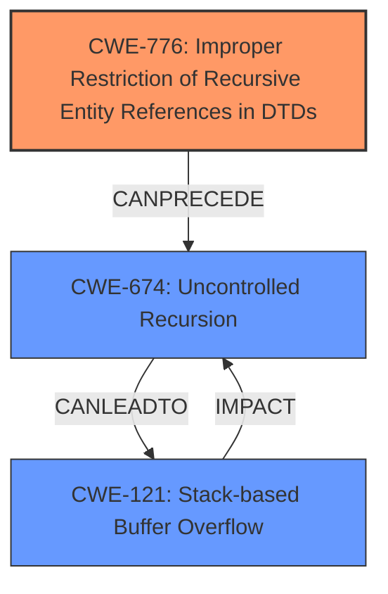

# Raw Analyzer Response for CVE-2024-8176

# Summary

| CWE ID    | CWE Name                                                                 | Confidence | CWE Abstraction Level | CWE Vulnerability Mapping Label | CWE-Vulnerability Mapping Notes |
| :-------- | :----------------------------------------------------------------------- | :--------- | :---------------------- | :------------------------------ | :------------------------------ |
| CWE-776   | Improper Restriction of Recursive Entity References in DTDs ('XML Entity Expansion') | 0.95       | Base                    | Primary                         | Allowed                       |
| CWE-674   | Uncontrolled Recursion                                                   | 0.80       | Class                   | Secondary                       | Allowed-with-Review           |
| CWE-121   | Stack-based Buffer Overflow                                              | 0.70       | Base                    | Secondary                       | Allowed                       |

## Evidence and Confidence

*   **Confidence Score:** 0.85
*   **Evidence Strength:** HIGH

## Relationship Analysis

The primary CWE is CWE-776, which directly addresses the **improper restriction of recursive entity references** in XML DTDs. CWE-674 (Uncontrolled Recursion) is a broader class that encompasses the specific issue in CWE-776, making it a related but less specific classification. The excessive recursion can lead to a **stack overflow**, potentially triggering CWE-121 (Stack-based Buffer Overflow) if the recursion overwrites stack memory. CWE-776 can precede CWE-674, and the resulting **uncontrolled recursion** can lead to CWE-121, creating a vulnerability chain.

## Vulnerability Chain

The vulnerability chain starts with **CWE-776 (Improper Restriction of Recursive Entity References in DTDs)**, which is the **root cause**. This leads to **CWE-674 (Uncontrolled Recursion)**, as the lack of proper restriction allows for excessive recursion. If the recursion goes too deep and overwrites stack memory, it results in **CWE-121 (Stack-based Buffer Overflow)**, causing **memory corruption** and potentially **denial of service**.

## Summary of Analysis

The analysis indicates that the primary weakness is the **improper handling of recursive entity references** in XML documents, which directly corresponds to CWE-776. The description explicitly mentions "recursive entity expansion" and the library's failure to "control the number of recursive definitions of entities." This aligns perfectly with CWE-776's description. The subsequent uncontrolled recursion leads to a **stack overflow**, which can potentially trigger a **stack-based buffer overflow** (CWE-121) and denial of service.

The other CWEs were considered, but deemed less appropriate:

*   CWE-611 (Improper Restriction of XML External Entity Reference): This CWE focuses on external entities, while the vulnerability description emphasizes recursive entity expansion within the DTD, making CWE-776 a more precise match.
*   CWE-190 (Integer Overflow or Wraparound): While integer overflows can lead to memory corruption, the vulnerability description does not mention integer calculations or overflows.
*   CWE-835 (Loop with Unreachable Exit Condition ('Infinite Loop')): While related to infinite loops, the problem is specifically related to recursion, not a general looping construct.
*   CWE-770 (Allocation of Resources Without Limits or Throttling): This is related to resource allocation without limits, the problem is about recursion with XML entities.

The chosen CWEs are at the optimal level of specificity. CWE-776 is a Base CWE that directly addresses the **root cause**, while CWE-674 and CWE-121 represent the potential consequences of the weakness.

Relevant CWE Information:
# Vulnerability Description

    A **stack overflow** vulnerability exists in the libexpat library due to the way it handles recursive entity expansion in XML documents. When parsing an XML document with deeply nested entity references, libexpat can be forced to recurse indefinitely, exhausting the stack space and causing a crash. This issue could lead to denial of service (DoS) or, in some cases, **exploitable memory corruption**, depending on the environment and library usage.