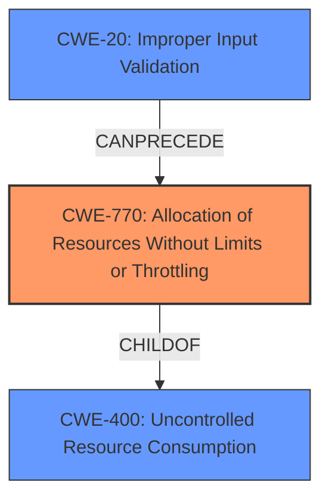

# Analysis Report for CVE-2024-8182

# Vulnerability Analysis Report: CVE-2024-8182

## Description

An Unauthenticated Denial of Service (DoS) vulnerability exists in Flowise version 1.8.2 leading to a complete crash of the instance running a vulnerable version due to **improper handling of user supplied input** to the /api/v1/get-upload-file api endpoint.

## Vulnerability Description Key Phrases

- **Rootcause:** improper handling of user supplied input
- **Impact:** ['Denial of Service', 'complete crash']
- **Attacker:** Unauthenticated
- **Product:** Flowise
- **Version:** 1.8.2
- **Component:** /api/v1/get-upload-file api endpoint

## Analysis (with Relationship Data)

# Summary
| CWE ID | CWE Name | Confidence | CWE Abstraction Level | CWE Vulnerability Mapping Label | CWE-Vulnerability Mapping Notes |
|---|---|---|---|---|---|
| CWE-770 | Allocation of Resources Without Limits or Throttling | 0.8 | Base | Allowed | Primary CWE. The application allocates resources without proper limits or throttling, leading to resource exhaustion and a denial-of-service condition. |
| CWE-400 | Uncontrolled Resource Consumption | 0.6 | Class | Discouraged | Secondary. The vulnerability leads to uncontrolled resource consumption, which is a direct result of the missing limits. |
| CWE-20 | Improper Input Validation | 0.5 | Class | Discouraged | Secondary. The root cause is the lack of input validation, which allows an attacker to cause the resource exhaustion. |

## Evidence and Confidence

*   **Confidence Score:** 0.7
*   **Evidence Strength:** MEDIUM

## Relationship Analysis
The primary weakness is CWE-770, which is related to CWE-400 (Uncontrolled Resource Consumption) as a child. CWE-20 (Improper Input Validation) can precede CWE-770, as the lack of input validation allows for resource allocation without limits.



## Vulnerability Chain
1.  **Root Cause:** CWE-770 (Allocation of Resources Without Limits or Throttling) - The application does not limit or throttle resource allocation.
2.  CWE-20 (Improper Input Validation) - Missing input validation allows for the excessive resource allocation.
3.  **Impact:** CWE-400 (Uncontrolled Resource Consumption) - Excessive resource allocation leads to resource exhaustion.
4.  Denial of Service (DoS) - The resource exhaustion causes the application to crash, resulting in a DoS.

## Summary of Analysis
The primary CWE is CWE-770 (Allocation of Resources Without Limits or Throttling) because the root cause of the vulnerability is the **improper handling of user supplied input** which leads to allocation of resources without limits or throttling. This leads to uncontrolled resource consumption (CWE-400) and eventually a Denial of Service. CWE-20 (Improper Input Validation) is a contributing factor as the **improper handling of user supplied input** is the reason why an attacker can cause the resource exhaustion.

The evidence for this assessment comes directly from the vulnerability description: "An Unauthenticated Denial of Service (DoS) vulnerability exists in Flowise version 1.8.2 leading to a complete crash of the instance running a vulnerable version due to **improper handling of user supplied input** to the /api/v1/get-upload-file api endpoint."

The graph relationships influenced the selection by highlighting how the lack of input validation can lead to uncontrolled resource allocation.

CWE-770 is at the optimal level of specificity because it directly addresses the root cause of the vulnerability which is the missing limits and throttling mechanisms when allocating resources.

CWE-20 (Improper Input Validation) was considered because the **improper handling of user supplied input** is the reason why an attacker can cause the resource exhaustion but it's a class level abstraction.

CWE-400 (Uncontrolled Resource Consumption) was considered because the vulnerability leads to uncontrolled resource consumption, which is a direct result of the missing limits. However, it describes the impact rather than the root cause.


## CWE Relationship Analysis

Current CWEs represent these abstraction levels: .


### Vulnerability Chain Analysis

**Chain starting from CWE-400:**
- 400 (Uncontrolled Resource Consumption) - ROOT


**Chain starting from CWE-770:**
- 770 (Allocation of Resources Without Limits or Throttling) - ROOT


### CWE Relationship Diagram

```mermaid
graph TD
    classDef primary fill:#f96,stroke:#333,stroke-width:2px
    classDef secondary fill:#69f,stroke:#333
    classDef tertiary fill:#9e9,stroke:#333
```


*Report generated on 2025-07-14 03:33:44*
