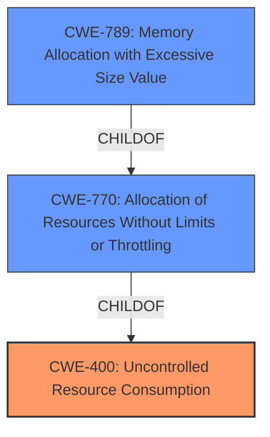

# Analysis for CVE-2024-8184

# Summary

| CWE ID   | CWE Name                                            | Confidence | CWE Abstraction Level | CWE Vulnerability Mapping Label | CWE-Vulnerability Mapping Notes |
| -------- | --------------------------------------------------- | ---------- | --------------------- | ------------------------------- | ------------------------------- |
| CWE-400  | Uncontrolled Resource Consumption                   | 0.9        | Class                 | Primary CWE                     | Discouraged                   |
| CWE-770  | Allocation of Resources Without Limits or Throttling | 0.7        | Base                  | Secondary Candidate             | Allowed                       |
| CWE-789  | Memory Allocation with Excessive Size Value         | 0.6        | Variant               | Secondary Candidate             | Allowed                       |

## Evidence and Confidence

*   **Confidence Score:** 0.8
*   **Evidence Strength:** MEDIUM

## Relationship Analysis

The primary relationship that influenced the CWE selection is the parent-child relationship between CWE-400 **Uncontrolled Resource Consumption** and CWE-770 **Allocation of Resources Without Limits or Throttling**. While CWE-770 is more specific and closer to the root cause, the provided information lacks sufficient detail to confirm that the allocation of resources is truly without limits or throttling, making CWE-400 a more appropriate albeit broader classification. CWE-789 **Memory Allocation with Excessive Size Value** was considered but there wasn't enough information to decide if an excessive size value was the root cause.

## Vulnerability Chain

The vulnerability chain starts with the **ThreadLimitHandler.getRemote()** method, which can be abused via crafted requests leading to **uncontrolled resource consumption** (CWE-400) and ultimately resulting in a **denial-of-service** (DoS) condition.

## Summary of Analysis

The initial assessment was based on the CVE description, which highlighted the DoS impact and the role of crafted requests in triggering OutOfMemory errors. The primary focus was on identifying the root cause of the memory exhaustion. The analysis considered several CWEs related to resource management and input validation.

The decision to assign CWE-400 as the primary CWE was primarily driven by the following evidence:

*   "attackers can trigger OutofMemory errors and exhaust the servers memory"
*   "By repeatedly sending crafted requests, attackers can trigger OutofMemory errors and exhaust the servers memory."
*   **CWE-400 (Uncontrolled Resource Consumption):** The core issue is that the `ThreadLimitHandler.getRemote()` method can be abused to consume excessive server memory.

While CWE-770 and CWE-789 were strong contenders, the lack of specific details about the allocation process made CWE-400 a safer choice. The relationship graph helped visualize how these CWEs are related, with CWE-770 and CWE-789 being more specific instances of CWE-400.

The chosen CWEs are at the optimal level of specificity given the available information. While a more detailed analysis of the `ThreadLimitHandler.getRemote()` method might reveal a more precise weakness, the current evidence supports CWE-400 as the most appropriate classification.

Relevant CWE Information:

# Enhanced Context (25 CWEs)
The following CWEs were identified as potentially relevant to this vulnerability:

## CWE-789: Memory Allocation with Excessive Size Value
**Abstraction Level**: Variant
**Similarity Score**: 0.72
**Source**: dense

**Description**:
The product allocates memory based on an untrusted, large size value, but it does not ensure that the size is within expected limits, allowing arbitrary amounts of memory to be allocated.

**Mapping Guidance**:
- Usage: Allowed
- Rationale: This CWE entry is at the Variant level of abstraction, which is a preferred level of abstraction for mapping to the root causes of vulnerabilities.

## CWE-770: Allocation of Resources Without Limits or Throttling
**Abstraction Level**: Base
**Similarity Score**: 0.70
**Source**: dense

**Description**:
The product allocates a reusable resource or group of resources on behalf of an actor without imposing any restrictions on the size or number of resources that can be allocated, in violation of the intended security policy for that actor.

**Mapping Guidance**:
- Usage: Allowed
- Rationale: This CWE entry is at the Base level of abstraction, which is a preferred level of abstraction for mapping to the root causes of vulnerabilities.

## CWE-400: Uncontrolled Resource Consumption
**Abstraction Level**: Class
**Similarity Score**: 0.69
**Source**: dense

**Description**:
The product does not properly control the allocation and maintenance of a limited resource, thereby enabling an actor to influence the amount of resources consumed, eventually leading to the exhaustion of available resources.

**Mapping Guidance**:
- Usage: Discouraged
- Rationale: CWE-400 is intended for incorrect behaviors in which the product is expected to track and restrict how many resources it consumes, but CWE-400 is often misused because it is conflated with the "technical impact" of vulnerabilities in which resource consumption occurs. It is sometimes used for low-information vulnerability reports. It is a level-1 Class (i.e., a child of a Pillar).

## CWE-410: Insufficient Resource Pool
**Abstraction Level**: Base
**Similarity Score**: 0.69
**Source**: dense

**Description**:
The product's resource pool is not large enough to handle peak demand, which allows an attacker to prevent others from accessing the resource by using a (relatively) large number of requests for resources.

**Mapping Guidance**:
- Usage: Allowed
- Rationale: This CWE entry is at the Base level of abstraction, which is a preferred level of abstraction for mapping to the root causes of vulnerabilities.

## CWE-755: Improper Handling of Exceptional Conditions
**Abstraction Level**: Class
**Similarity Score**: 0.68
**Source**: dense

**Description**:
The product does not handle or incorrectly handles an exceptional condition.

**Mapping Guidance**:
- Usage: Discouraged
- Rationale: This CWE entry is a level-1 Class (i.e., a child of a Pillar). It might have lower-level children that would be more appropriate

## CWE-674: Uncontrolled Recursion
**Abstraction Level**: Class
**Similarity Score**: 0.68
**Source**: dense

**Description**:
The product does not properly control the amount of recursion that takes place,  consuming excessive resources, such as allocated memory or the program stack.

**Mapping Guidance**:
- Usage: Allowed-with-Review
- Rationale: This CWE entry is a Class and might have Base-level children that would be more appropriate

## CWE-696: Incorrect Behavior Order
**Abstraction Level**: Class
**Similarity Score**: 0.68
**Source**: dense

**Description**:
The product performs multiple related behaviors, but the behaviors are performed in the wrong order in ways which may produce resultant weaknesses.

**Mapping Guidance**:
- Usage: Allowed-with-Review
- Rationale: This CWE entry is a Class and might have Base-level children that would be more appropriate

## CWE-799: Improper Control of Interaction Frequency
**Abstraction Level**: Class
**Similarity Score**: 0.67
**Source**: dense

**Description**:
The product does not properly limit the number or frequency of interactions that it has with an actor, such as the number of incoming requests.

**Mapping Guidance**:
- Usage: Allowed-with-Review
- Rationale: This CWE entry is a Class and might have Base-level children that would be more appropriate

## CWE-918: Server-Side Request Forgery (SSRF)
**Abstraction Level**: Base
**Similarity Score**: 0.67
**Source**: dense

**Description**:
The web server receives a URL or similar request from an upstream component and retrieves the contents of this URL, but it does not sufficiently ensure that the request is being sent to the expected destination.

**Mapping Guidance**:
- Usage: Allowed
- Rationale: This CWE entry is at the Base level of abstraction, which is a preferred level of abstraction for mapping to the root causes of vulnerabilities.

## CWE-917: Improper Neutralization of Special Elements used in an Expression Language Statement ('Expression Language Injection')
**Abstraction Level**: Base
**Similarity Score**: 0.67
**Source**: dense

**Description**:
The product constructs all or part of an expression language (EL) statement in a framework such as a Java Server Page (JSP) using externally-influenced input from an upstream component, but it does