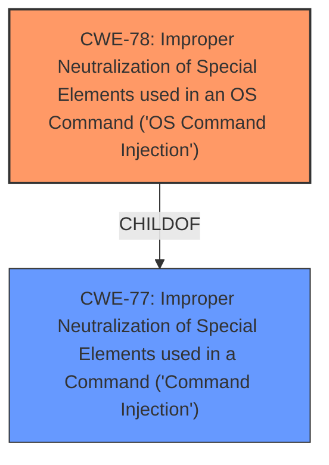

# Analysis for CVE-2024-8210

# Summary
| CWE ID | CWE Name | Confidence | CWE Abstraction Level | CWE Vulnerability Mapping Label | CWE-Vulnerability Mapping Notes |
|---|---|---|---|---|---|
| CWE-78 | Improper Neutralization of Special Elements used in an OS Command ('OS Command Injection') | 1.0 | Base | Allowed | Primary CWE |

## Evidence and Confidence

*   **Confidence Score:** 1.0
*   **Evidence Strength:** HIGH

## Relationship Analysis
The primary relationship considered was the parent-child relationship between CWE-77 (Command Injection) and CWE-78 (OS Command Injection). CWE-78 was selected as it is a more specific case of command injection, targeting OS commands. The tool's retriever results showed both as strong candidates, but since the vulnerability description explicitly mentions OS commands, CWE-78 was favored.

## Vulnerability Chain
The vulnerability chain starts with **improper neutralization** of the `f_mount` argument, leading to **command injection**. The root cause is the lack of input sanitization before the input is used in a `sprintf` function, which is then passed to a `system` command. This allows for the execution of arbitrary commands on the device.

## Summary of Analysis
The analysis is heavily based on the provided evidence, which explicitly mentions **command injection** via manipulation of the `f_mount` argument in the `/cgi-bin/hd_config.cgi` file. The **root cause** is the **lack of sanitization** of this input before it's used in a `sprintf` function and then passed to a `system` command.

The vulnerability description key phrases state: "**weakness:** **command injection**". The "CVE Reference Links Content Summary" states that the "**f_mount** variable from a POST request is used in a **sprintf** function which is then passed to a **system** command" and that "**user-controlled input (`f_mount`) is passed to a system command without sanitization**."

The retriever results also strongly suggest CWE-77 and CWE-78, with the latter being a more specific instance of the former.

The selection of CWE-78 is at the optimal level of specificity, as it directly addresses the vulnerability involving OS commands.

Relevant CWE Information:

# Enhanced Context (25 CWEs)
The following CWEs were identified as potentially relevant to this vulnerability:

## CWE-78: Improper Neutralization of Special Elements used in an OS Command ('OS Command Injection')
**Abstraction Level**: Base
**Similarity Score**: 0.80
**Source**: dense

**Description**:
The product constructs all or part of an OS command using externally-influenced input from an upstream component, but it does not neutralize or incorrectly neutralizes special elements that could modify the intended OS command when it is sent to a downstream component.

**Mapping Guidance**:
- Usage: Allowed
- Rationale: This CWE entry is at the Base level of abstraction, which is a preferred level of abstraction for mapping to the root causes of vulnerabilities.

## CWE-77: Improper Neutralization of Special Elements used in a Command ('Command Injection')
**Abstraction Level**: Class
**Similarity Score**: 0.77
**Source**: dense

**Description**:
The product constructs all or part of a command using externally-influenced input from an upstream component, but it does not neutralize or incorrectly neutralizes special elements that could modify the intended command when it is sent to a downstream component.

**Mapping Guidance**:
- Usage: Allowed-with-Review
- Rationale: CWE-77 is often misused when OS command injection (CWE-78) was intended instead [REF-1287].

I considered CWE-77, but it is a class level CWE while CWE-78 is a Base level CWE. Also the description specifically mentions OS commands so CWE-78 is a better fit. The rationale for CWE-77 states that it's often misused when OS command injection is intended, further supporting the selection of CWE-78.