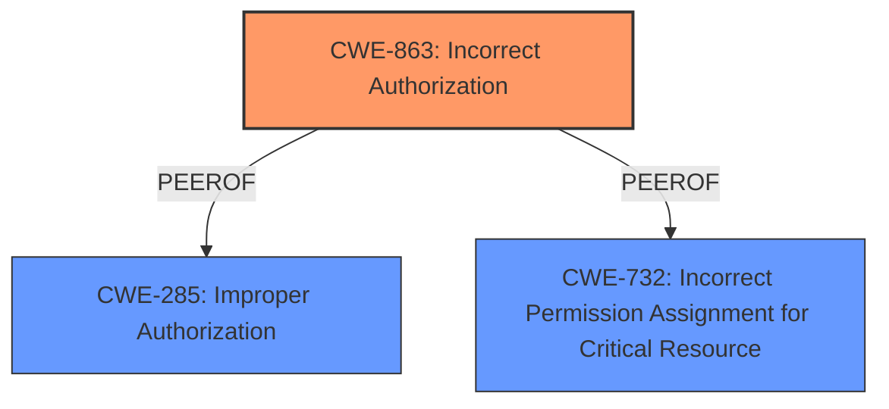

# Enhanced Analysis for CVE-2024-8256

# Summary

| CWE ID  | CWE Name                                                    | Confidence | CWE Abstraction Level | CWE Vulnerability Mapping Label | CWE-Vulnerability Mapping Notes |
| :-------- | :---------------------------------------------------------- | :--------- | :-------------------- | :------------------------------ | :------------------------------ |
| CWE-863   | Incorrect Authorization                                     | 0.9        | Class                 | Allowed-with-Review             | Primary CWE                     |
| CWE-285   | Improper Authorization                                      | 0.7        | Class                 | Discouraged                     | Secondary Candidate             |
| CWE-732   | Incorrect Permission Assignment for Critical Resource       | 0.7        | Class                 | Allowed-with-Review             | Secondary Candidate             |

## Evidence and Confidence

*   **Confidence Score:** 0.9
*   **Evidence Strength:** HIGH

## Relationship Analysis

The primary relationship influencing the selection is the hierarchical relationship between CWE-863 (**Incorrect Authorization**) and its potential base-level children. However, the provided information does not give enough information to descend to a base level CWE.



## Vulnerability Chain

The vulnerability chain starts with **incorrect permission handling**, leading to the access of critical device resources.

1.  **Root Cause:** **Incorrect permission handling** (CWE-863)
2.  **Impact:** Access to critical device resources.

## Summary of Analysis

The initial analysis focused on identifying the root cause of the vulnerability. The description explicitly mentions **"incorrect permission handling"** as the root cause, which strongly suggests an authorization or access control issue. The retriever results also highlight CWEs related to authorization and permission management, such as CWE-863 (**Incorrect Authorization**), CWE-285 (**Improper Authorization**), and CWE-732 (**Incorrect Permission Assignment for Critical Resource**).

The key phrase **"incorrect permission handling"** and the ability of a "lower privileged user with default permissions to access critical device resources via the API" clearly indicates an authorization issue, making CWE-863 (**Incorrect Authorization**) the most appropriate primary CWE.

The final decision to select CWE-863 is based on:

*   Direct evidence from the vulnerability description: **"incorrect permission handling"**
*   The retriever results, which identified CWE-863 as a relevant candidate.
*   The usage guidance for CWE-863 indicates "Allowed-with-Review" because it is a Class and might have Base-level children that would be more appropriate. However, the provided information does not give enough information to descend to a base level CWE.

Relevant CWE Information:

# Enhanced Context (25 CWEs)
The following CWEs were identified as potentially relevant to this vulnerability:

## CWE-863: Incorrect Authorization
**Abstraction Level**: Class
**Similarity Score**: 2027.97
**Source**: sparse

**Description**:
The product performs an authorization check when an actor attempts to access a resource or perform an action, but it does not correctly perform the check.

**Mapping Guidance**:
- Usage: Allowed-with-Review
- Rationale: This CWE entry is a Class and might have Base-level children that would be more appropriate


## CWE Relationship Analysis

Current CWEs represent these abstraction levels: .


### Vulnerability Chain Analysis

**Chain starting from CWE-863:**
- 863 (Incorrect Authorization) - ROOT


**Chain starting from CWE-285:**
- 285 (Improper Authorization) - ROOT


### CWE Relationship Diagram

```mermaid
graph TD
    classDef primary fill:#f96,stroke:#333,stroke-width:2px
    classDef secondary fill:#69f,stroke:#333
    classDef tertiary fill:#9e9,stroke:#333
```