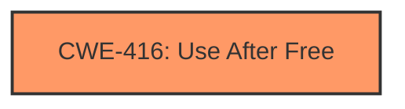

# Raw Analyzer Response for CVE-2024-8362

# Summary
| CWE ID | CWE Name | Confidence | CWE Abstraction Level | CWE Vulnerability Mapping Label | CWE-Vulnerability Mapping Notes |
|---|---|---|---|---|---|
| CWE-416 | Use After Free | 1.0 | Variant | Allowed | Primary CWE |

## Evidence and Confidence

*   **Confidence Score:** 1.0
*   **Evidence Strength:** HIGH

## Relationship Analysis
The primary CWE is CWE-416, which is a variant. The retriever results listed several other CWEs, including CWE-366 (Race Condition within a Thread), CWE-843 (Access of Resource Using Incompatible Type ('Type Confusion')), CWE-911 (Improper Update of Reference Count), and CWE-415 (Double Free). However, the vulnerability description clearly states "**use after free**" as the **rootcause**, which aligns perfectly with CWE-416. There are CANFOLLOW relationships from CWE-416 to CWE-754, CWE-364, CWE-362, and CWE-1265, suggesting possible exploitations or conditions arising after the use-after-free.

## Vulnerability Chain
The vulnerability chain starts with the **use after free** condition (CWE-416) which can then lead to heap corruption.

## Summary of Analysis
The vulnerability description clearly states "**use after free**" as the **rootcause** of the vulnerability in the WebAudio component of Google Chrome. The CVE Reference Links Content Summary confirms this by stating, "root_cause: Use after free in WebAudio" and "weaknesses: [ "Use-after-free" ]". The primary CWE match listed is CWE-416. Therefore, CWE-416 is the most appropriate CWE for this vulnerability. Other CWEs considered but not used are discussed below. The selection is based on the explicit evidence provided in the vulnerability description and supporting CVE details. The level of specificity is optimal as CWE-416 is a Variant, which is preferred.

Relevant CWE Information:

# Enhanced Context (25 CWEs)
The following CWEs were identified as potentially relevant to this vulnerability:

## CWE-366: Race Condition within a Thread
**Abstraction Level**: Base
**Similarity Score**: 0.77
**Source**: dense

**Description**:
If two threads of execution use a resource simultaneously, there exists the possibility that resources may be used while invalid, in turn making the state of execution undefined.

**Mapping Guidance**:
- Usage: Allowed
- Rationale: This CWE entry is at the Base level of abstraction, which is a preferred level of abstraction for mapping to the root causes of vulnerabilities.

*Reason for not selecting:* While race conditions can sometimes lead to use-after-free vulnerabilities, there is no specific evidence to suggest that a race condition is the direct cause of the vulnerability in this case. The provided information points directly to a use-after-free condition, making CWE-416 a more accurate classification.

## CWE-415: Double Free
**Abstraction Level**: Variant
**Similarity Score**: 0.70
**Source**: dense

**Description**:
The product calls free() twice on the same memory address, potentially leading to modification of unexpected memory locations.

**Mapping Guidance**:
- Usage: Allowed
- Rationale: This CWE entry is at the Variant level of abstraction, which is a preferred level of abstraction for mapping to the root causes of vulnerabilities.

*Reason for not selecting:* A double free is a distinct vulnerability from a use-after-free. The provided information explicitly identifies the vulnerability as a use-after-free.

## CWE-843: Access of Resource Using Incompatible Type ('Type Confusion')
**Abstraction Level**: Base
**Similarity Score**: 0.71
**Source**: dense

**Description**:
The product allocates or initializes a resource such as a pointer, object, or variable using one type, but it later accesses that resource using a type that is incompatible with the original type.

**Mapping Guidance**:
- Usage: Allowed
- Rationale: This CWE entry is at the Base level of abstraction, which is a preferred level of abstraction for mapping to the root causes of vulnerabilities.

*Reason for not selecting:* While type confusion can sometimes be related to memory safety issues, it is not the direct cause of this vulnerability. The explicit "use after free" indicates a memory management issue rather than a type mismatch issue.

## CWE-911: Improper Update of Reference Count
**Abstraction Level**: Base
**Similarity Score**: 0.55
**Source**: sparse

**Description**:
The product uses a reference count to manage a resource, but it does not update or incorrectly updates the reference count.

**Mapping Guidance**:
- Usage: Allowed
- Rationale: This CWE entry is at the Base level of abstraction, which is a preferred level of abstraction for mapping to the root causes of vulnerabilities.

*Reason for not selecting:* While an improper update of the reference count can lead to memory management issues including use-after-free, this is not explicitly mentioned in the description. The description clearly points to the "use after free" condition as the **rootcause**.