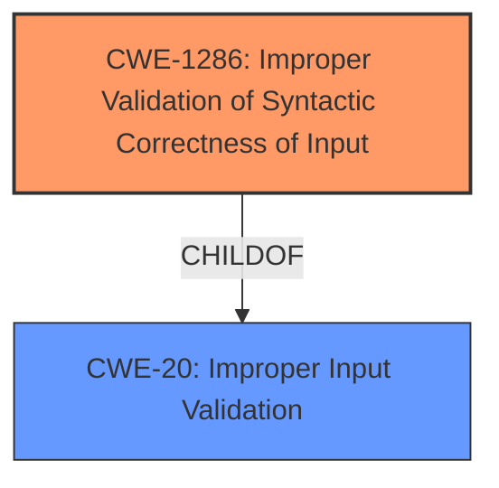

# Analysis Report for CVE-2024-8402

# Vulnerability Analysis Report: CVE-2024-8402

## Description

An issue was discovered in GitLab EE affecting all versions starting from 17.2 before 17.7.7, all versions starting from 17.8 before 17.8.5, all versions starting from 17.9 before 17.9.2. An **input validation issue** in the Google Cloud IAM integration feature could have enabled a Maintainer to introduce malicious code.

## Vulnerability Description Key Phrases

- **Rootcause:** input validation issue
- **Impact:** introduce malicious code
- **Attacker:** Maintainer
- **Product:** GitLab EE
- **Version:** ['all versions starting from 17.2 before 17.7.7', 'all versions starting from 17.8 before 17.8.5', 'all versions starting from 17.9 before 17.9.2']
- **Component:** Google Cloud IAM integration feature

## Analysis (with Relationship Data)

# Summary
| CWE ID | CWE Name | Confidence | CWE Abstraction Level | CWE Vulnerability Mapping Label | CWE-Vulnerability Mapping Notes |
|---|---|---|---|---|---|
| CWE-1286 | Improper Validation of Syntactic Correctness of Input | 0.9 | Base | Allowed | Primary CWE |

## Evidence and Confidence

*   **Confidence Score:** 0.9
*   **Evidence Strength:** MEDIUM

## Relationship Analysis
The primary CWE, CWE-1286, stands alone in this case. While it is a child of CWE-20 (Improper Input Validation), remaining at the base level offers a more precise characterization. There are no clear chain relationships to consider, as the description focuses on the root cause: the input validation failure.



## Vulnerability Chain
The vulnerability chain starts with **improper input validation** (CWE-1286), which allows a malicious maintainer to introduce malicious code.

CWE-1286 (Root Cause) -> Introduce Malicious Code (Impact)

## Summary of Analysis
The vulnerability description explicitly mentions an **input validation issue** as the root cause. The description states "An **input validation issue** in the Google Cloud IAM integration feature could have enabled a Maintainer to introduce malicious code."
CWE-1286 (Improper Validation of Syntactic Correctness of Input) directly addresses this, as it describes a scenario where input is expected to be well-formed but is not properly validated. The retriever results also list CWE-1286, with a good similarity score.
While other CWEs like Improper Authorization (CWE-285 and CWE-863) are present in the retriever results, they are not directly supported by the provided evidence. The core issue is that the input related to the Google Cloud IAM integration feature is not validated correctly, allowing for the introduction of malicious code, so input validation is more accurate.

Relevant CWE Information:

# Enhanced Context (25 CWEs)
The following CWEs were identified as potentially relevant to this vulnerability:

## CWE-1286: Improper Validation of Syntactic Correctness of Input
**Abstraction Level**: Base
**Similarity Score**: 0.75
**Source**: dense

**Description**:
The product receives input that is expected to be well-formed - i.e., to comply with a certain syntax - but it does not validate or incorrectly validates that the input complies with the syntax.

**Mapping Guidance**:
- Usage: Allowed
- Rationale: This CWE entry is at the Base level of abstraction, which is a preferred level of abstraction for mapping to the root causes of vulnerabilities.

## CWE-1286: Improper Validation of Syntactic Correctness of Input
**Abstraction Level**: Base
**Similarity Score**: 414.42
**Source**: sparse

**Description**:
The product receives input that is expected to be well-formed - i.e., to comply with a certain syntax - but it does not validate or incorrectly validates that the input complies with the syntax.

**Mapping Guidance**:
- Usage: Allowed
- Rationale: This CWE entry is at the Base level of abstraction, which is a preferred level of abstraction for mapping to the root causes of vulnerabilities.

CWE-1286 is at the optimal level of specificity, as it directly reflects the **input validation issue** mentioned in the vulnerability description. The other CWEs in the retriever results, such as CWE-285, CWE-863, CWE-400, and CWE-639, are less precise fits for the given information.


## CWE Relationship Analysis

Current CWEs represent these abstraction levels: .


### Vulnerability Chain Analysis

**Chain starting from CWE-863:**
- 863 (Incorrect Authorization) - ROOT


**Chain starting from CWE-400:**
- 400 (Uncontrolled Resource Consumption) - ROOT


### CWE Relationship Diagram

```mermaid
graph TD
    classDef primary fill:#f96,stroke:#333,stroke-width:2px
    classDef secondary fill:#69f,stroke:#333
    classDef tertiary fill:#9e9,stroke:#333
```


*Report generated on 2025-07-14 03:44:15*
