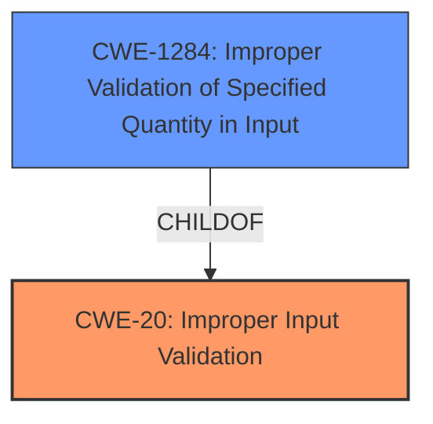

# Enhanced Analysis for CVE-2024-8445

# Summary
| CWE ID    | CWE Name                                                        | Confidence | CWE Abstraction Level | CWE Vulnerability Mapping Label | CWE-Vulnerability Mapping Notes |
| --------- | --------------------------------------------------------------- | ---------- | --------------------- | ------------------------------- | ----------------------------- |
| CWE-20    | Improper Input Validation                                       | 0.8        | Class                 | Primary                         | Discouraged                  |
| CWE-1284 | Improper Validation of Specified Quantity in Input | 0.7        | Base                 | Secondary                         | Allowed                  |

## Evidence and Confidence

*   **Confidence Score:** 0.75
*   **Evidence Strength:** MEDIUM

## Relationship Analysis
The primary relationship that influenced the decision was the parent-child relationship between CWE-20 and CWE-1284. Although CWE-20 is a class-level CWE and generally discouraged, the evidence points to a general input validation issue. CWE-1284 is a more specific Base CWE, but the description doesn't specifically talk about quantity, but validation of input as a whole. The chain relationship wasn't particularly relevant in this case.



## Vulnerability Chain
The vulnerability chain starts with the **improper input validation** (CWE-20), leading to the server crash due to malformed input. More specifically, **improper validation of the specified quantity in the input** (CWE-1284) during the `userPassword` modification. The final impact is a denial of service (DoS).

## Summary of Analysis
The initial assessment considered the vulnerability description, CVE reference summary, and retriever results to identify the most appropriate CWE. The core issue lies in the insufficient handling of **malformed input** when modifying the `userPassword` attribute.

The selection of CWE-20 (Improper Input Validation) as the primary CWE is based on the high-level nature of the vulnerability, where the input validation is generally insufficient, leading to the crash. The CVE reference summary mentions "insufficient handling of malformed input," which aligns with the description of CWE-20.

The retriever results also listed CWE-20 as a potential candidate, though it's marked as "Discouraged". However, given the generalized nature of the **weakness** described in the vulnerability, CWE-20 serves as a suitable high-level classification, with CWE-1284 to provide more details on the input it occurs in.

CWE-1284 (Improper Validation of Specified Quantity in Input) is considered as the secondary CWE. The vulnerability description mentions a "server crash while modifying `userPassword` using malformed input". This indicates that the **malformed input**, which could include the length or size of the password, is not properly validated. This aligns with the description of CWE-1284, which focuses on the validation of specified quantities in input.

The graph relationships influenced the decision by showing the parent-child relationship between CWE-20 and CWE-1284. This helped refine the classification from a general input validation issue to a more specific one related to the validation of quantities.

The selected CWEs are at a reasonable level of specificity. While more specific CWEs could potentially be identified with further information, the current evidence supports the selection of CWE-20 as a general issue and CWE-1284 to refine the general issue to a specific input during password modification.

Relevant CWE Information:

# Enhanced Context (25 CWEs)
The following CWEs were identified as potentially relevant to this vulnerability:

## CWE-303: Incorrect Implementation of Authentication Algorithm
**Abstraction Level**: Base
**Similarity Score**: 0.73
**Source**: dense

**Description**:
The requirements for the product dictate the use of an established authentication algorithm, but the implementation of the algorithm is incorrect.

**Mapping Guidance**:
- Usage: Allowed
- Rationale: This CWE entry is at the Base level of abstraction, which is a preferred level of abstraction for mapping to the root causes of vulnerabilities.

*Rationale for not selecting*: This vulnerability does not involve the authentication algorithm itself, but rather, the handling of input during password modification after successful authentication.

## CWE-918: Server-Side Request Forgery (SSRF)
**Abstraction Level**: Base
**Similarity Score**: 0.73
**Source**: dense

**Description**:
The web server receives a URL or similar request from an upstream component and retrieves the contents of this URL, but it does not sufficiently ensure that the request is being sent to the expected destination.

**Mapping Guidance**:
- Usage: Allowed
- Rationale: This CWE entry is at the Base level of abstraction, which is a preferred level of abstraction for mapping to the root causes of vulnerabilities.

*Rationale for not selecting*: This vulnerability does not involve server-side requests.

## CWE-1391: Use of Weak Credentials
**Abstraction Level**: Class
**Similarity Score**: 0.73
**Source**: dense

**Description**:
The product uses weak credentials (such as a default key or hard-coded password) that can be calculated, derived, reused, or guessed by an attacker.

**Mapping Guidance**:
- Usage: Allowed-with-Review
- Rationale: This CWE entry is a Class and might have Base-level children that would be more appropriate

*Rationale for not selecting*: The vulnerability is triggered by an authenticated user using **malformed input**, not weak credentials.

## CWE-204: Observable Response Discrepancy
**Abstraction Level**: Base
**Similarity Score**: 0.72
**Source**: dense

**Description**:
The product provides different responses to incoming requests in a way that reveals internal state information to an unauthorized actor outside of the intended control sphere.

**Mapping Guidance**:
- Usage: Allowed
- Rationale: This CWE entry is at the Base level of abstraction, which is a preferred level of abstraction for mapping to the root causes of vulnerabilities.

*Rationale for not selecting*: The vulnerability does not involve revealing internal state information.

## CWE-90: Improper Neutralization of Special Elements used in an LDAP Query ('LDAP Injection')
**Abstraction Level**: Base
**Similarity Score**: 0.71
**Source**: dense

**Description**:
The product constructs all or part of an LDAP query using externally-influenced input from an upstream component, but it does not neutralize or incorrectly neutralizes special elements that could modify the intended LDAP query when it is sent to a downstream component.

**Mapping Guidance**:
- Usage: Allowed
- Rationale: This CWE entry is at the Base level of abstraction, which is a preferred level of abstraction for mapping to the root causes of vulnerabilities.

*Rationale for not selecting*: This vulnerability is not related to LDAP injection.

## CWE-916: Use of Password Hash With Insufficient Computational Effort
**Abstraction Level**: Base
**Similarity Score**: 0.71
**Source**: dense

**Description**:
The product generates a hash for a password, but it uses a scheme that does not provide a sufficient level of computational effort that would make password cracking attacks infeasible or expensive.

**Mapping Guidance**:
- Usage: Allowed
- Rationale: This CWE entry is at the Base level of abstraction, which is a preferred level of abstraction for mapping to the root causes of vulnerabilities.

*Rationale for not selecting*: The vulnerability is not related to the strength of the password hash.

## CWE-620: Unverified Password Change
**Abstraction Level**: Base
**Similarity Score**: 0.71
**Source**: dense

**Description**:
When setting a new password for a user, the product does not require knowledge of the original password, or using another form of authentication.

**Mapping Guidance**:
- Usage: Allowed
- Rationale: This CWE entry is at the Base level of abstraction, which is a preferred level of abstraction for mapping to the root causes of vulnerabilities.

*Rationale for not selecting*: The vulnerability does not involve unverified password changes. The attacker is authenticated.

## CWE-1390: Weak Authentication
**Abstraction Level**: Class
**Similarity Score**: 0.70
**Source**: dense

**Description**:
The product uses an authentication mechanism to restrict access to specific users or identities, but the mechanism does not sufficiently prove that the claimed identity is correct.

**Mapping Guidance**:
- Usage: Allowed-with-Review
- Rationale: This CWE entry is a Class and might have Base-level children that would be more appropriate

*Rationale for not selecting*: The vulnerability is not related to weak authentication mechanisms. The attacker is authenticated.

## CWE-288: Authentication Bypass Using an Alternate Path or Channel
**Abstraction Level**: Base
**Similarity Score**: 0.70
**Source**: dense

**Description**:
The product requires authentication, but the product has an alternate path or channel that does not require authentication.

**Mapping Guidance**:
- Usage: Allowed
- Rationale: This CWE entry is at the Base level of


## CWE Relationship Analysis

Current CWEs represent these abstraction levels: .


### Vulnerability Chain Analysis

**Chain starting from CWE-90:**
- 90 (Improper Neutralization of Special Elements used in an LDAP Query ('LDAP Injection')) - ROOT


**Chain starting from CWE-1390:**
- 1390 (Weak Authentication) - ROOT


### CWE Relationship Diagram

```mermaid
graph TD
    classDef primary fill:#f96,stroke:#333,stroke-width:2px
    classDef secondary fill:#69f,stroke:#333
    classDef tertiary fill:#9e9,stroke:#333
```