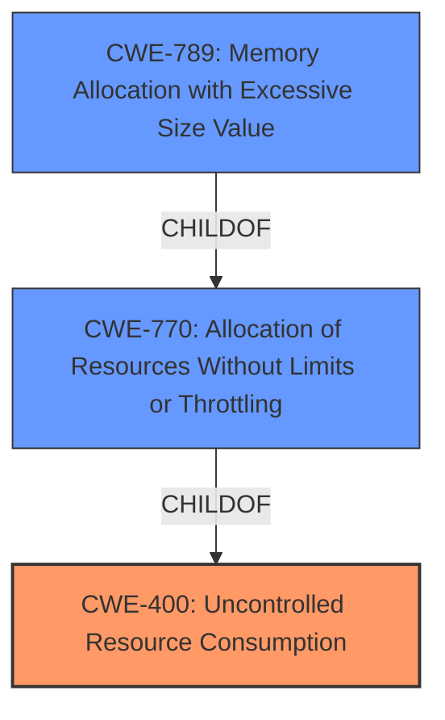

# Analysis for CVE-2024-8454

# Summary
| CWE ID | CWE Name | Confidence | CWE Abstraction Level | CWE Vulnerability Mapping Label | CWE-Vulnerability Mapping Notes |
|---|---|---|---|---|---|
| CWE-400 | Uncontrolled Resource Consumption | 0.7 | Class | Primary | Allowed |
| CWE-770 | Allocation of Resources Without Limits or Throttling | 0.6 | Base | Secondary Candidate | Allowed |
| CWE-789 | Memory Allocation with Excessive Size Value | 0.5 | Variant | Secondary Candidate | Allowed |

## Evidence and Confidence

*   **Confidence Score:** 0.7
*   **Evidence Strength:** MEDIUM

## Relationship Analysis
The primary CWE is CWE-400 **Uncontrolled Resource Consumption**, which is a Class-level CWE. The retriever results also suggest CWE-770 **Allocation of Resources Without Limits or Throttling** (Base) and CWE-789 **Memory Allocation with Excessive Size Value** (Variant). CWE-770 is a child of CWE-400 and CWE-789 is a child of CWE-770. The relationship influenced the decision to consider CWE-770 and CWE-789 as secondary candidates, but CWE-400 as the primary because the description indicates a denial of service via crafted packets which implies a resource exhaustion issue.

## Vulnerability Chain
The vulnerability chain starts with the receipt of **crafted packets** by the swctrl service. The service then fails to properly manage the resources consumed by these packets, leading to resource exhaustion and a denial-of-service condition.
- Root Cause: **Uncontrolled Resource Consumption** (CWE-400)
- Impact: Denial of Service

## Summary of Analysis
The vulnerability description clearly states that the swctrl service is vulnerable to a denial-of-service attack. The attack vector involves sending **crafted packets** that can crash the service. This points to a resource consumption issue, specifically CWE-400 **Uncontrolled Resource Consumption**.

The retriever results also list several other CWEs, including CWE-770 **Allocation of Resources Without Limits or Throttling** and CWE-789 **Memory Allocation with Excessive Size Value**. These are more specific and potentially relevant, but the description doesn't provide enough information to confirm that the root cause is related to memory allocation specifically. Therefore, CWE-400 is the best fit as a primary CWE.

CWE-770 and CWE-789 are considered secondary candidates. If the crafted packets cause the service to allocate an excessive amount of memory without limits (CWE-770), which leads to memory exhaustion (CWE-789), it would eventually result in **Uncontrolled Resource Consumption** and a denial of service (CWE-400).

The decision is based on the available evidence and the relationships between the CWEs. CWE-400 is chosen as the primary because it directly addresses the **impact** described in the vulnerability.

Relevant CWE Information:

# Enhanced Context (25 CWEs)

## CWE-497: Exposure of Sensitive System Information to an Unauthorized Control Sphere
This CWE is not relevant as the description focuses on denial of service rather than information exposure.

## CWE-668: Exposure of Resource to Wrong Sphere
This CWE is too broad and doesn't accurately describe the denial-of-service vulnerability.

## CWE-799: Improper Control of Interaction Frequency
This CWE could be related, but the primary issue is the resource consumption rather than the frequency of interactions.

## CWE-755: Improper Handling of Exceptional Conditions
This CWE is too generic and doesn't specify the type of exceptional condition.

## CWE-134: Use of Externally-Controlled Format String
This CWE is not relevant as there is no mention of format strings.

## CWE-400: Uncontrolled Resource Consumption
**Technical Explanation:** This CWE describes a situation where a product does not properly control the allocation and maintenance of a limited resource, allowing an attacker to influence the amount of resources consumed, leading to exhaustion. In this vulnerability, the swctrl service does not properly handle **crafted packets**, leading to resource exhaustion and a denial-of-service.
**Security Implications:** This can lead to a denial of service, preventing legitimate users from accessing the service.
**Relationship Analysis:** CWE-400 is a Class-level CWE.
**Mapping Guidance Influence:** The Usage is Allowed.
**Primary/Secondary:** Primary CWE.

## CWE-346: Origin Validation Error
This CWE is not relevant as there is no mention of origin validation.

## CWE-696: Incorrect Behavior Order
This CWE is not relevant as there is no mention of incorrect behavior order.

## CWE-807: Reliance on Untrusted Inputs in a Security Decision
This CWE is not relevant as there is no mention of security decisions based on untrusted inputs.

## CWE-73: External Control of File Name or Path
This CWE is not relevant as there is no mention of file paths.

## CWE-1284: Improper Validation of Specified Quantity in Input
This CWE could be relevant if the **crafted packets** contain a quantity that is not properly validated, leading to excessive resource consumption. However, the description is not specific enough to confirm this.

## CWE-789: Memory Allocation with Excessive Size Value
**Technical Explanation:** The product allocates memory based on an untrusted, large size value, but it does not ensure that the size is within expected limits, allowing arbitrary amounts of memory to be allocated. The **crafted packets** could potentially trigger the allocation of excessive memory, leading to denial of service.
**Security Implications:** This can lead to memory exhaustion and denial of service.
**Relationship Analysis:** CWE-789 is a Variant of CWE-770 (Allocation of Resources Without Limits or Throttling).
**Mapping Guidance Influence:** The Usage is Allowed.
**Primary/Secondary:** Secondary candidate.

## CWE-770: Allocation of Resources Without Limits or Throttling
**Technical Explanation:** The product allocates a reusable resource or group of resources on behalf of an actor without imposing any restrictions on the size or number of resources that can be allocated. The **crafted packets** could trigger the allocation of resources without limits, leading to denial of service.
**Security Implications:** This can lead to resource exhaustion and denial of service.
**Relationship Analysis:** CWE-770 is a Base-level CWE and a parent of CWE-789. It is also a child of CWE-400.
**Mapping Guidance Influence:** The Usage is Allowed.
**Primary/Secondary:** Secondary candidate.

## CWE-190: Integer Overflow or Wraparound
This CWE is not directly relevant as there is no mention of integer overflow.

## CWE-119: Improper Restriction of Operations within the Bounds of a Memory Buffer
This CWE is not directly relevant, but the **crafted packets** could potentially cause a buffer overflow if the service does not properly handle the size of the packets. The description is not specific enough to confirm this.

## CWE-1257: Improper Access Control Applied to Mirrored or Aliased Memory Regions
This CWE is not relevant as there is no mention of access control issues.

## CWE-1325: Improperly Controlled Sequential Memory Allocation
This CWE is not directly relevant as the vulnerability isn't explicitly about improperly controlled sequential memory allocation, however, it could be a contributing factor.

## CWE-128: Wrap-around Error
This CWE is not directly relevant as there is no mention of wrap-around errors.

## CWE-1339: Insufficient Precision or Accuracy of a Real Number
This CWE is not relevant as there is no mention of real number precision issues.

## CWE-22: Improper Limitation of a Pathname to a Restricted Directory ('Path Traversal')
This CWE is not relevant as there is no mention of path traversal.

## CWE-123: Write-what-where Condition
This CWE is not relevant as there is no mention of write-what-where conditions.