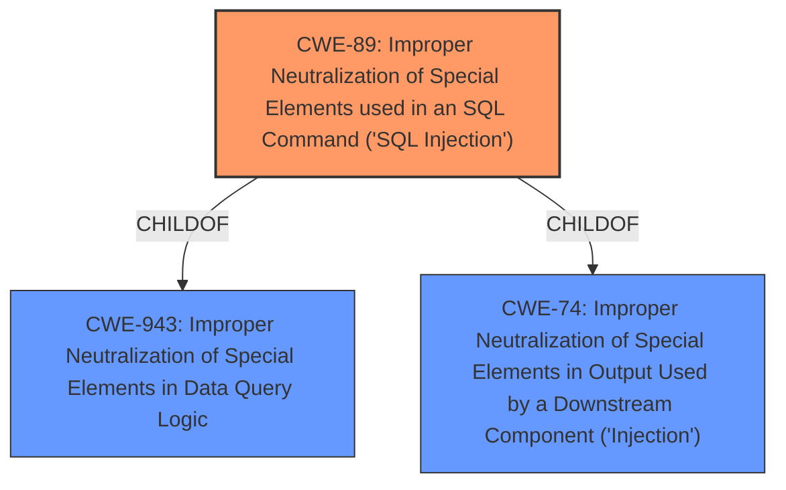

# Analysis Report for CVE-2024-8624

# Vulnerability Analysis Report: CVE-2024-8624

## Description

The MDTF - Meta Data and Taxonomies Filter plugin for WordPress is vulnerable to SQL Injection via the meta_key attribute of the mdf_select_title shortcode in all versions up to, and including, 1.3.3.3 due to **insufficient escaping on the user supplied parameter and lack of sufficient preparation on the existing SQL query**. This makes it possible for authenticated attackers, with Contributor-level access and above, to append additional SQL queries into already existing queries that can be used to extract sensitive information from the database.

## Vulnerability Description Key Phrases

- **Rootcause:** insufficient escaping on the user supplied parameter and lack of sufficient preparation on the existing SQL query
- **Weakness:** sql injection
- **Impact:** extract sensitive information from the database
- **Vector:** meta_key attribute of the mdf_select_title shortcode
- **Attacker:** authenticated attackers with Contributor-level access and above
- **Product:** MDTF - Meta Data and Taxonomies Filter plugin for WordPress
- **Version:** all versions up to and including 1.3.3.3
- **Component:** mdf_select_title shortcode

## Analysis (with Relationship Data)

# Summary
| CWE ID | CWE Name | Confidence | CWE Abstraction Level | CWE Vulnerability Mapping Label | CWE-Vulnerability Mapping Notes |
|---|---|---|---|---|---|
| CWE-89 | Improper Neutralization of Special Elements used in an SQL Command ('SQL Injection') | 1.0 | Base | Allowed | Primary CWE. The root cause is **insufficient escaping on the user supplied parameter and lack of sufficient preparation on the existing SQL query** which leads to SQL injection. |

## Evidence and Confidence

*   **Confidence Score:** 1.0
*   **Evidence Strength:** HIGH

## Relationship Analysis
The primary relationship that influenced the decision was the hierarchical relationship of CWE-89 as a Base level weakness related to **improper neutralization of special elements**. The vulnerability description explicitly mentions **insufficient escaping** and **lack of sufficient preparation on the existing SQL query** as the root cause, directly aligning with the concept of **improper neutralization** in SQL queries.



## Vulnerability Chain
The vulnerability chain starts with the **insufficient escaping on the user supplied parameter and lack of sufficient preparation on the existing SQL query** (CWE-89), which allows attackers to inject malicious SQL code. This leads to the impact of extracting sensitive information from the database.

## Summary of Analysis
The analysis is strongly based on the evidence provided in the vulnerability description, which explicitly states the root cause as "**insufficient escaping on the user supplied parameter and lack of sufficient preparation on the existing SQL query**". This directly corresponds to CWE-89, which focuses on **improper neutralization of special elements** in SQL commands. The "CVE Reference Links Content Summary" confirms that the fix involved using `$wpdb->prepare` to sanitize the input, further supporting the SQL Injection classification.

The retriever results also strongly support CWE-89 as the primary weakness, with a score of 1.0.

CWE-94 ("Improper Control of Generation of Code ('Code Injection')") was considered but not selected because the vulnerability is specifically related to SQL injection, rather than generic code injection. CWE-90 ("Improper Neutralization of Special Elements used in an LDAP Query ('LDAP Injection')") was also considered but discarded as the vulnerability relates to SQL, not LDAP.

The selected CWE (CWE-89) is at the optimal level of specificity (Base), as it directly addresses the root cause of the vulnerability.


## CWE Relationship Analysis

Current CWEs represent these abstraction levels: .


### Vulnerability Chain Analysis

**Chain starting from CWE-90:**
- 90 (Improper Neutralization of Special Elements used in an LDAP Query ('LDAP Injection')) - ROOT


**Chain starting from CWE-89:**
- 89 (Improper Neutralization of Special Elements used in an SQL Command ('SQL Injection')) - ROOT


### CWE Relationship Diagram

```mermaid
graph TD
    classDef primary fill:#f96,stroke:#333,stroke-width:2px
    classDef secondary fill:#69f,stroke:#333
    classDef tertiary fill:#9e9,stroke:#333
```


*Report generated on 2025-07-14 03:59:26*
