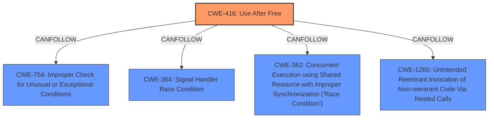

# Raw Analyzer Response for CVE-2024-8637

# Summary
| CWE ID | CWE Name | Confidence | CWE Abstraction Level | CWE Vulnerability Mapping Label | CWE-Vulnerability Mapping Notes |
|---|---|---|---|---|---|
| CWE-416 | Use After Free | 1.0 | Variant | Primary | Allowed |

## Evidence and Confidence

*   **Confidence Score:** 1.0
*   **Evidence Strength:** HIGH

## Relationship Analysis
The primary relationship is that CWE-416 is a Variant, offering a specific description of the vulnerability. There are also CANFOLLOW relationships to CWE-754, CWE-364, CWE-362, and CWE-1265, suggesting potential consequences or related weaknesses.

## Vulnerability Chain
The vulnerability chain starts with a **use after free** condition (CWE-416), which leads to potential heap corruption.

## Summary of Analysis
The analysis strongly supports the selection of CWE-416 as the primary CWE. The vulnerability description explicitly states "**use after free**," which directly matches the definition of CWE-416. The "CVE Reference Links Content Summary" section confirms the root cause as "Use after free". The retriever results also list CWE-416 as the top candidate with a high score. The mapping guidance for CWE-416 allows its usage as a Variant.

Relevant CWE Information:

# Enhanced Context (25 CWEs)
The following CWEs were identified as potentially relevant to this vulnerability:

## CWE-416: Use After Free
**Abstraction Level**: Variant
**Similarity Score**: 0.78
**Source**: dense

**Description**:
The product reuses or references memory after it has been freed. At some point afterward, the memory may be allocated again and saved in another pointer, while the original pointer references a location somewhere within the new allocation. Any operations using the original pointer are no longer valid because the memory "belongs" to the code that operates on the new pointer.

**Mapping Guidance**:
- Usage: Allowed
- Rationale: This CWE entry is at the Variant level of abstraction, which is a preferred level of abstraction for mapping to the root causes of vulnerabilities.