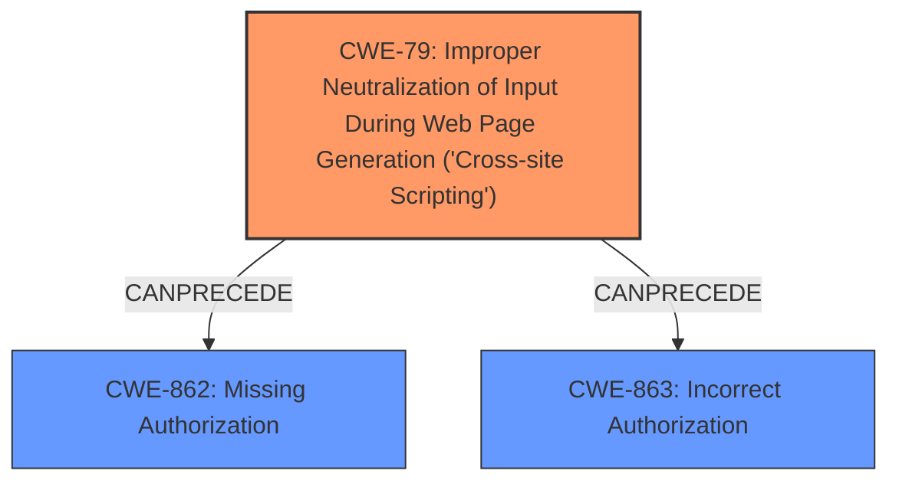

# Analysis Report for CVE-2024-8701

# Vulnerability Analysis Report: CVE-2024-8701

## Description

The events-calendar WordPress plugin through 1.0.4 **does not sanitise and escape some of its settings**, which could allow high privilege users such as admin to perform Stored Cross-Site Scripting attacks even when the unfiltered_html capability is disallowed (for example in multisite setup).

## Vulnerability Description Key Phrases

- **Rootcause:** does not sanitise and escape some of its settings
- **Weakness:** cross-site scripting
- **Impact:** Stored Cross-Site Scripting attacks
- **Attacker:** high privilege users such as admin
- **Product:** events-calendar WordPress plugin
- **Version:** through 1.0.4

## Analysis (with Relationship Data)

# Summary
| CWE ID  | CWE Name                                                                         | Confidence | CWE Abstraction Level | CWE Vulnerability Mapping Label | CWE-Vulnerability Mapping Notes |
| ------- | -------------------------------------------------------------------------------- | ---------- | --------------------- | ------------------------------- | --------------------------------- |
| CWE-79  | Improper Neutralization of Input During Web Page Generation ('Cross-site Scripting') | 1          | Base                  | Primary                         | Allowed                             |

## Evidence and Confidence

*   **Confidence Score:** 1
*   **Evidence Strength:** HIGH

## Relationship Analysis

The primary relationship influencing the decision is the direct match of the vulnerability description to the characteristics of CWE-79, indicating a classic case of Stored XSS due to **lack of proper sanitization and escaping**. While other CWEs like CWE-862 (Missing Authorization) and CWE-863 (Incorrect Authorization) were considered due to the administrative privilege requirement for exploitation, the core issue remains the **improper neutralization** of input, making CWE-79 the most accurate and specific classification. The base level of abstraction is appropriate as it directly reflects the nature of the weakness.



## Vulnerability Chain

The vulnerability chain begins with the **failure to sanitize and escape settings**, leading to the **Stored Cross-Site Scripting (XSS)** vulnerability. The chain could be extended depending on the system and privileges. However, the description's core issue is the XSS, so the chain starts with the root cause and concludes with the direct impact.

`Improper Sanitization` -> `Stored XSS`

## Summary of Analysis

The analysis strongly supports the classification of this vulnerability as CWE-79 (Improper Neutralization of Input During Web Page Generation ('Cross-site Scripting')). The **root cause** is explicitly stated as the plugin's failure to sanitize and escape settings. This directly aligns with the definition of CWE-79, where input is not properly neutralized, leading to the potential for malicious script injection. The evidence is strong, as the vulnerability description clearly outlines the attack vector and impact. The base level of abstraction is optimal because it accurately represents the specific weakness.

The retriever results listed several possible CWEs. The following is a summary of why they were considered, but not used:
*   CWE-352 (Cross-Site Request Forgery (CSRF)): While CSRF could potentially be related in some scenarios, the provided description focuses on XSS, making CWE-352 less relevant.
*   CWE-116 (Improper Encoding or Escaping of Output): Similar to CWE-79, but CWE-79 is more specific to XSS in web page generation.
*   CWE-862 (Missing Authorization) and CWE-863 (Incorrect Authorization): Authorization issues could exist in the broader context of the plugin, but the primary weakness is the lack of input sanitization, not the authorization mechanism itself.
*   CWE-89 (Improper Neutralization of Special Elements used in an SQL Command ('SQL Injection')): Not applicable, as the vulnerability involves script injection, not SQL injection.
*   CWE-434 (Unrestricted Upload of File with Dangerous Type): Not relevant, as the vulnerability does not involve file uploads.
*   CWE-138 (Improper Neutralization of Special Elements): Too general; CWE-79 is more specific.
*   CWE-96 (Improper Neutralization of Directives in Statically Saved Code ('Static Code Injection')): Although the Calendar name is statically saved, the lack of sanitization is the root cause, not a static code injection.
*   CWE-494 (Download of Code Without Integrity Check): Not relevant, as the vulnerability does not involve downloading code.

Relevant CWE Information:

**CWE-79: Improper Neutralization of Input During Web Page Generation ('Cross-site Scripting')**

*   **Description**: The product receives input from an upstream component, but it does not neutralize or incorrectly neutralizes special characters such as "<", ">", and "&" that could be interpreted as web-scripting elements when they are sent to a downstream component that processes web pages.
*   **Mapping Guidance**: Usage: Allowed, Rationale: This CWE entry is at the Base level of abstraction, which is a preferred level of abstraction for mapping to the root causes of vulnerabilities.

The vulnerability description and the CVE reference content summary clearly state that the plugin **does not sanitise and escape some of its settings**. This directly results in a Stored Cross-Site Scripting (XSS) vulnerability, as demonstrated by the ability to inject `<script>` tags into the calendar name field. The fact that this occurs even when `unfiltered_html` is disallowed further emphasizes the **improper neutralization** of input.


## CWE Relationship Analysis

Current CWEs represent these abstraction levels: .


### Vulnerability Chain Analysis

**Chain starting from CWE-863:**
- 863 (Incorrect Authorization) - ROOT


**Chain starting from CWE-89:**
- 89 (Improper Neutralization of Special Elements used in an SQL Command ('SQL Injection')) - ROOT


### CWE Relationship Diagram

```mermaid
graph TD
    classDef primary fill:#f96,stroke:#333,stroke-width:2px
    classDef secondary fill:#69f,stroke:#333
    classDef tertiary fill:#9e9,stroke:#333
```


*Report generated on 2025-07-14 04:02:56*
