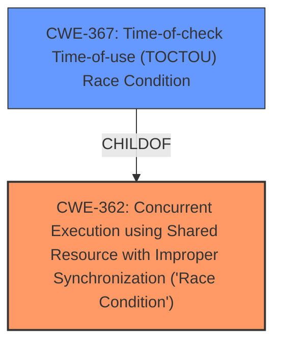

# Enhanced Analysis for CVE-2024-8772

# Summary
| CWE ID | CWE Name | Confidence | CWE Abstraction Level | CWE Vulnerability Mapping Label | CWE-Vulnerability Mapping Notes |
|---|---|---|---|---|---|
| CWE-362 | Concurrent Execution using Shared Resource with Improper Synchronization ('Race Condition') | 0.9 | Class | Allowed-with-Review | Primary CWE |
| CWE-367 | Time-of-check Time-of-use (TOCTOU) Race Condition | 0.7 | Base | Allowed | Secondary Candidate |

## Evidence and Confidence

*   **Confidence Score:** 0.8
*   **Evidence Strength:** HIGH

## Relationship Analysis
The primary relationship considered was the hierarchy between CWE-362 and CWE-367. CWE-362 is a Class-level CWE representing the general concept of a race condition, while CWE-367 is a Base-level CWE focusing on the specific case of a Time-of-check Time-of-use (TOCTOU) race condition. The description indicates a general **race condition**, making CWE-362 a more appropriate fit, even though CWE-367 was also considered.



## Vulnerability Chain
The vulnerability chain begins with the **race condition** (CWE-362), which allows an attacker to block access to the overlay configuration page. The root cause is the improper synchronization when accessing a shared resource, leading to the impact of blocked access.

## Summary of Analysis
The initial analysis focused on identifying the root cause of the vulnerability. The description explicitly mentions a **race condition** in the `managedoverlayimages.cgi` endpoint. The retriever results highlighted CWE-362 (Concurrent Execution using Shared Resource with Improper Synchronization ('Race Condition')) and CWE-367 (Time-of-check Time-of-use (TOCTOU) Race Condition) as potential candidates. After careful consideration, CWE-362 was chosen as the primary CWE because it represents the general class of **race condition**, while CWE-367 is a more specific type. The evidence supports the presence of a **race condition** that leads to blocking access to the overlay configuration page. The selection of CWE-362 is at an appropriate level of specificity, as it captures the essence of the vulnerability without over-specifying the exact type of race condition. The evidence for the **race condition** is directly from the "Vulnerability Description Key Phrases" section and the "CVE Reference Links Content Summary".

Relevant CWE Information:

# Enhanced Context (25 CWEs)
The following CWEs were identified as potentially relevant to this vulnerability:

## CWE-367: Time-of-check Time-of-use (TOCTOU) Race Condition
**Abstraction Level**: Base
**Similarity Score**: 0.74
**Source**: dense

**Description**:
The product checks the state of a resource before using that resource, but the resource's state can change between the check and the use in a way that invalidates the results of the check. This can cause the product to perform invalid actions when the resource is in an unexpected state.

**Mapping Guidance**:
- Usage: Allowed
- Rationale: This CWE entry is at the Base level of abstraction, which is a preferred level of abstraction for mapping to the root causes of vulnerabilities.

## CWE-362: Concurrent Execution using Shared Resource with Improper Synchronization ('Race Condition')
**Abstraction Level**: Class
**Similarity Score**: 0.73
**Source**: dense

**Description**:
The product contains a concurrent code sequence that requires temporary, exclusive access to a shared resource, but a timing window exists in which the shared resource can be modified by another code sequence operating concurrently.

**Mapping Guidance**:
- Usage: Allowed-with-Review
- Rationale: This CWE entry is a Class and might have Base-level children that would be more appropriate

## CWE-367: Time-of-check Time-of-use (TOCTOU) Race Condition
**Abstraction Level**: Base
**Similarity Score**: 731.88
**Source**: sparse

**Description**:
The product checks the state of a resource before using that resource, but the resource's state can change between the check and the use in a way that invalidates the results of the check. This can cause the product to perform invalid actions when the resource is in an unexpected state.

**Mapping Guidance**:
- Usage: Allowed
- Rationale: This CWE entry is at the Base level of abstraction, which is a preferred level of abstraction for mapping to the root causes of vulnerabilities.

## CWE-362: Concurrent Execution using Shared Resource with Improper Synchronization ('Race Condition')
**Abstraction Level**: Class
**Similarity Score**: 688.32
**Source**: sparse

**Description**:
The product contains a concurrent code sequence that requires temporary, exclusive access to a shared resource, but a timing window exists in which the shared resource can be modified by another code sequence operating concurrently.

**Mapping Guidance**:
- Usage: Allowed-with-Review
- Rationale: This CWE entry is a Class and might have Base-level children that would be more appropriate

### CWE-362: Concurrent Execution using Shared Resource with Improper Synchronization ('Race Condition')
*   **Technical Explanation:** The vulnerability occurs because the `managedoverlayimages.cgi` endpoint of the VAPIX API allows concurrent execution of code sequences that require exclusive access to a shared resource. **Improper synchronization** leads to a timing window where the shared resource can be modified by another code sequence, resulting in a **race condition**.
*   **Security Implications:** An attacker can exploit this race condition to block access to the overlay configuration page in the web interface of the Axis device. This can disrupt the functionality of the device and potentially lead to further security compromises.
*   **Relationship:** CWE-362 is a Class-level CWE.
*   **Mapping Guidance Influence:** The "Allowed-with-Review" usage is appropriate as this is a Class CWE, and more specific Base-level CWEs could exist, but CWE-362 is the best fit.
*   **Primary/Secondary:** Primary

### CWE-367: Time-of-check Time-of-use (TOCTOU) Race Condition
*   **Technical Explanation:** While the vulnerability description mentions a **race condition**, it doesn't specifically state that it's a Time-of-check Time-of-use (TOCTOU) **race condition**. TOCTOU occurs when a check is made on a resource, and then the resource is used, but the resource's state changes between the check and the use. Since this specific type of **race condition** isn't explicitly mentioned, it is a secondary candidate.
*   **Security Implications:** Similar to CWE-362, a TOCTOU **race condition** can lead to unauthorized access or modification of resources. In this specific case, it allows an attacker to block access to the overlay configuration page.
*   **Relationship:** CWE-367 is a child of CWE-362.
*   **Mapping Guidance Influence:** The "Allowed" usage is appropriate.
*   **Primary/Secondary:** Secondary

### CWEs Considered but Not Used:
*   CWE-923 (Improper Restriction of Communication Channel to Intended Endpoints), CWE-285 (Improper Authorization), CWE-306 (Missing Authentication for Critical Function), CWE-22 (Improper Limitation of a Pathname to a Restricted Directory ('Path Traversal')), CWE-78 (Improper Neutralization of Special Elements used in an OS Command ('OS Command Injection')): These CWEs are not directly related to the root cause, which is a **race condition**.
*   CWE-1284 (Improper Validation of Specified Quantity in Input): This CWE is related to input validation, which is not the primary issue described in the vulnerability.
*   CWE-322 (Key Exchange without Entity Authentication): This CWE is specific to key exchange, which is not relevant to the vulnerability description.


## CWE Relationship Analysis

Current CWEs represent these abstraction levels: .


### Vulnerability Chain Analysis

**Chain starting from CWE-1284:**
- 1284 (Improper Validation of Specified Quantity in Input) - ROOT


**Chain starting from CWE-22:**
- 22 (Improper Limitation of a Pathname to a Restricted Directory ('Path Traversal')) - ROOT


### CWE Relationship Diagram

```mermaid
graph TD
    classDef primary fill:#f96,stroke:#333,stroke-width:2px
    classDef secondary fill:#69f,stroke:#333
    classDef tertiary fill:#9e9,stroke:#333
```