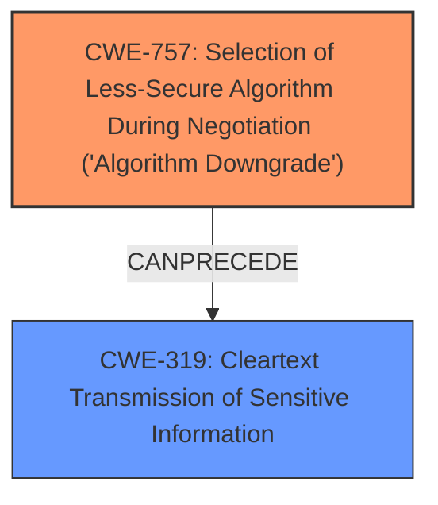

# Analysis Report for CVE-2024-8773

# Vulnerability Analysis Report: CVE-2024-8773

## Description

SIMPLE.ERP client is vulnerable to **MS SQL protocol downgrade request** from a server side, what could lead to an unencrypted communication vulnerable to data interception and modification. This issue affect SIMPLE.ERP from 6.20 to 6.30. Only the 6.30 version received a patch 6.30@a03.9, which make it possible for an administrator to enforce encrypted communication. Versions 6.20 and 6.25 remain unpatched.

## Vulnerability Description Key Phrases

- **Weakness:** MS SQL protocol downgrade request
- **Impact:** unencrypted communication vulnerable to data interception and modification
- **Attacker:** server side
- **Product:** SIMPLE.ERP
- **Version:** 6.20 to 6.30

## Analysis (with Relationship Data)

# Summary
| CWE ID | CWE Name | Confidence | CWE Abstraction Level | CWE Vulnerability Mapping Label | CWE-Vulnerability Mapping Notes |
|---|---|---|---|---|---|
| CWE-757 | Selection of Less-Secure Algorithm During Negotiation ('Algorithm Downgrade') | 1.0 | Base | Primary | Allowed |
| CWE-319 | Cleartext Transmission of Sensitive Information | 0.7 | Base | Secondary | Allowed |

## Evidence and Confidence

*   **Confidence Score:** 0.85
*   **Evidence Strength:** HIGH

## Relationship Analysis
The primary CWE is CWE-757, which describes the root cause: the selection of a less secure algorithm during negotiation. CWE-319 represents the direct consequence of this weakness, the transmission of sensitive information in cleartext. CWE-757 is a base CWE, providing a good level of detail. The relationship between CWE-757 and CWE-319 can be seen as a chain where the algorithm downgrade leads to cleartext transmission.



## Vulnerability Chain
The vulnerability chain starts with the **MS SQL protocol downgrade request** (CWE-757), leading to **unencrypted communication** (CWE-319), which then makes the system **vulnerable to data interception and modification**.

## Summary of Analysis
The analysis is strongly based on the provided evidence, specifically the vulnerability description and the CVE reference links content summary.

The vulnerability description key phrases clearly indicate a "**MS SQL protocol downgrade request**" which aligns directly with **CWE-757 (Selection of Less-Secure Algorithm During Negotiation ('Algorithm Downgrade'))**. The CVE reference links content summary reinforces this by stating "The vulnerability allows for a downgrade of the MS SQL protocol to an unencrypted form. The application accepts protocol downgrade requests originating from the server" and explicitly mentions "Selection of Less-Secure Algorithm During Negotiation ('Algorithm Downgrade') - CWE-757".

The consequence of this downgrade is the "**unencrypted communication vulnerable to data interception and modification**", which aligns with **CWE-319 (Cleartext Transmission of Sensitive Information)**.

The graph relationships confirm that this is a valid chain where the algorithm downgrade (CWE-757) can precede cleartext transmission (CWE-319).

The selected CWEs are at the optimal level of specificity as CWE-757 is a Base CWE and directly describes the root cause, while CWE-319 is a Base CWE and accurately describes the direct consequence.

Relevant CWE Information:

# Enhanced Context (25 CWEs)
The following CWEs were identified as potentially relevant to this vulnerability:

## CWE-303: Incorrect Implementation of Authentication Algorithm
**Abstraction Level**: Base
**Similarity Score**: 0.75
**Source**: dense

**Description**:
The requirements for the product dictate the use of an established authentication algorithm, but the implementation of the algorithm is incorrect.

**Mapping Guidance**:
- Usage: Allowed
- Rationale: This CWE entry is at the Base level of abstraction, which is a preferred level of abstraction for mapping to the root causes of vulnerabilities.

*Not Used:* While authentication is related, the primary issue is the downgrade to a less secure algorithm, not an incorrect implementation.

## CWE-311: Missing Encryption of Sensitive Data
**Abstraction Level**: Class
**Similarity Score**: 0.74
**Source**: dense

**Description**:
The product does not encrypt sensitive or critical information before storage or transmission.

**Mapping Guidance**:
- Usage: Discouraged
- Rationale: CWE-311 is high-level with more precise children available. It is a level-1 Class (i.e., a child of a Pillar).

*Not Used:* This is too general. CWE-319 is more specific.

## CWE-319: Cleartext Transmission of Sensitive Information
**Abstraction Level**: Base
**Similarity Score**: 0.73
**Source**: dense

**Description**:
The product transmits sensitive or security-critical data in cleartext in a communication channel that can be sniffed by unauthorized actors.

**Mapping Guidance**:
- Usage: Allowed
- Rationale: This CWE entry is at the Base level of abstraction, which is a preferred level of abstraction for mapping to the root causes of vulnerabilities.

*Used:* This is a consequence of the algorithm downgrade.

## CWE-1391: Use of Weak Credentials
**Abstraction Level**: Class
**Similarity Score**: 0.73
**Source**: dense

**Description**:
The product uses weak credentials (such as a default key or hard-coded password) that can be calculated, derived, reused, or guessed by an attacker.

**Mapping Guidance**:
- Usage: Allowed-with-Review
- Rationale: This CWE entry is a Class and might have Base-level children that would be more appropriate

*Not Used:* Weak credentials are not the root cause of this vulnerability.

## CWE-294: Authentication Bypass by Capture-replay
**Abstraction Level**: Base
**Similarity Score**: 0.73
**Source**: dense

**Description**:
A capture-replay flaw exists when the design of the product makes it possible for a malicious user to sniff network traffic and bypass authentication by replaying it to the server in question to the same effect as the original message (or with minor changes).

**Mapping Guidance**:
- Usage: Allowed
- Rationale: This CWE entry is at the Base level of abstraction, which is a preferred level of abstraction for mapping to the root causes of vulnerabilities.

*Not Used:* While a capture-replay attack is possible due to the cleartext transmission, the root cause is the algorithm downgrade.

## CWE-326: Inadequate Encryption Strength
**Abstraction Level**: Class
**Similarity Score**: 0.73
**Source**: dense

**Description**:
The product stores or transmits sensitive data using an encryption scheme that is theoretically sound, but is not strong enough for the level of protection required.

**Mapping Guidance**:
- Usage: Allowed-with-Review
- Rationale: This CWE entry is a Class and might have Base-level children that would be more appropriate

*Not Used:* The issue is the selection of a less secure algorithm that leads to no encryption, not inadequate encryption strength.

## CWE-918: Server-Side Request Forgery (SSRF)
**Abstraction Level**: Base
**Similarity Score**: 0.72
**Source**: dense

**Description**:
The web server receives a URL or similar request from an upstream component and retrieves the contents of this URL, but it does not sufficiently ensure that the request is being sent to the expected destination.

**Mapping Guidance**:
- Usage: Allowed
- Rationale: This CWE entry is at the Base level of abstraction, which is a preferred level of abstraction for mapping to the root causes of vulnerabilities.

*Not Used:* This vulnerability is not related to SSRF.

## CWE-346: Origin Validation Error
**Abstraction Level**: Class
**Similarity Score**: 0.72
**Source**: dense

**Description**:
The product does not properly verify that the source of data or communication is valid.

**Mapping Guidance**:
- Usage: Allowed-with-Review
- Rationale: This CWE entry is a Class and might have Base-level children that would be more appropriate

*Not Used:* Origin validation is not directly relevant here.

## CWE-200: Exposure of Sensitive Information to an Unauthorized Actor
**Abstraction Level**: Class
**Similarity Score**: 0.71
**Source**: dense

**Description**:
The product exposes sensitive information to an actor that is not explicitly authorized to have access to that information.

**Mapping Guidance**:
- Usage: Discouraged
- Rationale: CWE-200 is commonly misused to represent the loss of confidentiality in a vulnerability, but confidentiality loss is a technical impact - not a root cause error. As of CWE 4.9, over 400 CWE entries can lead to a loss of confidentiality. Other options are often available. [REF-1287].

*Not Used:* This is a consequence, not the root cause.

## CWE-345: Insufficient Verification of Data Authenticity
**Abstraction Level**: Class
**Similarity Score**: 0.71
**Source**: dense

**Description**:
The product does not sufficiently verify the origin or authenticity of data, in a way that causes it to accept invalid data.

**Mapping Guidance**:
- Usage: Discouraged
- Rationale: This CWE entry is a level-1 Class (i.e., a child of a Pillar). It might have lower-level children that would be more appropriate

*Not Used:* Data authenticity is not the primary concern here.

## CWE-757: Selection of Less-Secure Algorithm During Negotiation ('Algorithm Downgrade')
**Abstraction


## CWE Relationship Analysis

Current CWEs represent these abstraction levels: .


### Vulnerability Chain Analysis

**Chain starting from CWE-757:**
- 757 (Selection of Less-Secure Algorithm During Negotiation ('Algorithm Downgrade')) - ROOT


**Chain starting from CWE-345:**
- 345 (Insufficient Verification of Data Authenticity) - ROOT


### CWE Relationship Diagram

```mermaid
graph TD
    classDef primary fill:#f96,stroke:#333,stroke-width:2px
    classDef secondary fill:#69f,stroke:#333
    classDef tertiary fill:#9e9,stroke:#333
```


*Report generated on 2025-07-14 04:07:19*
