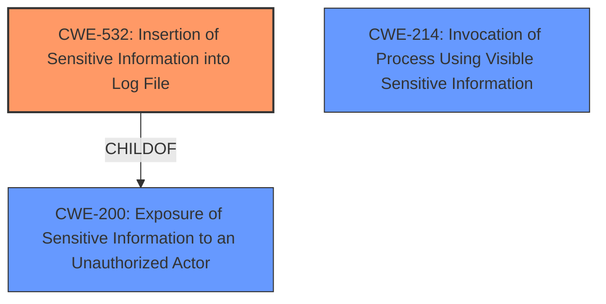

# Analysis Report for CVE-2024-8775

# Vulnerability Analysis Report: CVE-2024-8775

## Description

A flaw was found in Ansible, where sensitive information stored in Ansible Vault files can be exposed in plaintext during the execution of a playbook. This occurs when using tasks such as include_vars to load vaulted variables without setting the no_log true parameter, resulting in sensitive data being printed in the playbook output or logs. This can lead to the unintentional disclosure of secrets like passwords or API keys, compromising security and potentially allowing unauthorized access or actions.

## Vulnerability Description Key Phrases

- **Impact:** unintentional disclosure of secrets
- **Vector:** using tasks like include_vars without no_log true
- **Product:** Ansible

## Analysis (with Relationship Data)

# Summary
| CWE ID  | CWE Name                                                                     | Confidence | CWE Abstraction Level | CWE Vulnerability Mapping Label | CWE-Vulnerability Mapping Notes |
| :-------- | :--------------------------------------------------------------------------- | :--------- | :-------------------- | :------------------------------ | :------------------------------ |
| CWE-532   | Insertion of Sensitive Information into Log File                             | 0.9        | Base                  | Primary                         | Allowed                         |
| CWE-214   | Invocation of Process Using Visible Sensitive Information                  | 0.7        | Base                  | Secondary                       | Allowed                         |
| CWE-200   | Exposure of Sensitive Information to an Unauthorized Actor                             | 0.6        | Class                  | Secondary                       | Discouraged                         |

## Evidence and Confidence

*   **Confidence Score:** 0.8
*   **Evidence Strength:** HIGH

## Relationship Analysis
The primary relationship that influenced the selection was the parent-child relationship between CWE-200 (Exposure of Sensitive Information to an Unauthorized Actor) and CWE-532 (Insertion of Sensitive Information into Log File). While CWE-200 is a broader class, CWE-532 is a more specific base-level weakness that accurately captures the vulnerability's essence: sensitive data being written to a log file. CWE-214 (Invocation of Process Using Visible Sensitive Information) is a peer of CWE-526 (Cleartext Storage of Sensitive Information in an Environment Variable), suggesting a related but distinct vulnerability involving the exposure of sensitive information through process invocation, which is tangentially related but not the core issue.



## Vulnerability Chain
The vulnerability chain starts with the **improper handling of sensitive variables** loaded from Ansible Vault files. Specifically, using tasks like `include_vars` without setting `no_log: true`. This leads to **CWE-532**, the **insertion of sensitive information into log files**. The impact of this is the **unintentional disclosure of secrets**, which can then lead to unauthorized access or actions. The root cause is the **failure to prevent the logging of sensitive information**.

## Summary of Analysis
The primary CWE selected is CWE-532 (Insertion of Sensitive Information into Log File) because the vulnerability description explicitly states that sensitive information is being written to the playbook output or logs. The evidence for this is the vulnerability description, which mentions that "sensitive data being printed in the playbook output or logs." This aligns perfectly with the description of CWE-532.

CWE-214 (Invocation of Process Using Visible Sensitive Information) was considered as a secondary CWE because the vulnerability involves the execution of a playbook, which can be seen as invoking a process. Also, the vault variables are available during execution, so that fits CWE-214 too. However, the primary issue is the logging of sensitive information, making CWE-532 the more accurate choice.

CWE-200 (Exposure of Sensitive Information to an Unauthorized Actor) was also considered as a secondary CWE because it represents the overall impact of the vulnerability. However, CWE-200 is a very broad CWE, and CWE-532 provides a more specific description of the root cause. The retriever results also support CWE-532 as a relevant CWE.

The selection of CWE-532 is at the optimal level of specificity because it directly addresses the **weakness** of sensitive information being logged. The other CWEs considered are either too broad (CWE-200) or address related but distinct issues (CWE-214). The MITRE mapping guidance allows the use of CWE-532, and it is at the Base level of abstraction, which is preferred.


## CWE Relationship Analysis

Current CWEs represent these abstraction levels: .


### Vulnerability Chain Analysis

**Chain starting from CWE-200:**
- 200 (Exposure of Sensitive Information to an Unauthorized Actor) - ROOT


**Chain starting from CWE-214:**
- 214 (Invocation of Process Using Visible Sensitive Information) - ROOT


### CWE Relationship Diagram

```mermaid
graph TD
    classDef primary fill:#f96,stroke:#333,stroke-width:2px
    classDef secondary fill:#69f,stroke:#333
    classDef tertiary fill:#9e9,stroke:#333
```


*Report generated on 2025-07-14 04:07:34*
