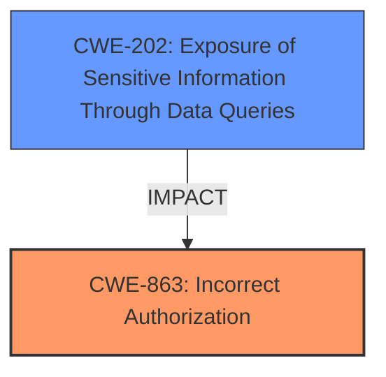

# Raw Analyzer Response for CVE-2024-8780

# Summary

| CWE ID  | CWE Name                                                                                  | Confidence | CWE Abstraction Level | CWE Vulnerability Mapping Label | CWE-Vulnerability Mapping Notes |
| :-------- | :---------------------------------------------------------------------------------------- | :--------- | :---------------------- | :------------------------------ | :------------------------------ |
| CWE-863   | Incorrect Authorization                                                                 | 0.85       | Class                   | Allowed-with-Review             | Primary CWE                     |
| CWE-202   | Exposure of Sensitive Information Through Data Queries                                  | 0.75       | Base                    | Allowed                         | Secondary Candidate             |

## Evidence and Confidence

*   **Confidence Score:** 0.80
*   **Evidence Strength:** MEDIUM

## Relationship Analysis

The primary CWE selected is CWE-863, Incorrect Authorization, which is a Class-level CWE. While more specific Base or Variant level CWEs are preferred, the provided evidence doesn't allow pinpointing the exact authorization flaw. CWE-202, Exposure of Sensitive Information Through Data Queries, is a secondary CWE, representing the impact of the **incorrect authorization** leading to the exposure of sensitive user data. CWE-863 can be a parent of CWE-942 (Permissive Cross-domain Policy with Untrusted Domains).

## Vulnerability Chain

The vulnerability chain starts with **incorrect authorization** (CWE-863) in the data query functionality. This **incorrect authorization** leads to the exposure of sensitive information through data queries (CWE-202), specifically accounts and password hashes of other users.

## Summary of Analysis

The initial analysis focused on identifying the root cause of the vulnerability based on the provided description. The key phrase "**does not properly restrict the query range**" strongly suggests an **authorization** issue, leading to the selection of CWE-863.

CWE-285 (Improper Authorization) was considered but ultimately rejected because it is discouraged and more specific options exist.

CWE-202 was selected as a secondary CWE because the vulnerability results in the exposure of sensitive information.

The final selection is based on the available evidence, with CWE-863 representing the **root cause** and CWE-202 representing the impact. The level of specificity is limited by the information provided in the vulnerability description.

Relevant CWE Information:

# Enhanced Context (25 CWEs)
The following CWEs were identified as potentially relevant to this vulnerability:

## CWE-863: Incorrect Authorization
**Abstraction Level**: Class
**Similarity Score**: 1345.67
**Source**: sparse

**Description**:
The product performs an authorization check when an actor attempts to access a resource or perform an action, but it does not correctly perform the check.

**Mapping Guidance**:
- Usage: Allowed-with-Review
- Rationale: This CWE entry is a Class and might have Base-level children that would be more appropriate

## CWE-202: Exposure of Sensitive Information Through Data Queries
**Abstraction Level**: base
**Similarity Score**: 2.40
**Source**: graph

**Description**:
CWE-202: Exposure of Sensitive Information Through Data Queries

**Mapping Guidance**:
- Usage: Allowed
- Rationale: This CWE entry is at the Base level of abstraction, which is a preferred level of abstraction for mapping to the root causes of vulnerabilities.

**Relationships**:
- CHILDOF -> CWE-1230
- CANALSOBE -> CWE-202
- PARENTOF -> CWE-202