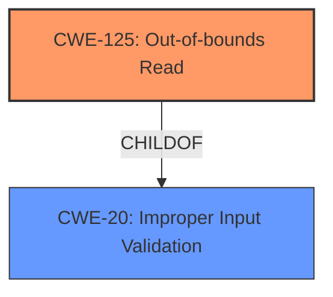

# Raw Analyzer Response for CVE-2024-8819

# Summary
| CWE ID    | CWE Name                                                                                    | Confidence | CWE Abstraction Level | CWE Vulnerability Mapping Label | CWE-Vulnerability Mapping Notes |
| --------- | ------------------------------------------------------------------------------------------- | ---------- | ----------------------- | ------------------------------- | ------------------------------- |
| CWE-125   | Out-of-bounds Read                                                                         | 0.9        | Base                    | Primary                         | Allowed                         |
| CWE-20    | Improper Input Validation                                                                 | 0.7        | Class                   | Secondary                       | Allowed                         |

## Evidence and Confidence

*   **Confidence Score:** 0.8
*   **Evidence Strength:** HIGH

## Relationship Analysis
The primary CWE is CWE-125, which describes the **out-of-bounds read** condition. CWE-20 is related because the **lack of proper validation** is a root cause. CWE-125 is a base level CWE, offering a specific description of the vulnerability. CWE-20 is a class-level CWE, representing the broader category of input validation issues.

## Vulnerability Chain
The vulnerability chain starts with **improper input validation (CWE-20)**, leading to an **out-of-bounds read (CWE-125)**, and ultimately resulting in **information disclosure**.

## Summary of Analysis
The primary weakness is the **out-of-bounds read**, directly stated in the vulnerability description. The **lack of proper validation** is the root cause that permits the vulnerability to occur. The vulnerability description explicitly mentions the **out-of-bounds read** and the **lack of proper validation**.

The selection of CWE-125 is based on the explicit mention of **out-of-bounds read** in the vulnerability description, which states: "The issue results from the **lack of proper validation of user-supplied data**, which can result in a read past the end of an allocated buffer." This directly aligns with the description of CWE-125: "The product reads data past the end, or before the beginning, of the intended buffer."

The secondary CWE, CWE-20, is added because the root cause is the **lack of proper validation of user-supplied data**. This aligns with the description of CWE-20: "The product receives input or data, but it does not validate or incorrectly validates that the input has the properties that are required to process the data safely and correctly."

Other CWEs were considered but deemed less appropriate. CWE-787 (**Out-of-bounds Write**) was considered due to its high score, but the vulnerability is specifically about reading, not writing, past the buffer. CWE-1284 (**Improper Validation of Specified Quantity in Input**) was also considered but deemed less relevant than CWE-20, as the issue isn't solely related to quantity but general input validation.

Relevant CWE Information:

**CWE-125: Out-of-bounds Read**
The product reads data past the end, or before the beginning, of the intended buffer.
**CWE-20: Improper Input Validation**
The product receives input or data, but it does not validate or incorrectly validates that the input has the properties that are required to process the data safely and correctly.