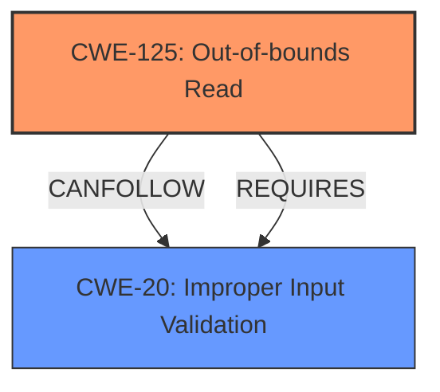

# Enhanced Analysis for CVE-2024-8823

# Summary
| CWE ID  | CWE Name                                                                 | Confidence | CWE Abstraction Level | CWE Vulnerability Mapping Label | CWE-Vulnerability Mapping Notes |
| :-------- | :----------------------------------------------------------------------- | :--------- | :---------------------- | :------------------------------ | :------------------------------ |
| CWE-125 | Out-of-bounds Read | 1.0  | Base                   | Primary          | Allowed                |
| CWE-20  | Improper Input Validation                                                  | 0.9        | Class                  | Secondary                       | Allowed                |

## Evidence and Confidence

*   **Confidence Score:** 0.95
*   **Evidence Strength:** HIGH

## Relationship Analysis
The primary weakness is **CWE-125 - Out-of-bounds Read**, which directly reflects the vulnerability description of reading past the end of an allocated object. This leads to **CWE-20 - Improper Input Validation** because the root cause is a **lack of proper validation of user-supplied data**. Thus, the program reads beyond the buffer.



## Vulnerability Chain
The vulnerability chain starts with **improper input validation** (**CWE-20**), leading to an **out-of-bounds read** (**CWE-125**). The impact of this is **information disclosure**.

## Summary of Analysis
The vulnerability is an out-of-bounds read due to a **lack of proper validation of user-supplied data**.
*   The description clearly states: "The issue results from the **lack of proper validation of user-supplied data**, which can result in a read past the end of an allocated object."
*   The vulnerability is classified as **CWE-125 - Out-of-bounds Read** because the description explicitly mentions "read past the end of an allocated object."
*   **CWE-20 - Improper Input Validation** is a secondary weakness because the root cause is a **lack of proper validation of user-supplied data**.

The retriever results and keyphrase analysis consistently highlight **CWE-20**, **CWE-125**, and **CWE-1284** as relevant. However, **CWE-125** directly matches the **Out-Of-Bounds Read** description.

**CWEs Considered But Not Used:**

*   **CWE-787 (Out-of-bounds Write)**: This CWE was not selected because the vulnerability description specifies a read, not a write.
*   **CWE-1284 (Improper Validation of Specified Quantity in Input)**: This CWE is related to validating quantities like size or length. While input validation is involved, **CWE-20** is a more general and appropriate fit for the **lack of proper validation of user-supplied data**.
*   **CWE-122 (Heap-based Buffer Overflow)**: This CWE was not selected as the description indicates an out-of-bounds read, and not necessarily a buffer overflow on the heap.
*   **CWE-126 (Buffer Over-read)**: This is similar to CWE-125. CWE-125 is preferred.


## CWE Relationship Analysis

Current CWEs represent these abstraction levels: .


### Vulnerability Chain Analysis

**Chain starting from CWE-1284:**
- 1284 (Improper Validation of Specified Quantity in Input) - ROOT


**Chain starting from CWE-125:**
- 125 (Out-of-bounds Read) - ROOT


### CWE Relationship Diagram

```mermaid
graph TD
    classDef primary fill:#f96,stroke:#333,stroke-width:2px
    classDef secondary fill:#69f,stroke:#333
    classDef tertiary fill:#9e9,stroke:#333
```