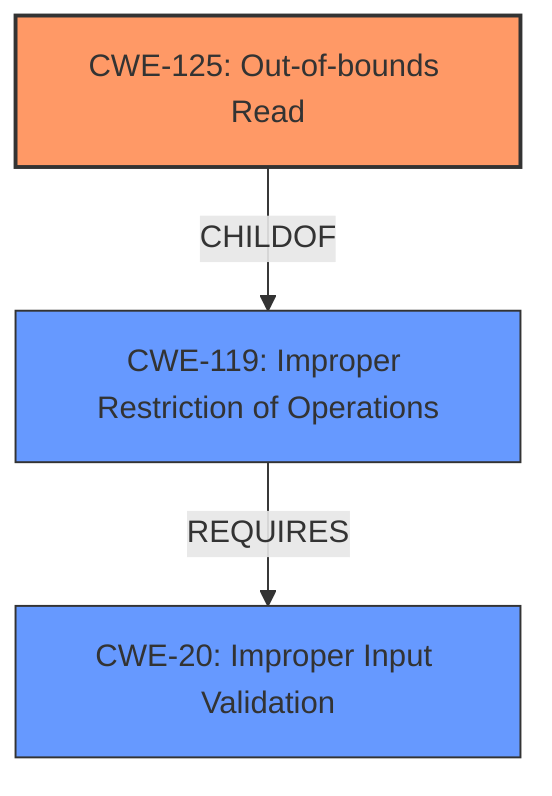

# Analysis Report for CVE-2024-8832

# Vulnerability Analysis Report: CVE-2024-8832

## Description

PDF-XChange Editor EMF File Parsing **Out-Of-Bounds Read** **Information Disclosure Vulnerability**. This vulnerability allows remote attackers to disclose sensitive information on affected installations of PDF-XChange Editor. User interaction is required to exploit this vulnerability in that the target must visit a malicious page or open a malicious file. The specific flaw exists within the parsing of EMF files. The issue results from the **lack of proper validation of user-supplied data**, which can result in a read past the end of an allocated object. An attacker can leverage this in conjunction with other vulnerabilities to execute arbitrary code in the context of the current process. Was ZDI-CAN-24317.

## Vulnerability Description Key Phrases

- **Rootcause:** lack of proper validation of user-supplied data
- **Weakness:** ['Information Disclosure Vulnerability', 'Out-Of-Bounds Read']
- **Impact:** ['Information Disclosure', 'disclose sensitive information', 'execute arbitrary code']
- **Vector:** visiting a malicious page or opening a malicious file
- **Attacker:** remote attackers
- **Product:** PDF-XChange Editor
- **Component:** EMF File Parsing

## Analysis (with Relationship Data)

# Summary
| CWE ID  | CWE Name                                                                                                                                 | Confidence | CWE Abstraction Level | CWE Vulnerability Mapping Label | CWE-Vulnerability Mapping Notes |
| :-------- | :--------------------------------------------------------------------------------------------------------------------------------------- | :----------- | :---------------------- | :------------------------------ | :------------------------------ |
| CWE-125   | Out-of-bounds Read                                                                                                                       | 1          | Base                    | Primary                         | Allowed                         |
| CWE-20    | Improper Input Validation                                                                                                                | 0.8          | Class                   | Secondary                       | Allowed                         |

## Evidence and Confidence

*   **Confidence Score:** 0.9
*   **Evidence Strength:** HIGH

## Relationship Analysis
The primary weakness is CWE-125, which is a base-level CWE, and accurately reflects the **out-of-bounds read** condition described in the vulnerability. CWE-125 is child of CWE-119 (Improper Restriction of Operations within the Bounds of a Memory Buffer), which is a more general class. CWE-20 is a class level of abstraction and a parent of CWE-1284, which could have been more specific if there was specific quantity being validated.



## Vulnerability Chain
The vulnerability chain starts with **lack of proper validation of user-supplied data** (CWE-20), which leads to an **out-of-bounds read** (CWE-125). The out-of-bounds read then leads to **information disclosure**.
  - The primary weakness is CWE-125 which is an **out-of-bounds read**.
  - The root cause is the **lack of proper validation** (CWE-20).
  - The impact is **information disclosure**.

## Summary of Analysis
The primary CWE, CWE-125 (Out-of-bounds Read), is selected based on the vulnerability description clearly stating an "Out-Of-Bounds Read". The vulnerability description states "The issue results from the **lack of proper validation of user-supplied data**, which can result in a read past the end of an allocated object". The **lack of proper validation** is a root cause, so CWE-20 is selected as a secondary CWE. The final impact of this vulnerability is **information disclosure**.

The retriever results generally align with the vulnerability description.

CWE-119 is too general.

CWE-787 is not correct because the vulnerability involves a read, not a write.

CWE-1284 could be considered but is not specific enough since the type of input is not a specified quantity.

CWE-497 (Exposure of Sensitive System Information to an Unauthorized Control Sphere) could be considered as the impact. But the retriever identified the **out-of-bounds read** condition.


## CWE Relationship Analysis

Current CWEs represent these abstraction levels: .


### Vulnerability Chain Analysis

**Chain starting from CWE-1284:**
- 1284 (Improper Validation of Specified Quantity in Input) - ROOT


**Chain starting from CWE-125:**
- 125 (Out-of-bounds Read) - ROOT


### CWE Relationship Diagram

```mermaid
graph TD
    classDef primary fill:#f96,stroke:#333,stroke-width:2px
    classDef secondary fill:#69f,stroke:#333
    classDef tertiary fill:#9e9,stroke:#333
```


*Report generated on 2025-07-14 04:14:37*
