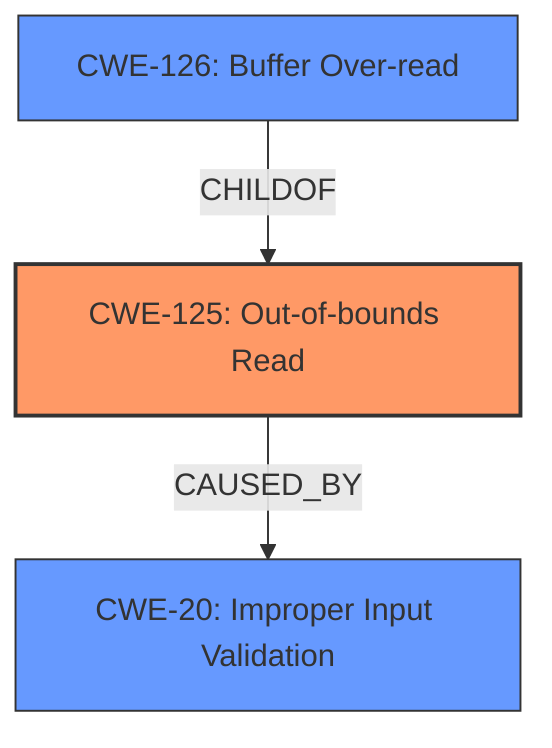

# Enhanced Analysis for CVE-2024-8843

# Summary
| CWE ID    | CWE Name                                                                  | Confidence | CWE Abstraction Level | CWE Vulnerability Mapping Label | CWE-Vulnerability Mapping Notes |
| :---------- | :------------------------------------------------------------------------ | :--------- | :---------------------- | :------------------------------ | :------------------------------ |
| CWE-125     | Out-of-bounds Read                                                        | 0.95       | Base                    | Primary CWE                     | Allowed                       |
| CWE-20      | Improper Input Validation                                                 | 0.85       | Class                   | Secondary Candidate             | Allowed                       |
| CWE-126     | Buffer Over-read                                                 | 0.70       | Variant                   | Secondary Candidate             | Allowed                       |

## Evidence and Confidence

*   **Confidence Score:** 0.90
*   **Evidence Strength:** HIGH

## Relationship Analysis
The primary weakness is an **Out-of-bounds Read (CWE-125)**, which is a type of memory access error. This often occurs because of **Improper Input Validation (CWE-20)**. **Buffer Over-read (CWE-126)** is a more specific type of out-of-bounds read. The relationships show that improper input validation can lead to out-of-bounds reads, and a buffer over-read is a specific instance of such a read.mermaid



## Vulnerability Chain
The vulnerability chain starts with **Improper Input Validation (CWE-20)**, leading to an **Out-of-bounds Read (CWE-125)**. This **Out-of-bounds Read** results in **Information Disclosure**. An attacker exploits the **lack of proper validation of user-supplied data** to trigger the **Out-of-bounds Read** condition during JB2 file parsing.

## Summary of Analysis
The primary classification is **CWE-125 (Out-of-bounds Read)**, as the vulnerability description explicitly states that the issue results in a read past the end of an allocated object. This is a direct match for the definition of **CWE-125**. The **lack of proper validation of user-supplied data** is a contributing factor and is classified as **CWE-20 (Improper Input Validation)**. **CWE-126 (Buffer Over-read)** was considered as a more specific case of **CWE-125** and is a reasonable secondary candidate, because the vulnerability occurs in the context of reading a buffer.

The vulnerability description states: "The issue results from the **lack of proper validation of user-supplied data**, which can result in a read past the end of an allocated object."

The graph relationships support this by showing that **CWE-20** can lead to **CWE-125**.

The selected CWEs are at the optimal level of specificity because **CWE-125** directly describes the **Out-of-bounds Read** condition, and **CWE-20** describes the **lack of proper validation** that leads to it.
```


## CWE Relationship Analysis

Current CWEs represent these abstraction levels: .


### Vulnerability Chain Analysis

**Chain starting from CWE-126:**
- 126 (Buffer Over-read) - ROOT


**Chain starting from CWE-20:**
- 20 (Improper Input Validation) - ROOT


### CWE Relationship Diagram

```mermaid
graph TD
    classDef primary fill:#f96,stroke:#333,stroke-width:2px
    classDef secondary fill:#69f,stroke:#333
    classDef tertiary fill:#9e9,stroke:#333
```