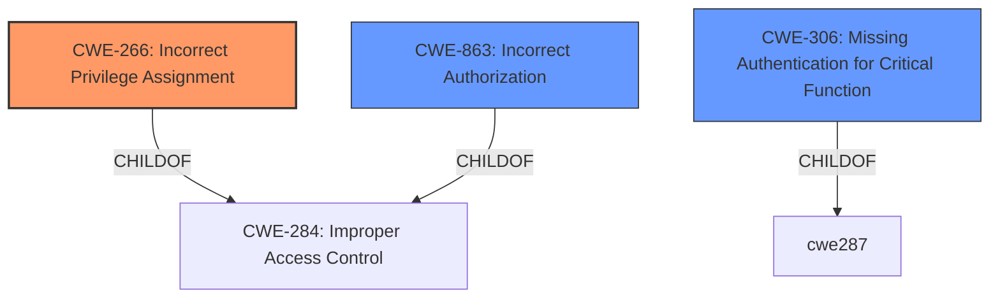

# Analysis Report for CVE-2024-8853

# Vulnerability Analysis Report: CVE-2024-8853

## Description

The Webo-facto plugin for WordPress is vulnerable to privilege escalation in versions up to, and including, 1.40 due to **insufficient restriction on the doSsoAuthentification function**. This makes it possible for unauthenticated attackers to make themselves administrators by registering with a username that contains -wfuser.

## Vulnerability Description Key Phrases

- **Rootcause:** insufficient restriction on the doSsoAuthentification function
- **Impact:** privilege escalation
- **Attacker:** unauthenticated attackers
- **Product:** Webo-facto plugin for WordPress
- **Version:** up to and including 1.40

## Analysis (with Relationship Data)

# Summary
| CWE ID  | CWE Name                                         | Confidence | CWE Abstraction Level | CWE Vulnerability Mapping Label | CWE-Vulnerability Mapping Notes |
| :-------- | :----------------------------------------------- | :--------- | :-------------------- | :------------------------------ | :------------------------------ |
| CWE-266   | Incorrect Privilege Assignment                   | 0.95       | Base                  | Primary                         | Allowed                       |
| CWE-306   | Missing Authentication for Critical Function     | 0.75       | Base                  | Secondary                       | Allowed                       |
| CWE-863   | Incorrect Authorization                          | 0.60       | Class                 | Secondary                       | Allowed-with-Review           |

## Evidence and Confidence

*   **Confidence Score:** 0.85
*   **Evidence Strength:** HIGH

## Relationship Analysis

The primary relationship influencing the CWE selection is the parent-child relationship, where more specific **Base** CWEs are preferred over generic **Class** or **Pillar** CWEs. The analysis considered the guidance on privileges vs. permissions. The vulnerability involves incorrect privilege assignment, leading to privilege escalation. This suggests **CWE-266 (Incorrect Privilege Assignment)** as the primary root cause. The **insufficient restriction** on the function, coupled with the ability for an unauthenticated user to exploit it, also suggests **CWE-306 (Missing Authentication for Critical Function)** as a secondary weakness. **CWE-863 (Incorrect Authorization)** is also considered, as the authorization check on the `doSsoAuthentification` function is present but flawed, allowing privilege escalation based on a crafted username.



## Vulnerability Chain

The vulnerability chain starts with **CWE-266 (Incorrect Privilege Assignment)**, where the plugin **incorrectly assigns privileges** by allowing unauthenticated users to become administrators. This leads to **CWE-306 (Missing Authentication for Critical Function)** because the `doSsoAuthentification` function lacks proper authentication checks. An attacker can then exploit this by registering with a username containing "-wfuser", triggering the vulnerability and escalating their privileges. This can be seen as leading to **CWE-863 (Incorrect Authorization)** as the authorization check does not properly restrict access based on roles, specifically allowing the attacker to bypass the intended restrictions. The final impact is privilege escalation, granting the attacker full control of the WordPress site.

## Summary of Analysis

The initial assessment focused on identifying the root cause of the vulnerability. The vulnerability description and CVE reference links highlight **insufficient restriction** on the `doSsoAuthentification` function, enabling unauthenticated attackers to gain administrative privileges. The key phrase "makes it possible for unauthenticated attackers to make themselves administrators" points to a problem with privilege management and authentication.

The retriever results suggest several relevant CWEs, including **CWE-287 (Improper Authentication)**, **CWE-284 (Improper Access Control)**, **CWE-863 (Incorrect Authorization)**, **CWE-862 (Missing Authorization)**, and **CWE-306 (Missing Authentication for Critical Function)**. After careful consideration, **CWE-266 (Incorrect Privilege Assignment)** was selected as the primary CWE because the plugin's logic flaw directly assigns administrative privileges based on a manipulated username, rather than a failure in authentication or authorization alone. The code checks if a user is logged in and if their username contains "-wfuser". If both conditions are met, the `makeAdmin` function is called, which elevates the user to administrator. This is an incorrect privilege assignment because an unauthenticated user can register with a crafted username and gain administrative privileges.

The graph relationships and mapping guidance further solidified the choice of **CWE-266**. The mapping guidance highlights that **CWE-266** is appropriate when the system assigns incorrect privileges to a user due to misconfigured roles or faulty logic. This aligns perfectly with the vulnerability description, where the plugin assigns admin privileges based on a flawed username check.

Other considered but unused CWEs:

*   **CWE-287 (Improper Authentication)**: While authentication is related, the core issue is the incorrect assignment of privileges based on a faulty check.
*   **CWE-284 (Improper Access Control)**: Too generic. **CWE-266** provides a more specific description of the vulnerability.
*   **CWE-862 (Missing Authorization)**: The function has an authorization check, though it is flawed. Therefore, it's not a case of completely missing authorization, but incorrect authorization.
*   **CWE-285 (Improper Authorization)**: Similar to **CWE-863**, but **CWE-863** is more aligned with the description that "it does not correctly perform the check."
*   **CWE-306 (Missing Authentication for Critical Function)**: While the function is vulnerable for unauthenticated users, **CWE-266** explains that the function logic assigns admin privileges.

The selected CWEs are at the optimal level of specificity because they accurately represent the root cause and contributing factors of the vulnerability, based on the provided evidence.


## CWE Relationship Analysis

Current CWEs represent these abstraction levels: .


### Vulnerability Chain Analysis

**Chain starting from CWE-863:**
- 863 (Incorrect Authorization) - ROOT


**Chain starting from CWE-862:**
- 862 (Missing Authorization) - ROOT


### CWE Relationship Diagram

```mermaid
graph TD
    classDef primary fill:#f96,stroke:#333,stroke-width:2px
    classDef secondary fill:#69f,stroke:#333
    classDef tertiary fill:#9e9,stroke:#333
```


*Report generated on 2025-07-14 04:20:04*
