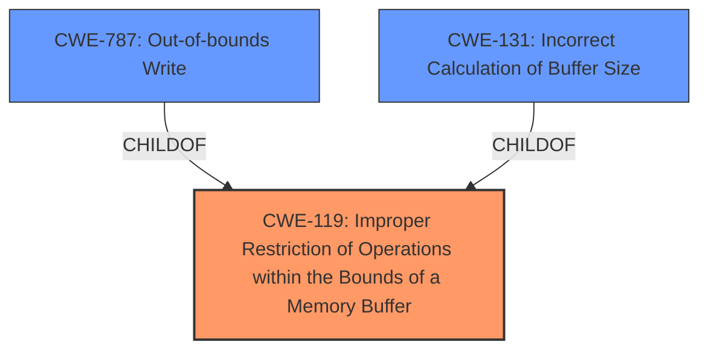

# Analysis Report for CVE-2024-8938

# Vulnerability Analysis Report: CVE-2024-8938

## Description

CWE-119 **Improper Restriction of Operations within the Bounds of a Memory Buffer** vulnerability exists that could cause a potential arbitrary code execution after a successful Man-In-The-Middle attack followed by sending a crafted Modbus function call to tamper with memory area involved in memory size computation.

## Vulnerability Description Key Phrases

- **Rootcause:** Improper Restriction of Operations within the Bounds of a Memory Buffer
- **Impact:** arbitrary code execution
- **Vector:** crafted Modbus function call
- **Attacker:** attacker

## Analysis (with Relationship Data)

# Summary

| CWE ID  | CWE Name                                                                 | Confidence | CWE Abstraction Level | CWE Vulnerability Mapping Label | CWE-Vulnerability Mapping Notes |
| :-------- | :----------------------------------------------------------------------- | :--------- | :-------------------- | :------------------------------ | :------------------------------ |
| CWE-119 | Improper Restriction of Operations within the Bounds of a Memory Buffer | 0.90       | Class                 | Primary                         | Discouraged                     |
| CWE-787 | Out-of-bounds Write                                                      | 0.65       | Base                  | Secondary                       | Allowed                         |
| CWE-131 | Incorrect Calculation of Buffer Size                                     | 0.60       | Base                  | Secondary                       | Allowed                         |

## Evidence and Confidence

*   **Confidence Score:** 0.75
*   **Evidence Strength:** MEDIUM

## Relationship Analysis

The primary CWE, CWE-119 **Improper Restriction of Operations within the Bounds of a Memory Buffer**, is a Class-level CWE. While it directly matches the description's root cause, it's generally **Discouraged** due to its high level of abstraction. The analysis considered more specific Base-level CWEs like CWE-787 **Out-of-bounds Write** and CWE-131 **Incorrect Calculation of Buffer Size**. These are related to CWE-119 through ChildOf relationships. CWE-787 and CWE-131 were chosen as secondary because they reflect the specific mechanisms through which the buffer overflow occurs, related to memory size computation and writing beyond allocated memory.



## Vulnerability Chain

The vulnerability chain starts with a successful Man-In-The-Middle attack, followed by a crafted Modbus function call. This crafted call exploits an **Improper Restriction of Operations within the Bounds of a Memory Buffer (CWE-119)**, potentially due to an **Incorrect Calculation of Buffer Size (CWE-131)**, leading to an **Out-of-bounds Write (CWE-787)**, and ultimately resulting in arbitrary code execution.

Root Cause: CWE-119 (triggered by CWE-131) -> Weakness: CWE-787 -> Impact: Arbitrary Code Execution

## Summary of Analysis

The initial analysis strongly pointed towards CWE-119 **Improper Restriction of Operations within the Bounds of a Memory Buffer**, based on the description and CVE summary: "The vulnerability is due to an 'Improper Restriction of Operations within the Bounds of a Memory Buffer'." However, the retriever results and CWE specifications emphasize choosing more specific CWEs when available.

The analysis considered CWE-787 **Out-of-bounds Write** and CWE-131 **Incorrect Calculation of Buffer Size** because the crafted Modbus function call tampers with the memory area involved in memory size computation, and the vulnerability allows for potentially writing beyond allocated memory space. These are more specific than CWE-119 and contribute to the root cause.

The final decision includes CWE-119 as the primary due to it being explicitly mentioned in the vulnerability description and CVE summary as the root cause. CWE-787 and CWE-131 are included as secondary CWEs to provide more specific details about the vulnerability mechanism.

Relevant CWE Information:

# Enhanced Context (25 CWEs)

## CWE-119: Improper Restriction of Operations within the Bounds of a Memory Buffer
**Abstraction Level**: Class
**Similarity Score**: 0.75
**Source**: dense

**Description**:
The product performs operations on a memory buffer, but it reads from or writes to a memory location outside the buffer's intended boundary. This may result in read or write operations on unexpected memory locations that could be linked to other variables, data structures, or internal program data.

**Mapping Guidance**:
- Usage: Discouraged
- Rationale: CWE-119 is commonly misused in low-information vulnerability reports when lower-level CWEs could be used instead, or when more details about the vulnerability are available.

*Technical Explanation:* This CWE describes the general condition of writing outside of a buffer's boundaries. The vulnerability description explicitly mentions this weakness as the root cause.
*Security Implications:* Allows for overwriting adjacent memory, leading to potential arbitrary code execution.
*Relationship Analysis:* It is a Class-level CWE, and more specific Base or Variant CWEs might be more appropriate if the specific cause of the buffer overflow is known.

## CWE-805: Buffer Access with Incorrect Length Value
**Abstraction Level**: Base
**Similarity Score**: 0.73
**Source**: dense

**Description**:
The product uses a sequential operation to read or write a buffer, but it uses an incorrect length value that causes it to access memory that is outside of the bounds of the buffer.

**Mapping Guidance**:
- Usage: Allowed
- Rationale: This CWE entry is at the Base level of abstraction, which is a preferred level of abstraction for mapping to the root causes of vulnerabilities.

*Technical Explanation:* This CWE focuses on incorrect length values used in buffer operations.
*Security Implications:* Can cause out-of-bounds read or write operations, leading to information disclosure or arbitrary code execution.
*Relationship Analysis:* A Base-level CWE that provides more detail than CWE-119.

## CWE-131: Incorrect Calculation of Buffer Size
**Abstraction Level**: Base
**Similarity Score**: 0.73
**Source**: dense

**Description**:
The product does not correctly calculate the size to be used when allocating a buffer, which could lead to a buffer overflow.

**Mapping Guidance**:
- Usage: Allowed
- Rationale: This CWE entry is at the Base level of abstraction, which is a preferred level of abstraction for mapping to the root causes of vulnerabilities.

*Technical Explanation:* This CWE describes the scenario where the buffer size is incorrectly calculated.
*Security Implications:* Leads to undersized buffers, causing buffer overflows when data exceeds the calculated size.
*Relationship Analysis:* A Base-level CWE that can lead to CWE-119.

## CWE-824: Access of Uninitialized Pointer
**Abstraction Level**: Base
**Similarity Score**: 0.73
**Source**: dense

**Description**:
The product accesses or uses a pointer that has not been initialized.

**Mapping Guidance**:
- Usage: Allowed
- Rationale: This CWE entry is at the Base level of abstraction, which is a preferred level of abstraction for mapping to the root causes of vulnerabilities.

*Technical Explanation:* This CWE involves using a pointer before it has been assigned a valid memory address.
*Security Implications:* Can lead to unpredictable behavior, including crashes, information disclosure, or arbitrary code execution.
*Relationship Analysis:* While related to memory access, it doesn't directly apply to the buffer overflow scenario described.

## CWE-134: Use of Externally-Controlled Format String
**Abstraction Level**: Base
**Similarity Score**: 0.71
**Source**: dense

**Description**:
The product uses a function that accepts a format string as an argument, but the format string originates from an external source.

**Mapping Guidance**:
- Usage: Allowed
- Rationale: This CWE entry is at the Base level of abstraction, which is a preferred level of abstraction for mapping to the root causes of vulnerabilities.

*Technical Explanation:* This CWE involves using a format string from an external source in a function call.
*Security Implications:* Can allow attackers to read from or write to arbitrary memory locations.
*Relationship Analysis:* Not directly related to the buffer overflow described.

## CWE-789: Memory Allocation with Excessive Size Value
**Abstraction Level**: Variant
**Similarity Score**: 0.71
**Source**: dense

**Description**:
The product allocates memory based on an untrusted, large size value, but it does not ensure that the size is within expected limits, allowing arbitrary amounts of memory to be allocated.

**Mapping Guidance**:
- Usage: Allowed
- Rationale: This CWE entry is at the Variant level of abstraction, which is a preferred level of abstraction for mapping to the root causes of vulnerabilities.

*Technical Explanation:* This CWE describes allocating memory based on an excessively large, untrusted size.
*Security Implications:* Can lead to denial-of-service due to excessive memory consumption.
*Relationship Analysis:* Not directly relevant to the described vulnerability.

## CWE-755: Improper Handling of Exceptional Conditions
**Abstraction Level**: Class
**Similarity Score**: 0.71
**Source**: dense

**Description**:
The product does not handle or incorrectly handles an exceptional condition.

**Mapping Guidance**:
- Usage: Discouraged
- Rationale: This


## CWE Relationship Analysis

Current CWEs represent these abstraction levels: .


### Vulnerability Chain Analysis

**Chain starting from CWE-805:**
- 805 (Buffer Access with Incorrect Length Value) - ROOT


**Chain starting from CWE-131:**
- 131 (Incorrect Calculation of Buffer Size) - ROOT


### CWE Relationship Diagram

```mermaid
graph TD
    classDef primary fill:#f96,stroke:#333,stroke-width:2px
    classDef secondary fill:#69f,stroke:#333
    classDef tertiary fill:#9e9,stroke:#333
```


*Report generated on 2025-07-14 04:25:45*
