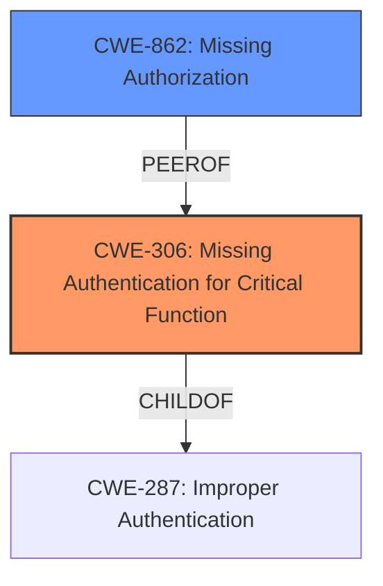

# Analysis Report for CVE-2024-8956

# Vulnerability Analysis Report: CVE-2024-8956

## Description

PTZOptics PT30X-SDI/NDI-xx before firmware 6.3.40 is vulnerable to an **insufficient authentication** issue. The camera does not properly enforce authentication to /cgi-bin/param.cgi when requests are sent without an HTTP Authorization header. The result is a remote and unauthenticated attacker can leak sensitive data such as usernames, password hashes, and configurations details. Additionally, the attacker can update individual configuration values or overwrite the whole file.

## Vulnerability Description Key Phrases

- **Rootcause:** insufficient authentication
- **Weakness:** authentication issue
- **Impact:** ["['leak sensitive data'", "'update individual configuration values'", "'overwrite the whole file']"]
- **Vector:** requests without an HTTP Authorization header
- **Attacker:** remote and unauthenticated attacker
- **Product:** PTZOptics PT30X-SDI/NDI-xx
- **Version:** before firmware 6.3.40
- **Component:** /cgi-bin/param.cgi

## Analysis (with Relationship Data)

# Summary
| CWE ID | CWE Name | Confidence | CWE Abstraction Level | CWE Vulnerability Mapping Label | CWE-Vulnerability Mapping Notes |
|---|---|---|---|---|---|
| CWE-306 | Missing Authentication for Critical Function | 1.0 | Base | Primary CWE | Allowed |
| CWE-862 | Missing Authorization | 0.7 | Base | Secondary Candidate | Allowed |

## Evidence and Confidence

*   **Confidence Score:** 0.9
*   **Evidence Strength:** HIGH

## Relationship Analysis
The primary relationship influencing the selection was the parent-child relationship between CWE-287 (Improper Authentication) and CWE-306 (Missing Authentication for Critical Function). Since the vulnerability explicitly describes a scenario where authentication is entirely missing for a critical function, CWE-306 was chosen as the more specific and accurate representation. CWE-862 (Missing Authorization) was considered but deemed less appropriate because the issue is rooted in the complete absence of authentication, not a failure in authorization after authentication.



## Vulnerability Chain
The vulnerability chain starts with the **lack of authentication (CWE-306)** for the `/cgi-bin/param.cgi` endpoint. This allows an unauthenticated attacker to access and modify sensitive camera parameters. The impact of this **missing authentication** leads to potential information disclosure (usernames, password hashes, and configuration details) and the ability to modify camera settings. Thus, the chain is:

CWE-306 (Missing Authentication) -> Information Disclosure / Configuration Modification

## Summary of Analysis
The initial analysis identified several candidate CWEs, but the most accurate is CWE-306 (Missing Authentication for Critical Function). The vulnerability description explicitly states that the camera **does not properly enforce authentication** to `/cgi-bin/param.cgi` when requests are sent without an HTTP Authorization header. This directly aligns with the definition of CWE-306.

The evidence supporting this decision is:
- **Vulnerability Description Key Phrases**: "**rootcause:** **insufficient authentication**"
- **CVE Reference Links Content Summary**: "The vulnerability stems from **insufficient authentication** for the `/cgi-bin/param.cgi` endpoint on PTZOptics cameras. This allows unauthorized access to modify device settings."
- **CVE Reference Links Content Summary**: "The primary issue is the **lack of proper authentication checks** on the `/cgi-bin/param.cgi` endpoint. This allows unauthenticated users to access and modify sensitive camera parameters via HTTP-CGI requests."

CWE-862 (Missing Authorization) was considered, but the root cause is the absence of authentication, not a failure in authorization after successful authentication. Therefore, CWE-306 is the more appropriate choice.

The selected CWE is at the optimal level of specificity (Base) because it directly addresses the root cause of the vulnerability.
The CWE Classification Guidance was very helpful in differentiating Authentication vs. Authorization.

Relevant CWE Information:

# Enhanced Context (25 CWEs)
The following CWEs were identified as potentially relevant to this vulnerability:

## CWE-1391: Use of Weak Credentials
**Abstraction Level**: Class
**Similarity Score**: 0.77
**Source**: dense

**Description**:
The product uses weak credentials (such as a default key or hard-coded password) that can be calculated, derived, reused, or guessed by an attacker.

**Mapping Guidance**:
- Usage: Allowed-with-Review
- Rationale: This CWE entry is a Class and might have Base-level children that would be more appropriate
- *Not selected*: The vulnerability is about **insufficient authentication**, not the usage of weak credentials.

## CWE-807: Reliance on Untrusted Inputs in a Security Decision
**Abstraction Level**: Base
**Similarity Score**: 0.76
**Source**: dense

**Description**:
The product uses a protection mechanism that relies on the existence or values of an input, but the input can be modified by an untrusted actor in a way that bypasses the protection mechanism.

**Mapping Guidance**:
- Usage: Allowed
- Rationale: This CWE entry is at the Base level of abstraction, which is a preferred level of abstraction for mapping to the root causes of vulnerabilities.
- *Not selected*: This doesn't apply as the vulnerability lies in **missing authentication**, not in relying on untrusted inputs.

## CWE-303: Incorrect Implementation of Authentication Algorithm
**Abstraction Level**: Base
**Similarity Score**: 0.76
**Source**: dense

**Description**:
The requirements for the product dictate the use of an established authentication algorithm, but the implementation of the algorithm is incorrect.

**Mapping Guidance**:
- Usage: Allowed
- Rationale: This CWE entry is at the Base level of abstraction, which is a preferred level of abstraction for mapping to the root causes of vulnerabilities.
- *Not selected*: The vulnerability is about **missing authentication**, not an incorrect implementation of an authentication algorithm.

## CWE-41: Improper Resolution of Path Equivalence
**Abstraction Level**: Base
**Similarity Score**: 0.76
**Source**: dense

**Description**:
The product is vulnerable to file system contents disclosure through path equivalence. Path equivalence involves the use of special characters in file and directory names. The associated manipulations are intended to generate multiple names for the same object.

**Mapping Guidance**:
- Usage: Allowed
- Rationale: This CWE entry is at the Base level of abstraction, which is a preferred level of abstraction for mapping to the root causes of vulnerabilities.
- *Not selected*: This is not relevant to the vulnerability, which is about **missing authentication**.

## CWE-472: External Control of Assumed-Immutable Web Parameter
**Abstraction Level**: Base
**Similarity Score**: 0.76
**Source**: dense

**Description**:
The web application does not sufficiently verify inputs that are assumed to be immutable but are actually externally controllable, such as hidden form fields.

**Mapping Guidance**:
- Usage: Allowed
- Rationale: This CWE entry is at the Base level of abstraction, which is a preferred level of abstraction for mapping to the root causes of vulnerabilities.
- *Not selected*: The vulnerability is not about external control of assumed-immutable web parameters, but rather the **absence of authentication**.

## CWE-425: Direct Request ('Forced Browsing')
**Abstraction Level**: Base
**Similarity Score**: 0.76
**Source**: dense

**Description**:
The web application does not adequately enforce appropriate authorization on all restricted URLs, scripts, or files.

**Mapping Guidance**:
- Usage: Allowed
- Rationale: This CWE entry is at the Base level of abstraction, which is a preferred level of abstraction for mapping to the root causes of vulnerabilities.
- *Not selected*: While related, as it leads to unauthorized access, the root cause is more precisely the **missing authentication** rather than a general failure to enforce authorization.

## CWE-345: Insufficient Verification of Data Authenticity
**Abstraction Level**: Class
**Similarity Score**: 0.76
**Source**: dense

**Description**:
The product does not sufficiently verify the origin or authenticity of data, in a way that causes it to accept invalid data.

**Mapping Guidance**:
- Usage: Discouraged
- Rationale: This CWE entry is a level-1 Class (i.e., a child of a Pillar). It might have lower-level children that would be more appropriate
- *Not selected*: This is not about insufficient verification of data authenticity; it's about **missing authentication**.

## CWE-288: Authentication Bypass Using an Alternate Path or Channel
**Abstraction Level**: Base
**Similarity Score**: 0.75
**Source**: dense

**Description**:
The product requires authentication, but the product has an alternate path or channel that does not require authentication.

**Mapping Guidance**:
- Usage: Allowed
- Rationale: This CWE entry is at the Base level of abstraction, which is a preferred level of abstraction for mapping to the root causes of vulnerabilities.
- *Not selected*: While the vulnerability allows bypassing authentication, the core issue is simply the **absence of authentication** on the primary path, not the existence of an alternate path.

## CWE-1390: Weak Authentication
**Abstraction Level**: Class
**Similarity Score**: 0.75
**Source**: dense

**Description**:
The product uses an authentication mechanism to restrict access to specific users or identities, but the mechanism does not sufficiently prove that the claimed identity is correct.

**Mapping Guidance**:
- Usage: Allowed-with-Review
- Rationale: This CWE entry is a Class and might have Base-level children that would be more appropriate
- *Not selected*: The vulnerability is about **missing authentication


## CWE Relationship Analysis

Current CWEs represent these abstraction levels: .


### Vulnerability Chain Analysis

**Chain starting from CWE-288:**
- 288 (Authentication Bypass Using an Alternate Path or Channel) - ROOT


**Chain starting from CWE-1390:**
- 1390 (Weak Authentication) - ROOT


### CWE Relationship Diagram

```mermaid
graph TD
    classDef primary fill:#f96,stroke:#333,stroke-width:2px
    classDef secondary fill:#69f,stroke:#333
    classDef tertiary fill:#9e9,stroke:#333
```


*Report generated on 2025-07-14 04:27:03*
