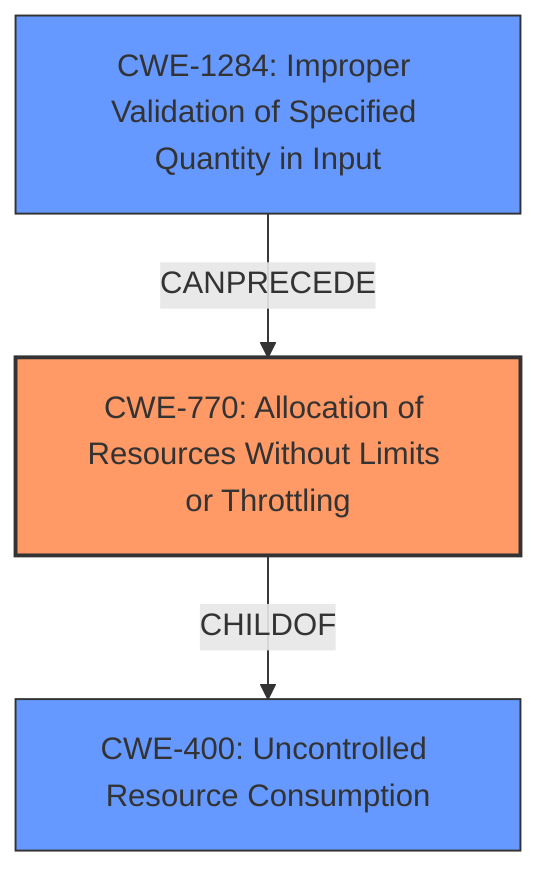

# Analysis Report for CVE-2024-8966

# Vulnerability Analysis Report: CVE-2024-8966

## Description

A vulnerability in the file upload process of gradio-app/gradio version @gradio/video@0.10.2 allows for a Denial of Service (DoS) attack. An attacker can append a large number of characters to the end of a multipart boundary, causing the system to continuously process each character and issue warnings. This can render Gradio inaccessible for extended periods, disrupting services and causing significant downtime.

## Vulnerability Description Key Phrases

- **Impact:** Denial of Service (DoS)
- **Vector:** append a large number of characters to the end of a multipart boundary
- **Attacker:** attacker
- **Product:** gradio-app/gradio
- **Version:** @gradio/video@0.10.2
- **Component:** file upload process

## Analysis (with Relationship Data)

# Summary

| CWE ID  | CWE Name                                                        | Confidence | CWE Abstraction Level | CWE Vulnerability Mapping Label | CWE-Vulnerability Mapping Notes |
| :------- | :-------------------------------------------------------------- | :--------- | :-------------------- | :------------------------------ | :------------------------------ |
| CWE-770 | Allocation of Resources Without Limits or Throttling          | 0.85       | Base                  | Primary                         | Allowed                         |
| CWE-400 | Uncontrolled Resource Consumption                             | 0.75       | Class                 | Secondary                       | Discouraged                     |
| CWE-1284 | Improper Validation of Specified Quantity in Input          | 0.65       | Base                  | Secondary                       | Allowed                         |

## Evidence and Confidence

*   **Confidence Score:** 0.80
*   **Evidence Strength:** MEDIUM

## Relationship Analysis

The primary relationship influencing the CWE selection is the hierarchical relationship between CWE-770 (Base) and CWE-400 (Class). CWE-770 is a child of CWE-400, representing a more specific case of uncontrolled resource consumption. The vulnerability description points towards the **allocation of resources without limits or throttling** as the root cause, making CWE-770 the more appropriate choice. CWE-1284 is potentially part of the chain of weaknesses if the quantity of characters wasn't validated.



## Vulnerability Chain

The vulnerability chain starts with the attacker appending a large number of characters to the multipart boundary. This leads to the system **allocating resources without limits or throttling** (CWE-770), resulting in **uncontrolled resource consumption** (CWE-400), and ultimately causing a Denial of Service (DoS). The **improper validation of the specified quantity in input** (CWE-1284) is a potential prerequisite to CWE-770, as the system should have validated the size of the multipart boundary to prevent excessive resource allocation.

## Summary of Analysis

The initial analysis focused on identifying the root cause of the Denial of Service vulnerability. The description mentions the **allocation of resources without limits or throttling** due to a large number of characters being appended to the multipart boundary. This aligns well with CWE-770, which describes the allocation of resources without imposing restrictions on size or number. CWE-400 was considered but is too high-level. CWE-1284 could be a pre-cursor.

The graph relationships further support this decision, as CWE-770 is a child of CWE-400, providing a more specific classification. The evidence from the vulnerability description, combined with the hierarchical relationship, justifies selecting CWE-770 as the primary CWE. The level of specificity is optimal as it directly addresses the root cause of the vulnerability: **unlimited resource allocation**.

Relevant CWE Information:

# Enhanced Context (25 CWEs)
The following CWEs were identified as potentially relevant to this vulnerability:

## CWE-434: Unrestricted Upload of File with Dangerous Type
**Abstraction Level**: Base
**Similarity Score**: 0.69
**Source**: dense

**Description**:
The product allows the upload or transfer of dangerous file types that are automatically processed within its environment.

**Mapping Guidance**:
- Usage: Allowed
- Rationale: This CWE entry is at the Base level of abstraction, which is a preferred level of abstraction for mapping to the root causes of vulnerabilities.


## CWE-789: Memory Allocation with Excessive Size Value
**Abstraction Level**: Variant
**Similarity Score**: 0.67
**Source**: dense

**Description**:
The product allocates memory based on an untrusted, large size value, but it does not ensure that the size is within expected limits, allowing arbitrary amounts of memory to be allocated.

**Mapping Guidance**:
- Usage: Allowed
- Rationale: This CWE entry is at the Variant level of abstraction, which is a preferred level of abstraction for mapping to the root causes of vulnerabilities.


## CWE-941: Incorrectly Specified Destination in a Communication Channel
**Abstraction Level**: Base
**Similarity Score**: 0.65
**Source**: dense

**Description**:
The product creates a communication channel to initiate an outgoing request to an actor, but it does not correctly specify the intended destination for that actor.

**Mapping Guidance**:
- Usage: Allowed
- Rationale: This CWE entry is at the Base level of abstraction, which is a preferred level of abstraction for mapping to the root causes of vulnerabilities.


## CWE-770: Allocation of Resources Without Limits or Throttling
**Abstraction Level**: Base
**Similarity Score**: 0.64
**Source**: dense

**Description**:
The product allocates a reusable resource or group of resources on behalf of an actor without imposing any restrictions on the size or number of resources that can be allocated, in violation of the intended security policy for that actor.

**Mapping Guidance**:
- Usage: Allowed
- Rationale: This CWE entry is at the Base level of abstraction, which is a preferred level of abstraction for mapping to the root causes of vulnerabilities.

**CWE-770 is the best fit here.**

## CWE-400: Uncontrolled Resource Consumption
**Abstraction Level**: Class
**Similarity Score**: 0.64
**Source**: dense

**Description**:
The product does not properly control the allocation and maintenance of a limited resource, thereby enabling an actor to influence the amount of resources consumed, eventually leading to the exhaustion of available resources.

**Mapping Guidance**:
- Usage: Discouraged
- Rationale: CWE-400 is intended for incorrect behaviors in which the product is expected to track and restrict how many resources it consumes, but CWE-400 is often misused because it is conflated with the "technical impact" of vulnerabilities in which resource consumption occurs. It is sometimes used for low-information vulnerability reports. It is a level-1 Class (i.e., a child of a Pillar).

**CWE-400 is too high level.**

## CWE-346: Origin Validation Error
**Abstraction Level**: Class
**Similarity Score**: 0.64
**Source**: dense

**Description**:
The product does not properly verify that the source of data or communication is valid.

**Mapping Guidance**:
- Usage: Allowed-with-Review
- Rationale: This CWE entry is a Class and might have Base-level children that would be more appropriate

**CWE-346 doesn't fit the vulnerability description.**

## CWE-407: Inefficient Algorithmic Complexity
**Abstraction Level**: Class
**Similarity Score**: 0.63
**Source**: dense

**Description**:
An algorithm in a product has an inefficient worst-case computational complexity that may be detrimental to system performance and can be triggered by an attacker, typically using crafted manipulations that ensure that the worst case is being reached.

**Mapping Guidance**:
- Usage: Allowed-with-Review
- Rationale: This CWE entry is a Class and might have Base-level children that would be more appropriate

**CWE-407 doesn't fit the vulnerability description.**

## CWE-1284: Improper Validation of Specified Quantity in Input
**Abstraction Level**: Base
**Similarity Score**: 0.63
**Source**: dense

**Description**:
The product receives input that is expected to specify a quantity (such as size or length), but it does not validate or incorrectly validates that the quantity has the required properties.

**Mapping Guidance**:
- Usage: Allowed
- Rationale: This CWE entry is at the Base level of abstraction, which is a preferred level of abstraction for mapping to the root causes of vulnerabilities.

**CWE-1284 could be a contributing factor.**

## CWE-134: Use of Externally-Controlled Format String
**Abstraction Level**: Base
**Similarity Score**: 0.63
**Source**: dense

**Description**:
The product uses a function that accepts a format string as an argument, but the format string originates from an external source.

**Mapping Guidance**:
- Usage: Allowed
- Rationale: This CWE entry is at the Base level of abstraction, which is a preferred level of abstraction for mapping to the root causes of vulnerabilities.

**CWE-134 doesn't fit the vulnerability description.**

## CWE-209: Generation of Error Message Containing Sensitive Information
**Abstraction Level**: Base
**Similarity Score**: 0.63
**Source**: dense

**Description**:
The product generates an error message that includes sensitive information about its environment, users, or associated data.

**Mapping Guidance**:
- Usage: Allowed
- Rationale: This CWE entry is at


## CWE Relationship Analysis

Current CWEs represent these abstraction levels: .


### Vulnerability Chain Analysis

**Chain starting from CWE-1284:**
- 1284 (Improper Validation of Specified Quantity in Input) - ROOT


**Chain starting from CWE-400:**
- 400 (Uncontrolled Resource Consumption) - ROOT


### CWE Relationship Diagram

```mermaid
graph TD
    classDef primary fill:#f96,stroke:#333,stroke-width:2px
    classDef secondary fill:#69f,stroke:#333
    classDef tertiary fill:#9e9,stroke:#333
```


*Report generated on 2025-07-14 04:27:23*
