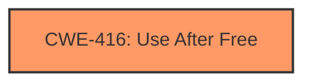

# Raw Analyzer Response for CVE-2024-9120

# Summary
| CWE ID | CWE Name | Confidence | CWE Abstraction Level | CWE Vulnerability Mapping Label | CWE-Vulnerability Mapping Notes |
|---|---|---|---|---|---|
| CWE-416 | Use After Free | 1.0 | Variant | Allowed | Primary CWE |

## Evidence and Confidence

*   **Confidence Score:** 1.0
*   **Evidence Strength:** HIGH

## Relationship Analysis
The primary CWE identified is CWE-416 (Use After Free), which is a variant-level CWE. There are several other CWEs that could potentially relate to the vulnerability but are either more general (Class) or less directly relevant. The graph relationships show that CWE-416 can be part of a vulnerability chain, potentially following CWE-123 (Write-what-where Condition) or CWE-364 (Signal Handler Race Condition).

## Vulnerability Chain
The vulnerability chain starts with a **use after free** condition (CWE-416). The impact is potential heap corruption, which could lead to arbitrary code execution or denial of service.

## Summary of Analysis
The primary focus of this analysis is identifying the root cause of the vulnerability. The description clearly states "**rootcause:** **use after free**". The CVE Reference Links Content Summary also confirms "**Root cause of vulnerability:** Use-after-free in Dawn."

The retriever results also show that CWE-416 is the top candidate.

Based on this evidence, CWE-416 (Use After Free) is the most appropriate CWE. It's a variant-level CWE, which is the preferred level of abstraction, and it directly matches the described vulnerability.

Relevant CWE Information:

# Enhanced Context (25 CWEs)
The following CWEs were identified as potentially relevant to this vulnerability:

## CWE-416: Use After Free
**Abstraction Level**: Variant
**Similarity Score**: 0.75
**Source**: dense

**Description**:
The product reuses or references memory after it has been freed. At some point afterward, the memory may be allocated again and saved in another pointer, while the original pointer references a location somewhere within the new allocation. Any operations using the original pointer are no longer valid because the memory "belongs" to the code that operates on the new pointer.

**Mapping Guidance**:
- Usage: Allowed
- Rationale: This CWE entry is at the Variant level of abstraction, which is a preferred level of abstraction for mapping to the root causes of vulnerabilities.