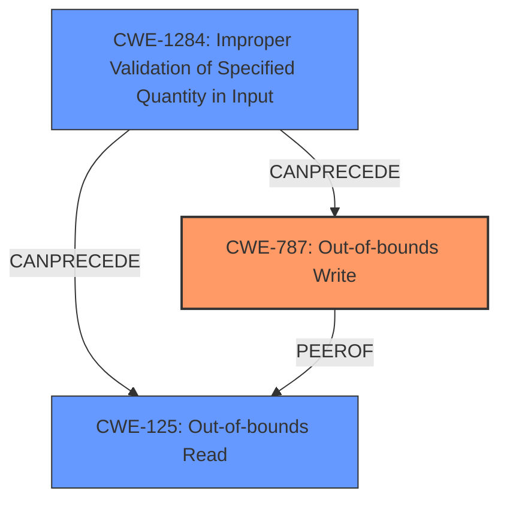

# Enhanced Analysis for CVE-2024-9143

# Summary
| CWE ID | CWE Name | Confidence | CWE Abstraction Level | CWE Vulnerability Mapping Label | CWE-Vulnerability Mapping Notes |
|---|---|---|---|---|---|
| CWE-787 | Out-of-bounds Write | 0.9 | Base | Allowed | Primary CWE. The vulnerability description and CVE reference links explicitly mention out-of-bounds writes as a potential impact. |
| CWE-125 | Out-of-bounds Read | 0.8 | Base | Allowed | Secondary CWE. The vulnerability description mentions out-of-bounds memory reads, making this a relevant, though secondary, classification. |
| CWE-1284 | Improper Validation of Specified Quantity in Input | 0.7 | Base | Allowed | Secondary CWE. The root cause is the **use of low-level GF(2^m) elliptic curve APIs with untrusted explicit values**, implying the specified quantity (field polynomial) was not properly validated. |

## Evidence and Confidence

*   **Confidence Score:** 0.8
*   **Evidence Strength:** HIGH

## Relationship Analysis
The primary weakness is an out-of-bounds write (CWE-787), which can be caused by improper input validation (CWE-1284). An out-of-bounds read (CWE-125) can also occur due to the same root cause. CWE-1284 can precede CWE-787.



## Vulnerability Chain
1.  **Improper Input Validation (CWE-1284):** The product does not properly validate the provided GF(2^m) field polynomial.
2.  **Out-of-bounds Write (CWE-787) / Out-of-bounds Read (CWE-125):** Due to the **improperly validated input**, the product attempts to write data outside the bounds of allocated memory (or read from outside the bounds).
3.  **Impact:** Application crash, potential remote code execution.

## Summary of Analysis
The primary weakness is clearly identified as CWE-787 (Out-of-bounds Write) due to the explicit mention in the vulnerability description and CVE reference. The root cause is the **improper validation** of the field polynomial (CWE-1284), which leads to the out-of-bounds write (CWE-787) and potentially an out-of-bounds read (CWE-125).

The evidence supporting CWE-787 is strong: "Use of the low-level GF(2^m) elliptic curve APIs with untrusted explicit values for the field polynomial can lead to **out-of-bounds memory reads or writes**." From the CVE Reference Links Content Summary: ""The `BN_GF2m_poly2arr()` function in OpenSSL does not properly validate the input polynomial, allowing an attacker to provide an invalid polynomial with a zero constant term. This leads to an out-of-bounds memory access in the `BN_GF2m_mod_arr()` function, which relies on the polynomial having a non-zero constant term."

CWE-1284 is also a strong candidate, as the root cause involves **untrusted explicit values** for the field polynomial, which is a specified quantity in the input. From the CVE Reference Links Content Summary: "The `BN_GF2m_poly2arr()` function in OpenSSL **does not properly validate the input polynomial**...".

CWE-125 (Out-of-bounds Read) is also relevant because the vulnerability description mentions "**out-of-bounds memory reads or writes**".

The selected CWEs are at the Base level of abstraction, which is the preferred level.

The other CWEs from the **Retriever Results** were not selected because they were not as directly relevant to the **rootcause** and **weakness** described in the vulnerability. CWE-20 (Improper Input Validation) is too general. CWE-190 (Integer Overflow or Wraparound) and CWE-823 (Use of Out-of-range Pointer Offset) do not fit the specific details of the vulnerability.


## CWE Relationship Analysis

Current CWEs represent these abstraction levels: .


### Vulnerability Chain Analysis

**Chain starting from CWE-1284:**
- 1284 (Improper Validation of Specified Quantity in Input) - ROOT


**Chain starting from CWE-823:**
- 823 (Use of Out-of-range Pointer Offset) - ROOT


### CWE Relationship Diagram

```mermaid
graph TD
    classDef primary fill:#f96,stroke:#333,stroke-width:2px
    classDef secondary fill:#69f,stroke:#333
    classDef tertiary fill:#9e9,stroke:#333
```