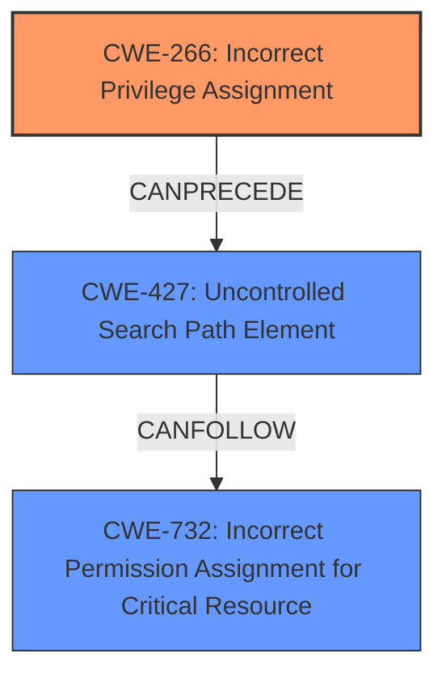

# Enhanced Analysis for CVE-2024-9157

# Summary
| CWE ID | CWE Name | Confidence | CWE Abstraction Level | CWE Vulnerability Mapping Label | CWE-Vulnerability Mapping Notes |
|---|---|---|---|---|---|
| CWE-266 | Incorrect Privilege Assignment | 0.9 | Base | Allowed | Primary CWE. The service **incorrectly assigns a privilege** by not restricting access to the named pipe allowing any user to send data to the service. |
| CWE-427 | Uncontrolled Search Path Element | 0.7 | Base | Allowed | Secondary Candidate. The root cause indicates an **unrestricted DLL loading from a user-supplied path**, which aligns with the concept of an uncontrolled search path element. |
| CWE-732 | Incorrect Permission Assignment for Critical Resource | 0.6 | Class | Allowed-with-Review | Secondary Candidate. The service's **incorrect permission assignment** for the named pipe could be considered a critical resource. |

## Evidence and Confidence

*   **Confidence Score:** 0.8
*   **Evidence Strength:** MEDIUM

## Relationship Analysis
The primary CWE is CWE-266, which is a Base level CWE detailing the root cause of the vulnerability. Secondary CWEs like CWE-427 and CWE-732 provide additional context. CWE-427 describes the uncontrolled search path for loading DLLs, while CWE-732 highlights the incorrect permission assignment for a critical resource. The relationships show that a misconfigured privilege (CWE-266) can lead to an uncontrolled environment where DLLs can be loaded from untrusted paths (CWE-427), ultimately affecting critical resources (CWE-732).



## Vulnerability Chain
The vulnerability chain starts with an **incorrect privilege assignment** (CWE-266) due to the **missing security descriptor** on the named pipe. This leads to an **uncontrolled search path** (CWE-427) where a malicious DLL can be loaded from a user-supplied path. The final impact is an **elevation of privileges**, as the DLL is loaded into a process running with elevated privileges.
1.  **Root Cause:** CWE-266 (Incorrect Privilege Assignment) - **Missing security descriptor** on the named pipe.
2.  **Weakness:** CWE-427 (Uncontrolled Search Path Element) - **Unrestricted DLL loading** from user-supplied path.
3.  **Impact:** Privilege Escalation - DLL loaded into a process running at elevated privilege.

## Summary of Analysis
The primary assessment is based on the provided evidence. The root cause is the **incorrect privilege assignment**, where the service creates a named pipe without a security descriptor, allowing any user to send data. This leads to the ability to load a DLL from a user-supplied path. The graph relationships influenced the decision to include CWE-427 as a secondary CWE, as the **uncontrolled search path** is a direct consequence of the **incorrect privilege assignment**.

The selected CWEs are at the optimal level of specificity. CWE-266 accurately represents the root cause, while CWE-427 provides additional context about the specific mechanism used to exploit the vulnerability.

Relevant CWE Information:

# Enhanced Context (25 CWEs)
The following CWEs were identified as potentially relevant to this vulnerability:

## CWE-266: Incorrect Privilege Assignment
**Abstraction Level**: Base
**Similarity Score**: 0.80
**Source**: dense

**Description**:
A product **incorrectly assigns a privilege** to a particular actor, creating an unintended sphere of control for that actor.

**Mapping Guidance**:
- Usage: Allowed
- Rationale: This CWE entry is at the Base level of abstraction, which is a preferred level of abstraction for mapping to the root causes of vulnerabilities.

**Justification:** The root cause of the vulnerability is the **incorrect privilege assignment** on the named pipe, which allows any user to send data to the service. This aligns perfectly with the description of CWE-266.

## CWE-427: Uncontrolled Search Path Element
**Abstraction Level**: Base
**Similarity Score**: 0.448
**Source**: sparse

**Description**:
The product uses external input to construct a pathname that should refer to a resource, but the product does not neutralize or incorrectly neutralizes special elements that could modify the path to locate resources in the wrong directory.

**Mapping Guidance**:
- Usage: Allowed
- Rationale: This CWE entry is at the Base level of abstraction, which is a preferred level of abstraction for mapping to the root causes of vulnerabilities.

**Justification:** The vulnerability involves loading a DLL from a user-supplied path. This aligns with the concept of an **uncontrolled search path element**, where the product does not properly validate or control the path used to locate the DLL.

## CWE-732: Incorrect Permission Assignment for Critical Resource
**Abstraction Level**: Class
**Similarity Score**: 0.445
**Source**: sparse

**Description**:
The product specifies permissions for a security-critical resource in a way that allows that resource to be read or modified by unintended actors.

**Mapping Guidance**:
- Usage: Allowed-with-Review
- Rationale: While the name itself indicates an assignment of permissions for resources, this is often misused for vulnerabilities in which "permissions" are not checked, which is an "authorization" weakness (CWE-285 or descendants) within CWE's model [REF-1287].

**Justification:** The named pipe is a critical resource, and the service **incorrectly assigns permissions** to it by not setting a security descriptor. This allows any user to access the pipe, which is a violation of intended access control.

## CWE-863: Incorrect Authorization
**Abstraction Level**: Class
**Similarity Score**: 0.430
**Source**: sparse

**Description**:
The product performs an authorization check when an actor attempts to access a resource or perform an action, but it does not correctly perform the check.

**Mapping Guidance**:
- Usage: Allowed-with-Review
- Rationale: This CWE entry is a Class and might have Base-level children that would be more appropriate

**Why it was not selected:** Although there's an **incorrect authorization**, the root cause is more specific to the lack of a security descriptor on the named pipe (CWE-266), which leads to the **uncontrolled search path** for DLL loading (CWE-427).

## CWE-285: Improper Authorization
**Abstraction Level**: Class
**Similarity Score**: 1557.70
**Source**: sparse

**Description**:
The product does not perform or incorrectly performs an authorization check when an actor attempts to access a resource or perform an action.

**Mapping Guidance**:
- Usage: Discouraged
- Rationale: CWE-285 is high-level and lower-level CWEs can frequently be used instead. It is a level-1 Class (i.e., a child of a Pillar).

**Why it was not selected:** While there is an authorization issue, CWE-266 provides a more specific explanation of the root cause, which is the **incorrect privilege assignment**.


## CWE Relationship Analysis

Current CWEs represent these abstraction levels: .


### Vulnerability Chain Analysis

**Chain starting from CWE-863:**
- 863 (Incorrect Authorization) - ROOT


**Chain starting from CWE-427:**
- 427 (Uncontrolled Search Path Element) - ROOT


### CWE Relationship Diagram

```mermaid
graph TD
    classDef primary fill:#f96,stroke:#333,stroke-width:2px
    classDef secondary fill:#69f,stroke:#333
    classDef tertiary fill:#9e9,stroke:#333
```