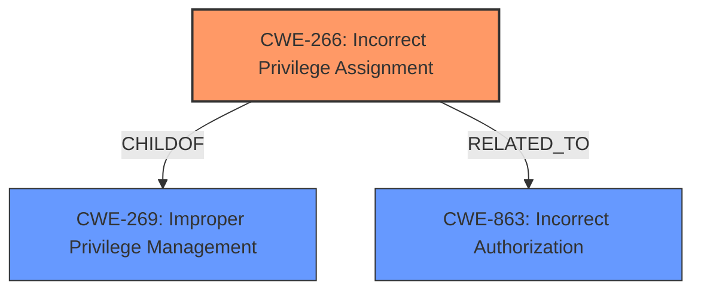

# Raw Analyzer Response for CVE-2024-9192

# Summary
| CWE ID | CWE Name | Confidence | CWE Abstraction Level | CWE Vulnerability Mapping Label | CWE-Vulnerability Mapping Notes |
|---|---|---|---|---|---|
| CWE-266 | Incorrect Privilege Assignment | 0.9 | Base | Allowed | Primary CWE. The plugin incorrectly assigns privileges by failing to validate user meta updates, allowing unauthorized privilege escalation.|
| CWE-863 | Incorrect Authorization | 0.7 | Class | Allowed-with-Review | Secondary Candidate. The authorization check is present, but it is not correctly implemented. |
| CWE-269 | Improper Privilege Management | 0.6 | Class | Discouraged | Secondary Candidate. The plugin does not properly manage privileges by not validating user meta updates. |

## Evidence and Confidence

*   **Confidence Score:** 0.8
*   **Evidence Strength:** HIGH

## Relationship Analysis
The primary weakness is CWE-266 Incorrect Privilege Assignment, which is a Base level CWE. It is related to the Class-level CWE-269 Improper Privilege Management, as incorrect privilege assignment is a type of improper privilege management. It is also related to CWE-863 Incorrect Authorization as the incorrect privilege assignment is due to an incorrect authorization check. CWE-266 is preferred as it is a Base level CWE and more specific than the Class level CWEs.

## Vulnerability Chain
The vulnerability chain starts with **insufficient validation** of user meta in the `wpvr_rate_request_result()` function (CWE-266). This leads to **improper privilege management** where authenticated users can modify their user meta without proper validation, which allows them to escalate their privileges to administrator.

## Summary of Analysis
The analysis is based on the provided evidence, which includes the vulnerability description, key phrases, and CVE reference links content summary. The key phrase "**insufficient validation**" points to a root cause related to improper handling or checking of input, which can lead to privilege escalation. The CVE reference links content summary confirms this by stating that the vulnerability stems from insufficient validation of user meta updates and that the plugin allows authenticated users to modify their user meta data without proper validation.

The retriever results also support this analysis, with CWE-266, CWE-863 and CWE-269 being among the top CWEs. CWE-266 Incorrect Privilege Assignment is selected as the primary CWE because the vulnerability allows authenticated users to update their user meta and escalate their privileges to administrator due to **insufficient validation**. This is a direct **incorrect assignment of privilege**.

CWE-862 Missing Authorization was considered, but it was determined that the authorization check was present but not correctly implemented, so CWE-863 Incorrect Authorization is a better fit.

CWE-269 Improper Privilege Management was considered, but CWE-266 Incorrect Privilege Assignment is more specific and accurately reflects the root cause of the vulnerability. CWE-266 is at the optimal level of specificity as it is a Base level CWE.

Relevant CWE Information:

# Enhanced Context (25 CWEs)
The following CWEs were identified as potentially relevant to this vulnerability:

## CWE-266: Incorrect Privilege Assignment
**Abstraction Level**: Base
**Similarity Score**: 0.79
**Source**: dense

**Description**:
A product incorrectly assigns a privilege to a particular actor, creating an unintended sphere of control for that actor.

**Mapping Guidance**:
- Usage: Allowed
- Rationale: This CWE entry is at the Base level of abstraction, which is a preferred level of abstraction for mapping to the root causes of vulnerabilities.