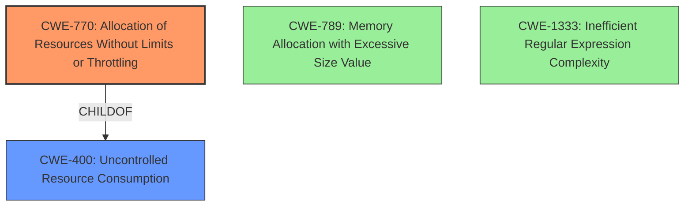

# Analysis Report for CVE-2024-9229

# Vulnerability Analysis Report: CVE-2024-9229

## Description

A Denial of Service (DoS) vulnerability in the file upload feature of stangirard/quivr v0.0.298 allows unauthenticated attackers to cause excessive resource consumption by appending characters to the end of a multipart boundary in an HTTP request. This leads to the server continuously processing each character, rendering the service unavailable and impacting all users.

## Vulnerability Description Key Phrases

- **Component:** file upload feature
- **Vector:** appending characters to multipart boundary in HTTP request
- **Product:** stangirard/quivr
- **Impact:** Denial of Service, excessive resource consumption, service unavailable
- **Attacker:** unauthenticated attackers
- **Version:** v0.0.298

## Analysis (with Relationship Data)

# Summary
| CWE ID | CWE Name | Confidence | CWE Abstraction Level | CWE Vulnerability Mapping Label | CWE-Vulnerability Mapping Notes |
|---|---|---|---|---|---|
| CWE-770 | Allocation of Resources Without Limits or Throttling | 0.9 | Base | Allowed | Primary CWE: The application **allocates resources without properly limiting or throttling** them, allowing an attacker to exhaust resources. |
| CWE-400 | Uncontrolled Resource Consumption | 0.7 | Class | Discouraged | Secondary Candidate: The vulnerability leads to **uncontrolled resource consumption**, but CWE-770 is a more specific root cause. |

## Evidence and Confidence

*   **Confidence Score:** 0.8
*   **Evidence Strength:** MEDIUM

## Relationship Analysis
The primary CWE, CWE-770, is a base-level weakness that describes the **allocation of resources without limits or throttling**. This is directly related to the vulnerability description, which mentions **excessive resource consumption**. CWE-770 is a child of CWE-400, **Uncontrolled Resource Consumption**, which is a broader class. The relationship indicates that while the vulnerability leads to uncontrolled resource consumption, the root cause lies in the lack of limits on resource allocation. Other CWEs like CWE-789, **Memory Allocation with Excessive Size Value**, and CWE-1333, **Inefficient Regular Expression Complexity**, were considered but deemed less relevant as the core issue is the absence of resource limits rather than inefficient algorithms or excessive memory allocation.



## Vulnerability Chain
The vulnerability chain starts with the attacker sending a malicious HTTP request with an altered multipart boundary. This leads to the server continuously processing each character due to the **lack of limits on resource allocation (CWE-770)**, resulting in **excessive resource consumption and ultimately a Denial of Service (CWE-400)**. The chain can be summarized as: Malicious Request -> **CWE-770** -> **CWE-400** -> Denial of Service.

## Summary of Analysis
The analysis focuses on the root cause of the Denial of Service vulnerability. The key phrase **"excessive resource consumption"** points towards resource management issues. The retriever results highlight CWE-770, **Allocation of Resources Without Limits or Throttling**, and CWE-400, **Uncontrolled Resource Consumption**. While CWE-400 describes the impact, CWE-770 represents the underlying flaw: the application's failure to limit resource allocation. The vulnerability description specifically mentions the server continuously processing each character, meaning the server does not have any restrictions on how much it should process. Thus, CWE-770 is selected as the primary CWE because it accurately reflects the root cause.

The decision to prioritize CWE-770 is also supported by its Base abstraction level, which is preferred for root cause mapping. Although CWE-400 is related, it is a Class-level CWE and represents the impact rather than the cause. CWE-789 and CWE-1333 were also considered, but they address specific types of resource consumption (memory and CPU due to regex), while the description indicates a broader lack of resource control.

Relevant CWE Information:
- CWE-770: The product allocates a reusable resource or group of resources on behalf of an actor without imposing any restrictions on the size or number of resources that can be allocated, in violation of the intended security policy for that actor.
- CWE-400: The product does not properly control the allocation and maintenance of a limited resource, thereby enabling an actor to influence the amount of resources consumed, eventually leading to the exhaustion of available resources.


## CWE Relationship Analysis

Current CWEs represent these abstraction levels: .


### Vulnerability Chain Analysis

**Chain starting from CWE-400:**
- 400 (Uncontrolled Resource Consumption) - ROOT


**Chain starting from CWE-789:**
- 789 (Memory Allocation with Excessive Size Value) - ROOT


### CWE Relationship Diagram

```mermaid
graph TD
    classDef primary fill:#f96,stroke:#333,stroke-width:2px
    classDef secondary fill:#69f,stroke:#333
    classDef tertiary fill:#9e9,stroke:#333
```


*Report generated on 2025-07-14 04:39:55*
