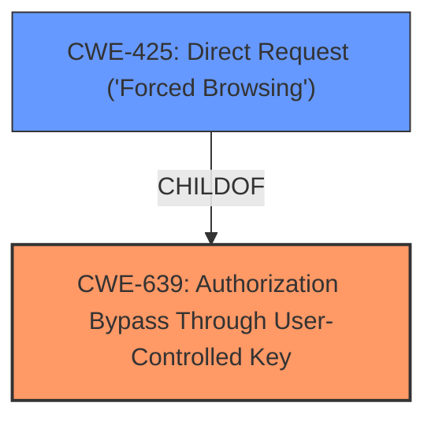

# Analysis for CVE-2024-9298

# Summary
| CWE ID | CWE Name | Confidence | CWE Abstraction Level | CWE Vulnerability Mapping Label | CWE-Vulnerability Mapping Notes |
|---|---|---|---|---|---|
| CWE-639 | Authorization Bypass Through User-Controlled Key | 1.0 | Base | Primary | Allowed |
| CWE-425 | Direct Request ('Forced Browsing') | 0.7 | Base | Secondary | Allowed |

## Evidence and Confidence

*   **Confidence Score:** 0.9
*   **Evidence Strength:** HIGH

## Relationship Analysis
The primary weakness, CWE-639 Authorization Bypass Through User-Controlled Key, is a base-level CWE that accurately describes the **improper access controls** due to the manipulation of the 'id' argument. This allows unauthorized access to resources by directly modifying the key value.

CWE-425 Direct Request ('Forced Browsing') is a related weakness, as the application fails to enforce proper authorization on restricted URLs. This is a direct consequence of the ability to manipulate the 'id' parameter.

## Vulnerability Chain
The vulnerability chain begins with **improper access controls**, specifically the ability to manipulate the 'id' argument in the URL. This leads to an **Authorization Bypass Through User-Controlled Key (CWE-639)**, ultimately resulting in **Direct Request ('Forced Browsing') (CWE-425)**.

## Summary of Analysis
The primary CWE is CWE-639, as it directly addresses the root cause of the vulnerability: the ability to bypass authorization by manipulating the 'id' parameter. CWE-425 is a secondary weakness that highlights the consequence of this bypass.

The selection of CWE-639 is strongly supported by the evidence, particularly the "Root Cause of Vulnerability" section in the CVE Reference Links Content Summary, which states: "The root cause is an Insecure Direct Object Reference (IDOR) vulnerability. This occurs because the application uses direct object references (ticket IDs) in the URL without proper authorization checks."

The "Vulnerability Description Key Phrases" section also supports this mapping, as it identifies **improper access controls** as the root cause.

The "Attack Vectors" section further clarifies the vulnerability: "An attacker can directly modify the `ids` parameter in the URL (e.g., `http://localhost/orrs/?page=tickets&ids=123`) to view and download tickets associated with different ticket IDs."

The relationships between CWEs also influenced the decision. CWE-425 is a child of higher-level access control CWEs, indicating a potential connection.

The chosen CWEs are at the optimal level of specificity because they directly address the **improper access controls** and the resulting unauthorized access to resources.

Relevant CWE Information:

# Enhanced Context (25 CWEs)
The following CWEs were identified as potentially relevant to this vulnerability:

## CWE-472: External Control of Assumed-Immutable Web Parameter
**Abstraction Level**: Base
**Similarity Score**: 0.78
**Source**: dense

**Description**:
The web application does not sufficiently verify inputs that are assumed to be immutable but are actually externally controllable, such as hidden form fields.

**Mapping Guidance**:
- Usage: Allowed
- Rationale: This CWE entry is at the Base level of abstraction, which is a preferred level of abstraction for mapping to the root causes of vulnerabilities.

## CWE-639: Authorization Bypass Through User-Controlled Key
**Abstraction Level**: Base
**Similarity Score**: 0.76
**Source**: dense

**Description**:
The system's authorization functionality does not prevent one user from gaining access to another user's data or record by modifying the key value identifying the data.

**Mapping Guidance**:
- Usage: Allowed
- Rationale: This CWE entry is at the Base level of abstraction, which is a preferred level of abstraction for mapping to the root causes of vulnerabilities.

## CWE-425: Direct Request ('Forced Browsing')
**Abstraction Level**: Base
**Similarity Score**: 0.76
**Source**: dense

**Description**:
The web application does not adequately enforce appropriate authorization on all restricted URLs, scripts, or files.

**Mapping Guidance**:
- Usage: Allowed
- Rationale: This CWE entry is at the Base level of abstraction, which is a preferred level of abstraction for mapping to the root causes of vulnerabilities.

## CWE-639: Authorization Bypass Through User-Controlled Key
**Abstraction Level**: Base
**Similarity Score**: 1207.21
**Source**: sparse

**Description**:
The system's authorization functionality does not prevent one user from gaining access to another user's data or record by modifying the key value identifying the data.

**Mapping Guidance**:
- Usage: Allowed
- Rationale: This CWE entry is at the Base level of abstraction, which is a preferred level of abstraction for mapping to the root causes of vulnerabilities.

## CWE-425: Direct Request ('Forced Browsing')
**Abstraction Level**: Base
**Similarity Score**: 1006.71
**Source**: sparse

**Description**:
The web application does not adequately enforce appropriate authorization on all restricted URLs, scripts, or files.

**Mapping Guidance**:
- Usage: Allowed
- Rationale: This CWE entry is at the Base level of abstraction, which is a preferred level of abstraction for mapping to the root causes of vulnerabilities.

### Detailed Analysis of Selected CWEs:

*   **CWE-639: Authorization Bypass Through User-Controlled Key**
    *   **Technical Explanation:** This CWE directly addresses the vulnerability where an attacker can modify the 'id' parameter to access unauthorized data. The application **fails** to properly validate the 'id', allowing the bypass.
    *   **Security Implications:** Unauthorized access to sensitive information, privacy violation.
    *   **Relationship Analysis:** Base-level CWE, directly related to the root cause.
    *   **Mapping Guidance Influence:** Allowed, aligns with the CWE description and mapping guidance.
*   **CWE-425: Direct Request ('Forced Browsing')**
    *   **Technical Explanation:** The application **does not adequately enforce authorization** on the 'tickets' page, allowing users to directly request tickets using manipulated IDs.
    *   **Security Implications:** Unauthorized access to restricted resources.
    *   **Relationship Analysis:** ChildOf higher-level access control CWEs.
    *   **Mapping Guidance Influence:** Allowed, aligns with the CWE description and mapping guidance.

### CWEs Considered But Not Used:

*   **CWE-89: Improper Neutralization of Special Elements used in an SQL Command ('SQL Injection')** - While SQL injection is a common vulnerability, there's no evidence in the provided description to suggest that SQL injection is the root cause or even a contributing factor. The vulnerability focuses on **improper access controls**, not the neutralization of SQL special elements.
*   **CWE-79: Improper Neutralization of Input During Web Page Generation ('Cross-site Scripting')** - Similar to SQL injection, there is no evidence that cross-site scripting is involved. The focus is on authorization, not input neutralization for web page generation.
*   **CWE-472: External Control of Assumed-Immutable Web Parameter** - While this CWE is related, CWE-639 more accurately describes the direct authorization bypass. CWE-472 is more relevant when immutable parameters are unexpectedly controlled, which is not the primary issue here.
*   **CWE-306: Missing Authentication for Critical Function** - This CWE is not as accurate as CWE-639 because the issue is not a complete absence of authentication, but rather a bypass of authorization due to a user-controlled key.