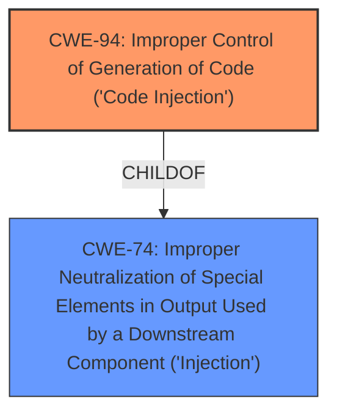

# Analysis Report for CVE-2024-9324

# Vulnerability Analysis Report: CVE-2024-9324

## Description

A vulnerability was found in Intelbras InControl up to 2.21.57. It has been rated as critical. Affected by this issue is some unknown functionality of the file /v1/operador/ of the component Relatorio de Operadores Page. The manipulation of the argument fields leads to code injection. The attack may be launched remotely. The exploit has been disclosed to the public and may be used. The vendor was informed early on 2024-07-19 about this issue. The release of a fixed version 2.21.58 was announced for the end of August 2024 but then was postponed until 2024-09-20.

## Vulnerability Description Key Phrases

- **Impact:** code injection
- **Vector:** manipulation of arguments
- **Product:** Intelbras InControl
- **Version:** up to 2.21.57
- **Component:** /v1/operador/

## Analysis (with Relationship Data)

# Summary
| CWE ID | CWE Name | Confidence | CWE Abstraction Level | CWE Vulnerability Mapping Label | CWE-Vulnerability Mapping Notes |
|---|---|---|---|---|---|
| CWE-94 | Improper Control of Generation of Code ('Code Injection') | 0.9 | Base | Allowed-with-Review | Primary CWE |
| CWE-74 | Improper Neutralization of Special Elements in Output Used by a Downstream Component ('Injection') | 0.6 | Class | Discouraged | Secondary Candidate |

## Evidence and Confidence

*   **Confidence Score:** 0.9
*   **Evidence Strength:** HIGH

## Relationship Analysis
The primary relationship that influenced the decision was the parent-child relationship between CWE-74 and CWE-94. CWE-94 is a child of CWE-74. The vulnerability involves the injection of code, specifically Python code, and CWE-94 directly addresses the improper control of code generation, making it a more specific and appropriate choice than the broader CWE-74.



## Vulnerability Chain
The vulnerability chain starts with the lack of proper input validation, leading to code injection, and ultimately resulting in the ability to execute arbitrary commands on the server.
  - Improper Input Validation (Implicit) -> **CWE-94** -> Remote Code Execution

## Summary of Analysis
The initial analysis focused on identifying the root cause of the vulnerability. The CVE description and summary clearly indicate that the vulnerability stems from the ability to inject and execute arbitrary code. The key evidence is the use of `eval` and `compile` functions on unsanitized input, allowing for Python code injection.

The Retriever Results suggested several CWEs, including CWE-79, CWE-89, and CWE-74. However, these CWEs are either too broad or focus on specific injection types (e.g., SQL injection or Cross-Site Scripting). CWE-94, "Improper Control of Generation of Code ('Code Injection')", aligns most directly with the vulnerability, as it describes the core issue of injecting and executing arbitrary code. The relationship analysis further supports this choice, as CWE-94 is a more specific child of the broader CWE-74.

The final decision is based on the evidence of code injection, the specificity of CWE-94, and the relationship analysis that positions CWE-94 as a more precise classification than its parent, CWE-74.

Relevant CWE Information:

# Enhanced Context (25 CWEs)
The following CWEs were identified as potentially relevant to this vulnerability:

## CWE-74: Improper Neutralization of Special Elements in Output Used by a Downstream Component ('Injection')
**Abstraction Level**: Class
**Similarity Score**: 0.79
**Source**: dense

**Description**:
The product constructs all or part of a command, data structure, or record using externally-influenced input from an upstream component, but it does not neutralize or incorrectly neutralizes special elements that could modify how it is parsed or interpreted when it is sent to a downstream component.

**Mapping Guidance**:
- Usage: Discouraged
- Rationale: CWE-74 is high-level and often misused when lower-level weaknesses are more appropriate.

## CWE-94: Improper Control of Generation of Code ('Code Injection')
**Abstraction Level**: base
**Similarity Score**: 3.14
**Source**: graph

**Description**:
CWE-94: Improper Control of Generation of Code ('Code Injection')

**Mapping Guidance**:
- Usage: Allowed-with-Review
- Rationale: This entry is frequently misused for vulnerabilities with a technical impact of "code execution," which does not by itself indicate a root cause weakness, since dozens of weaknesses can enable code execution.

**Relationships**:
- CANFOLLOW -> CWE-98
- PARENTOF -> CWE-96
- PARENTOF -> CWE-95
- PARENTOF -> CWE-1336
- CHILDOF -> CWE-913

**CWE-94**: Improper Control of Generation of Code ('Code Injection')

*   **Technical Explanation:** The Intelbras InControl software **fails to properly sanitize input** used in the `fields` parameter of the API calls, specifically in `/v1/operador/relatorio` and `/v1/evento_operador/relatorio` endpoints. This **allows an attacker to inject arbitrary Python code** that is then executed by the `eval` and `compile` functions. This directly aligns with the description of CWE-94, which involves the improper control of code generation.
*   **Security Implications:** This vulnerability allows for Remote Code Execution (RCE), giving the attacker full control over the affected server. The attacker can install malware, steal sensitive data, or disrupt operations.
*   **Relationship Analysis:** CWE-94 is a child of CWE-74, "Improper Neutralization of Special Elements in Output Used by a Downstream Component ('Injection')". While CWE-74 is a broader category, CWE-94 specifically addresses the injection and execution of code, making it a more precise classification for this vulnerability.
*   **Mapping Guidance Influence:** The mapping guidance for CWE-94 indicates "Allowed-with-Review" because it can be misused for vulnerabilities where code execution is the impact rather than the root cause. In this case, the **root cause is the lack of sanitization** leading directly to code injection, justifying its selection.
*   **Primary/Secondary:** This is the primary weakness as it directly causes the vulnerability.
*   **Supporting Evidence:** "The vulnerability is due to a lack of proper input sanitization in the `fields` parameter of the API calls related to report generation, specifically in the `/v1/operador/relatorio` and `/v1/evento_operador/relatorio` endpoints. This allows for the injection of arbitrary Python code."

**CWE-74**: Improper Neutralization of Special Elements in Output Used by a Downstream Component ('Injection')

*   **Technical Explanation:** While the vulnerability results in code injection (CWE-94), a broader perspective could include CWE-74, which covers the **improper neutralization of special elements that modify how data is interpreted by a downstream component**. In this case, the injected code is the special element. However, CWE-94 is more specific.
*   **Security Implications:** Similar to CWE-94, this can lead to RCE and full server control, but it's a broader classification.
*   **Relationship Analysis:** CWE-74 is a parent of CWE-94, making CWE-94 the preferred, more specific choice.
*   **Mapping Guidance Influence:** The mapping guidance for CWE-74 is "Discouraged" because lower-level weaknesses are often more appropriate.
*   **Primary/Secondary:** This is a secondary candidate, as it is a more general classification of the same issue.
*   **Supporting Evidence:** The vulnerability description states, "The manipulation of the argument fields leads to code injection." This can be seen as a failure to neutralize special elements.

**CWEs Considered But Not Used:**

*   **CWE-79 (Improper Neutralization of Input During Web Page Generation ('Cross-site Scripting')):** This CWE is not applicable because the vulnerability does not involve injecting code into web pages to be executed by other users. The code is executed directly on the server.
*   **CWE-89 (Improper Neutralization of Special Elements used in an SQL Command ('SQL Injection')):** This CWE is not applicable because the vulnerability does not involve injecting SQL commands.
*   **CWE-1336 (Improper Neutralization of Special Elements Used in a Template Engine):** This CWE is not applicable because the vulnerability does not involve template engines.
*   **CWE-287 (Improper Authentication) and CWE-306 (Missing Authentication for Critical Function):** While the "CVE Reference Links Content Summary" mentions default credentials, the primary vulnerability is code injection due to missing input sanitization, not an authentication issue.
*   **CWE-78 (Improper Neutralization of Special Elements used in an OS Command ('OS Command Injection')):** Although the injected code can be used to execute OS commands, the vulnerability itself is the injection of code, making CWE-94 more appropriate.


## CWE Relationship Analysis

Current CWEs represent these abstraction levels: .


### Vulnerability Chain Analysis

**Chain starting from CWE-89:**
- 89 (Improper Neutralization of Special Elements used in an SQL Command ('SQL Injection')) - ROOT


**Chain starting from CWE-94:**
- 94 (Improper Control of Generation of Code ('Code Injection')) - ROOT


### CWE Relationship Diagram

```mermaid
graph TD
    classDef primary fill:#f96,stroke:#333,stroke-width:2px
    classDef secondary fill:#69f,stroke:#333
    classDef tertiary fill:#9e9,stroke:#333
```


*Report generated on 2025-07-14 04:45:57*
