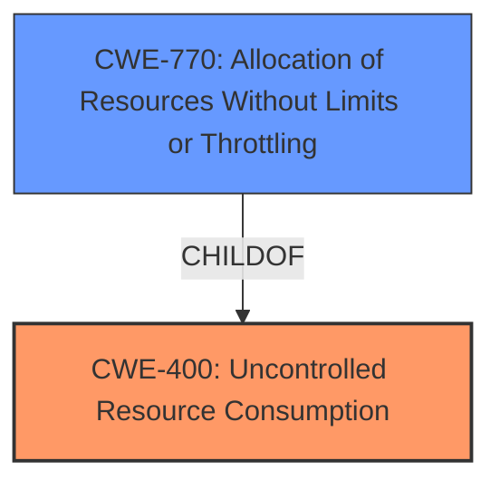

# Raw Analyzer Response for CVE-2024-9409

# Summary
| CWE ID | CWE Name | Confidence | CWE Abstraction Level | CWE Vulnerability Mapping Label | CWE-Vulnerability Mapping Notes |
|---|---|---|---|---|---|
| CWE-400 | Uncontrolled Resource Consumption | 0.9 | Class | Primary | Discouraged |
| CWE-770 | Allocation of Resources Without Limits or Throttling | 0.7 | Base | Secondary | Allowed |

## Evidence and Confidence

*   **Confidence Score:** 0.8
*   **Evidence Strength:** HIGH

## Relationship Analysis
The primary relationship impacting the decision is the hierarchical relationship between CWE-400 **Uncontrolled Resource Consumption** and its potential child CWE-770 **Allocation of Resources Without Limits or Throttling**. While CWE-770 is more specific, the provided vulnerability description doesn't explicitly state that resources are being allocated *without limits or throttling*. It only mentions that **uncontrolled resource consumption** leads to the device becoming unresponsive when a large amount of IGMP packets is present. Thus, CWE-400 is selected as the primary weakness.

## Vulnerability Chain
The vulnerability chain starts with the **uncontrolled resource consumption** (CWE-400), triggered by a large amount of IGMP packets, which leads to the device becoming unresponsive and a loss of communication. This results in a denial-of-service.

## Summary of Analysis
The initial analysis identified CWE-400 as the most relevant weakness due to the **uncontrolled resource consumption** caused by a large amount of IGMP packets. The retriever results and the vulnerability description key phrases both highlighted this CWE. The final decision relies heavily on the provided evidence stating that the device becomes unresponsive due to **uncontrolled resource consumption** when a large amount of IGMP packets are present on the network, as mentioned in the "CVE Reference Links Content Summary".

Relevant CWE Information:

# Enhanced Context (25 CWEs)
The following CWEs were identified as potentially relevant to this vulnerability:

## CWE-405: Asymmetric Resource Consumption (Amplification)
**Abstraction Level**: Class
**Similarity Score**: 0.75
**Source**: dense

**Description**:
The product does not properly control situations in which an adversary can cause the product to consume or produce excessive resources without requiring the adversary to invest equivalent work or otherwise prove authorization, i.e., the adversary's influence is "asymmetric."

**Mapping Guidance**:
- Usage: Allowed-with-Review
- Rationale: This CWE entry is a Class and might have Base-level children that would be more appropriate

## CWE-410: Insufficient Resource Pool
**Abstraction Level**: Base
**Similarity Score**: 0.73
**Source**: dense

**Description**:
The product's resource pool is not large enough to handle peak demand, which allows an attacker to prevent others from accessing the resource by using a (relatively) large number of requests for resources.

**Mapping Guidance**:
- Usage: Allowed
- Rationale: This CWE entry is at the Base level of abstraction, which is a preferred level of abstraction for mapping to the root causes of vulnerabilities.

## CWE-404: Improper Resource Shutdown or Release
**Abstraction Level**: Class
**Similarity Score**: 0.72
**Source**: dense

**Description**:
The product does not release or incorrectly releases a resource before it is made available for re-use.

**Mapping Guidance**:
- Usage: Allowed-with-Review
- Rationale: This CWE entry is a Class and might have Base-level children that would be more appropriate

## CWE-400: Uncontrolled Resource Consumption
**Abstraction Level**: Class
**Similarity Score**: 0.72
**Source**: dense

**Description**:
The product does not properly control the allocation and maintenance of a limited resource, thereby enabling an actor to influence the amount of resources consumed, eventually leading to the exhaustion of available resources.

**Mapping Guidance**:
- Usage: Discouraged
- Rationale: CWE-400 is intended for incorrect behaviors in which the product is expected to track and restrict how many resources it consumes, but CWE-400 is often misused because it is conflated with the "technical impact" of vulnerabilities in which resource consumption occurs. It is sometimes used for low-information vulnerability reports. It is a level-1 Class (i.e., a child of a Pillar).

**Technical Explanation:**

*   **CWE-400 Uncontrolled Resource Consumption:** The vulnerability description explicitly states the existence of an **Uncontrolled Resource Consumption** vulnerability. The device doesn't properly manage resources when handling a large number of IGMP packets. This leads to resource exhaustion, causing the device to become unresponsive and lose communication.
    *   **Security Implications and Potential Impact:** This can lead to a denial-of-service condition, preventing legitimate users from accessing the device and its functionalities.
    *   **Relationship:** CWE-400 is a class-level CWE. It's often a parent to more specific resource management issues.
    *   **Mapping Guidance:** While the usage is "Discouraged," the rationale suggests it is misused when conflated with technical impact. In this case, the vulnerability description clearly identifies **Uncontrolled Resource Consumption** as the **weakness**, not just an impact. Therefore, using CWE-400 is appropriate here.
    *   **Evidence:** "An **Uncontrolled Resource Consumption** vulnerability exists that could cause the device to become unresponsive resulting in communication loss when a large amount of IGMP packets is present in the network."

*   **CWE-770 Allocation of Resources Without Limits or Throttling:** The product allocates resources without imposing any restrictions on the size or number of resources that can be allocated.
    *   **Security Implications and Potential Impact:** Attackers can exhaust available resources, leading to a denial-of-service condition.
    *   **Relationship:** CWE-770 is a Base-level CWE and a child of CWE-400.
    *   **Mapping Guidance:** The usage is "Allowed."
    *   **Rationale for not selecting:** It could be a more specific variant of CWE-400, but there isn't explicit information to support that the resources are allocated "without limits or throttling", only that the resource consumption is uncontrolled.

**CWEs Considered But Not Used:**

*   CWE-410: Insufficient Resource Pool - While related to resource consumption, the description focuses on the resource pool *not being large enough*, rather than *uncontrolled consumption*.
*   CWE-772: Missing Release of Resource after Effective Lifetime - The description doesn't explicitly state that resources are not being released.
*   CWE-789: Memory Allocation with Excessive Size Value - The description doesn't specify that memory allocation is the issue, only that resources are being consumed in an uncontrolled manner.
*   CWE-1176: Inefficient CPU Computation - The description doesn't explicitly state that inefficient computation is the cause.